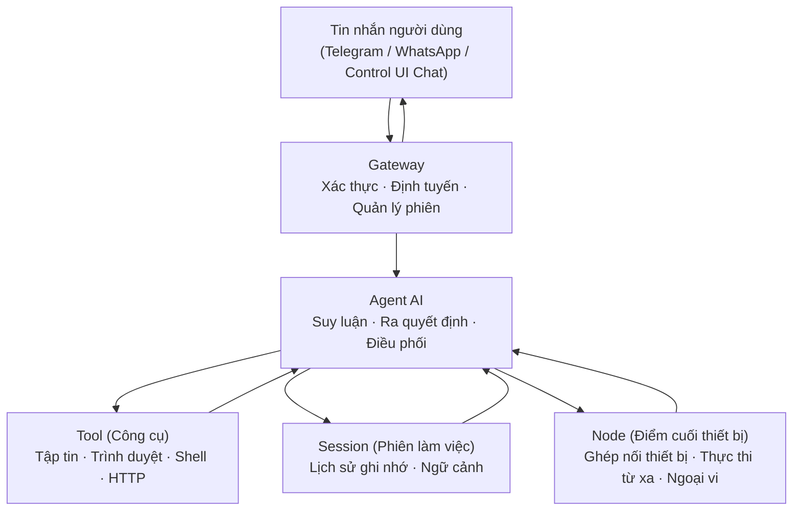

## 1.3 Tổng quan các khái niệm cốt lõi

Trước khi đi sâu vào kỹ thuật, bạn chỉ cần ghi nhớ 5 khái niệm trọng yếu: **Gateway, Agent, Tool, Session, Node**.

Hình 1-1: Năm khái niệm cốt lõi và mối quan hệ giữa chúng

| Khái niệm | Định nghĩa trong một câu |
|---|---|
| **Gateway** | "Cánh cổng" của hệ thống, tiếp nhận tin nhắn từ các kênh, xác thực danh tính, duy trì trạng thái kết nối và chuyển yêu cầu vào mặt phẳng điều khiển (Control Plane) |
| **Agent** | Đơn vị "trực tiếp làm việc", gọi mô hình ngôn ngữ lớn để suy luận, quyết định bước tiếp theo cần dùng công cụ nào và tổng hợp kết quả để phản hồi |
| **Tool (Công cụ)** | "Cánh tay" của Agent, trực tiếp thực thi thao tác cụ thể — như đọc một tập tin, mở một trang web, gọi một API |
| **Session (Phiên làm việc)** | "Cuốn sổ ghi nhớ" của Agent, lưu trữ lịch sử đối thoại qua nhiều vòng để AI nhớ được "trước đó đã nói những gì" |
| **Node (Điểm cuối thiết bị)** | Thiết bị hoặc điểm cuối thực thi kết nối với Gateway qua WebSocket, dùng để cung cấp năng lực phần cứng như camera, màn hình, thông báo hoặc thực thi từ xa |

### 1.3.1 Quan hệ bao hàm giữa các thành phần

Trong kiến trúc của OpenClaw, luồng xử lý lõi là **Gateway → Agent → Tool / Session**. Node là điểm cuối thực thi hoặc ngoại vi tùy chọn — chỉ khi bạn gắn thêm camera, điện thoại, máy tính từ xa thì các thiết bị này mới tham gia vào chuỗi điều phối của Agent thông qua Node. Tóm lại:

> **Gateway → Agent → Tool / Session (Node kết nối theo nhu cầu)**
>
> Gateway tiếp nhận tin nhắn và đóng vai trò mặt phẳng điều khiển; Agent thực hiện suy luận và điều phối; Tool và Session đảm nhận vai trò thực thi và duy trì ngữ cảnh; Node chỉ xuất hiện khi cần năng lực thiết bị hoặc thực thi từ xa.

### 1.3.2 Hành trình tối giản của một tin nhắn

Khi bạn gửi tin nhắn trên Telegram cho bot: "Kiểm tra giúp tôi thời tiết hôm nay", điều gì sẽ diễn ra phía sau?

1. Tin nhắn trước hết đến **Gateway** — Gateway xác thực danh tính của bạn, bảo đảm bạn có quyền sử dụng dịch vụ.
2. Gateway chuyển tin nhắn này đến đúng **Agent** và **Session** tương ứng — giúp hệ thống xác định "ai sẽ xử lý" và "có cần mang theo ngữ cảnh lịch sử không".
3. **Agent** đọc lại lịch sử trong **Session** (ví dụ thành phố bạn từng hỏi hôm qua), sau đó quyết định gọi **Tool** tra cứu thời tiết.
4. Tool trả về dữ liệu thời tiết thô, Agent tổng hợp lại thành ngôn ngữ tự nhiên dễ hiểu, rồi gửi phản hồi ngược lại cho bạn theo đường Gateway → Telegram.

Nếu tác vụ này cần chụp ảnh từ camera điện thoại, đọc thông báo trên máy tính hoặc chạy lệnh trên máy chủ từ xa, các năng lực này sẽ được cung cấp cho Agent thông qua **Node**.

Toàn bộ quá trình chỉ mất vài giây, nhưng bên dưới bao gồm đủ 5 mắt xích: xác thực, định tuyến, suy luận, gọi công cụ và quản trị ngữ cảnh — đây chính là nội dung sẽ được bóc tách chi tiết trong các chương tiếp theo.

### 1.3.3 Bảng đối chiếu khái niệm và các chương chuyên sâu

Sau mục này, bạn đã làm quen với 5 vai trò nòng cốt. Mỗi thành phần sẽ được phân tích sâu ở các chương nào?

| Khái niệm | Chương phân tích sâu | Nội dung bạn sẽ học được |
|---|---|---|
| Gateway | [Chương 9](../09_gateway_protocol/README.md) | Kiến trúc Control Plane, giao thức WebSocket, tính bất biến của sự kiện (Idempotency), ghép nối thiết bị |
| Agent | [Chương 10](../10_agent_loop/README.md) | Nhân Agent Loop, lắp ráp prompt, thực thi công cụ, phản hồi dạng luồng (Streaming) |
| Tool | [Chương 5](../05_tools_skills/README.md) | Danh mục công cụ tích hợp, Skill và Plugin, chính sách phân quyền và môi trường cô lập Sandbox |
| Session | [Chương 6](../06_context_memory/README.md) | Phiên làm việc và lưu trữ bền vững (Persistence), ngân sách cửa sổ ngữ cảnh, chiến lược ghi nhớ và nén |
| Node | [Chương 9](../09_gateway_protocol/README.md) | Ghép nối thiết bị, điểm cuối thực thi từ xa và tích hợp năng lực ngoại vi |

---

Hãy ghi nhớ 5 cái tên này. Cuốn sách sẽ đi sâu vào cách cấu hình và nguyên lý vận hành của từng thành phần.

Muốn tìm hiểu sâu chi tiết kiến trúc ngay? Hãy tham khảo [9.1 Toàn cảnh kiến trúc & Khung 5 mặt phẳng](../09_gateway_protocol/9.1_architecture_overview.md) và [10.1 Vòng đời luân chuyển yêu cầu & Chẩn đoán theo tầng](../10_agent_loop/10.1_request_lifecycle.md).
