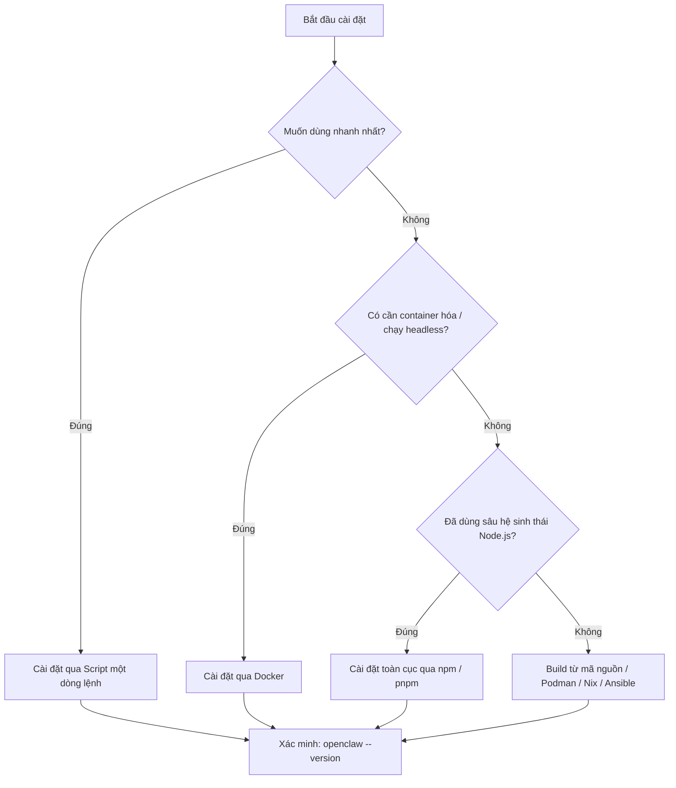

## 2.2 Cài đặt OpenClaw

> **Thời lượng ước tính**: 10–20 phút (tùy thuộc vào phương thức cài đặt và tốc độ mạng)

Mục này hướng dẫn cách cài đặt OpenClaw trong môi trường bạn đã chọn. Đối với người dùng lần đầu, chúng tôi đặc biệt khuyến nghị sử dụng **Script cài đặt một dòng lệnh** vì 3 lý do: Thứ nhất, script tự động xử lý các phụ thuộc và lựa chọn phiên bản phù hợp, giúp bạn tránh khỏi các xung đột phiên bản npm phức tạp; Thứ hai, đây là con đường ngắn nhất để có một hệ thống chạy được ngay; Thứ ba, nếu sau này bạn cần đóng gói Docker hoặc tùy biến mã nguồn, bạn hoàn toàn có thể chạy thông luồng trước qua script này rồi mới chuyển đổi sau. Trình tự này giúp bạn tránh rơi vào cái bẫy "bế tắc trong khâu chọn công cụ" ngay từ ngày đầu.

### 2.2.1 Phương thức cài đặt khuyến nghị: Script một dòng lệnh

Cách thức đơn giản và nhanh chóng nhất là thực thi script cài đặt chính thức.

**Kiểm tra điều kiện trước khi chạy**

Trước khi thực thi script, vui lòng xác nhận nhanh:

- Bạn đã đọc kỹ [Mục 2.1 Yêu cầu hệ thống](2.1_requirements.md) và đáp ứng các **điều kiện bắt buộc** (phiên bản Node.js, kết nối mạng).
- Kết nối mạng đến `openclaw.ai` thông suốt (trong mạng nội bộ doanh nghiệp có thể cần cấu hình HTTP Proxy; nếu chưa chắc chắn, hãy chạy lệnh `curl -v https://openclaw.ai/install.sh` để kiểm tra).
- Nếu sử dụng Windows, hãy đảm bảo đã kích hoạt WSL2 (chứ không phải WSL1), có thể kiểm tra qua lệnh `wsl --list --verbose`.

**Bắt đầu cài đặt**

> Lưu ý an toàn: Dưới đây là lộ trình cài đặt nhanh chính thức. Trong môi trường doanh nghiệp có kiểm soát an ninh nghiêm ngặt, bạn nên tải script về xem xét nội dung trước, hoặc sử dụng phương thức cài đặt thủ công qua npm chính thức để tránh thực thi trực tiếp script từ xa chưa qua kiểm duyệt.

macOS / Linux:

```bash
curl -fsSL https://openclaw.ai/install.sh | bash
```

Nếu bạn chỉ muốn cài đặt công cụ dòng lệnh (CLI) và tạm thời bỏ qua quy trình onboarding ban đầu, hãy chạy:

```bash
curl -fsSL https://openclaw.ai/install.sh | bash -s -- --no-onboard
```

**Windows (PowerShell)**

Mở PowerShell và chạy lệnh sau:

```powershell
iwr -useb https://openclaw.ai/install.ps1 | iex
```

Nếu muốn bỏ qua onboarding, sử dụng tham số chính thức:

```powershell
& ([scriptblock]::Create((iwr -useb https://openclaw.ai/install.ps1))) -NoOnboard
```

### 2.2.2 Xác minh kết quả cài đặt

Sau khi cài đặt xong, bạn nên thực hiện ngay bước kiểm tra tối thiểu (đảm bảo lệnh khả dụng và biến môi trường PATH đã nhận đúng; xem thêm các lệnh CLI tại [Phụ lục E: Sổ tay tra cứu lệnh nhanh](../appendix/command_cheatsheet.md)):

```bash
openclaw --version
openclaw --help
```

Nếu kiểm tra thất bại, đừng vội vàng cài đặt lại ngay lập tức. Hãy xác định rõ lệnh đã được cài vào môi trường thực thi nào, và thư mục npm toàn cục (Global npm prefix) của môi trường đó đã nằm trong biến PATH hay chưa. OpenClaw hỗ trợ Node 24.16+ hoặc 26.1+, cài đặt mới khuyến nghị dùng Node 26, Node 22, 23, 25 không còn được hỗ trợ; các quy tắc phiên bản và PATH tuân theo [Tài liệu cài đặt Node.js chính thức](https://docs.openclaw.ai/install/node).

#### Chẩn đoán trên macOS / Linux / WSL (POSIX shell)

Trong **cùng một cửa sổ shell mà bạn vừa chạy lệnh cài đặt**, hãy lần lượt thực thi:

```bash
node --version
npm prefix -g
command -v openclaw
printf '%s\n' "$PATH"
openclaw doctor
openclaw gateway status
```

Lệnh `npm prefix -g` sẽ trả về đường dẫn `<npm-prefix>`; trên macOS, Linux và WSL, tệp thực thi thường nằm tại `<npm-prefix>/bin`. Nếu `command -v openclaw` không cho kết quả và trong PATH chưa có thư mục này, hãy thêm dòng sau vào tệp `~/.zshrc` hoặc `~/.bashrc` của bạn:

```bash
export PATH="$(npm prefix -g)/bin:$PATH"
```

Lưu lại, sau đó đóng và mở lại cửa sổ Terminal rồi chạy lại các lệnh chẩn đoán trên. Bạn cũng có thể chạy lệnh `rehash` (với zsh) hoặc `hash -r` (với bash) để làm mới bộ nhớ đệm lệnh trong phiên hiện tại. Lưu ý: Không cài đặt trên môi trường macOS/Linux host rồi lại tìm kiếm lệnh bên trong WSL; chúng sở hữu môi trường Node, npm prefix và biến PATH hoàn toàn độc lập với nhau.

#### Chẩn đoán trên Windows PowerShell

Đối với bản cài đặt Windows gốc, hãy mở một cửa sổ PowerShell mới và chạy:

```powershell
node --version
$npmPrefix = npm prefix -g
$npmPrefix
Get-Command openclaw -ErrorAction SilentlyContinue
$env:Path -split ';'
$env:Path -split ';' -contains $npmPrefix
openclaw doctor
openclaw gateway status --json
```

Windows thêm trực tiếp `<npm-prefix>` vào biến PATH chứ không cần nối thêm `/bin`. Nếu dòng `-contains` ở trên trả về `False`, hãy vào mục "Settings → System → Environment Variables" để thêm giá trị thực tế của `$npmPrefix` vào biến PATH người dùng, sau đó mở lại Windows Terminal hoặc PowerShell; các cửa sổ đang mở sẵn sẽ không tự động cập nhật biến PATH mới.

#### Ranh giới định tuyến giữa Windows Hub và WSL2

Trên Windows có 3 lộ trình độc lập: Windows Hub, CLI/Gateway chạy trực tiếp trên PowerShell, và Gateway cài đặt thủ công trong một bản phân phối WSL2 cụ thể. Bạn cần chọn đúng một lộ trình rồi chẩn đoán trong môi trường tương ứng:

- Thiết lập cục bộ (Local Setup) của Windows Hub sẽ tự động tạo một bản phân phối WSL riêng tên là `OpenClawGateway` và tự động ghép nối (Pairing), không can thiệp vào bản Ubuntu hiện có của bạn. Với lộ trình này, hãy ưu tiên kiểm tra trạng thái kết nối, ghép nối và Gateway tại mục Command Center và Connections trên giao diện Hub.
- Bản cài đặt PowerShell gốc sử dụng Node, npm prefix và biến PATH của Windows; không dùng lệnh `command -v` của WSL để phán đoán trạng thái thành bại.
- Bản cài đặt WSL2 thủ công bắt buộc phải chạy chẩn đoán bên trong chính bản phân phối đó. Từ PowerShell, trước tiên dùng `wsl --list --verbose` để xác định tên bản phân phối, sau đó thay thế `<DistroName>` bằng tên thực tế:

```powershell
wsl -d <DistroName> -- openclaw doctor
wsl -d <DistroName> -- openclaw gateway status
```

Máy chủ Windows host thường có thể truy cập các dịch vụ lắng nghe trong WSL2 qua địa chỉ `localhost`; nhưng đối với kết nối xuyên máy tính thì không được dùng `127.0.0.1` làm địa chỉ Gateway từ xa, mà phải sử dụng URL mạng mà máy client có thể định tuyến tới, đồng thời kiểm tra địa chỉ ràng buộc (Binding address) và tường lửa. Xem thêm chi tiết lựa chọn và xử lý lỗi tại [Cẩm nang Windows chính thức của OpenClaw](https://docs.openclaw.ai/platforms/windows); xem quy tắc mạng NAT, mirrored networking và port forwarding tại [Tài liệu kết nối mạng WSL của Microsoft](https://learn.microsoft.com/windows/wsl/networking).

### 2.2.3 Các phương thức cài đặt thay thế

Nếu script một dòng lệnh không phù hợp với môi trường của bạn, dưới đây là các phương thức cài đặt thay thế.

> [!TIP]
> **Lần đầu triển khai chỉ nên chọn duy nhất một con đường để chạy thông luồng.** Nếu mục tiêu hiện tại của bạn chỉ là vào được giao diện Dashboard và hoàn thành phiên chat đầu tiên, đừng vội đem so sánh npm, Docker, build mã nguồn và các giải pháp vận hành phức tạp cùng một lúc. Con đường ngắn nhất dẫn tới thành công luôn là ưu tiên hàng đầu, các lộ trình khác hãy để dành khi bạn đã thực sự cần container hóa hoặc tùy biến chuyên sâu.

Nếu chưa biết nên chọn con đường nào, hãy tham khảo cây quyết định dưới đây:



Hình 2-1: Cây quyết định lựa chọn phương thức cài đặt OpenClaw

#### 1. Cài đặt qua npm

Nếu bạn thành thạo hệ sinh thái Node hoặc cần quản lý chính xác phiên bản gói trong quy trình CI/CD, bạn có thể cài đặt toàn cục trực tiếp qua `npm`, `pnpm` hoặc `bun`.

```bash
# Cài đặt toàn cục qua npm (npm 12 mặc định chặn các lifecycle script của gói,
# sẽ bỏ qua bước preinstall/postinstall của OpenClaw, cần thêm --allow-scripts= để cho phép rõ ràng;
# chú ý là dùng dấu bằng, nếu viết dấu cách sẽ bị hiểu nhầm là tên gói thứ 2 cần cài.
# Đối với npm 11.15 trở về trước không có tùy chọn này, cần bỏ tham số đó đi)
npm install -g openclaw@latest --allow-scripts=openclaw

# Cài đặt toàn cục qua pnpm (lệnh approve-builds -g từng bị gỡ bỏ ở pnpm 11.0, nhưng đã phục hồi từ 11.24;
# truyền trực tiếp --allow-build=openclaw trên lệnh pnpm add -g là cách cho phép build script một lần khi cài)
pnpm add -g --allow-build=openclaw openclaw@latest
```

Khuyến nghị: Trong môi trường kiểm thử và sản xuất, không nên gắn chặt lâu dài với nhãn `latest`. Cách làm an toàn hơn là cố định vào một phiên bản cụ thể và ghi rõ phiên bản đó vào tài liệu bàn giao.

```bash
npm install -g openclaw@<version> --allow-scripts=openclaw
```

#### 2. Cài đặt qua Docker

Phù hợp cho các kịch bản container hóa, triển khai headless hoặc cần môi trường Gateway cách ly an toàn. Tài liệu chính thức xem Docker là **lộ trình tùy chọn**; nếu bạn chỉ muốn trải nghiệm nhanh trên máy cá nhân thì cài đặt thông thường sẽ trực quan hơn.

**Yêu cầu tiên quyết**: Đã cài đặt Docker Desktop hoặc Docker Engine (bao gồm Docker Compose v2), bộ nhớ RAM không thấp hơn mức yêu cầu tối thiểu tại [Mục 2.1](2.1_requirements.md) (4 GB).

**Cài đặt nhanh (Khuyến nghị)**: Thực thi script tự động tại **thư mục gốc của kho mã nguồn OpenClaw** (chú ý: không phải thư mục gốc của kho sách này), script sẽ tự động build image, chạy wizard cấu hình, khởi động Gateway và sinh Token:

```bash
./scripts/docker/setup.sh
```

Bạn có thể tùy biến thông qua các biến môi trường, ví dụ bật sandbox và đóng gói thêm các tiện ích mở rộng plugin:

```bash
export OPENCLAW_SANDBOX=1
export OPENCLAW_EXTENSIONS="diagnostics-otel matrix"
./scripts/docker/setup.sh
```

Hoặc sử dụng image chính thức dựng sẵn để bỏ qua bước build cục bộ:

```bash
export OPENCLAW_IMAGE="ghcr.io/openclaw/openclaw:latest"
./scripts/docker/setup.sh
```

Tài liệu Docker chính thức nhấn mạnh: Script setup trên sẽ thực hiện onboarding trước, ghi gateway token vào `.env`, rồi mới khởi động `openclaw-gateway`. Nếu bạn chỉ muốn bỏ qua việc biên dịch cục bộ, hãy giữ biến `OPENCLAW_IMAGE` và tiếp tục chạy cùng script đó.

**Cài đặt thủ công**: Nếu không dùng script tự động, bạn có thể lần lượt thực thi các lệnh sau tại thư mục gốc kho mã nguồn OpenClaw. Cách này phù hợp cho những ai muốn tự tùy biến image hoặc gỡ lỗi từng bước, không khuyến nghị cho người dùng cài lần đầu:

```bash
docker build -t openclaw:local -f Dockerfile .
docker compose run --rm --no-deps --entrypoint node openclaw-gateway dist/index.js onboard --mode local --no-install-daemon
docker compose run --rm --no-deps --entrypoint node openclaw-gateway dist/index.js config set gateway.mode local
docker compose run --rm --no-deps --entrypoint node openclaw-gateway dist/index.js config set gateway.bind lan
docker compose run --rm --no-deps --entrypoint node openclaw-gateway dist/index.js config set gateway.controlUi.allowedOrigins '["http://localhost:18789","http://127.0.0.1:18789"]' --strict-json
docker compose up -d openclaw-gateway
```

> [!NOTE]
> Trong tài liệu chính thức, `openclaw-cli` là container công cụ chạy sau khi Gateway đã khởi động. Đối với lần setup Docker đầu tiên, cần dùng container `openclaw-gateway` để hoàn tất onboarding và ghi cấu hình trước khi kích hoạt Gateway.

**Xác minh sau cài đặt**: Mở trình duyệt truy cập `http://127.0.0.1:18789/`, lấy Token từ file `.env` và dán vào trường xác thực trong mục Settings của Control UI. Bạn có thể kiểm tra trạng thái hoạt động của Gateway qua các endpoint healthcheck:

```bash
curl -fsS http://127.0.0.1:18789/healthz
curl -fsS http://127.0.0.1:18789/readyz
```

Kho sách này không chứa các script triển khai Docker nói trên, để xem thêm các tùy chọn cấu hình xin tham khảo [Hướng dẫn cài đặt Docker chính thức](https://docs.openclaw.ai/install/docker).

#### 3. Các phương thức khác (Build mã nguồn, Podman, Nix, Ansible)

Phù hợp cho mục đích nghiên cứu phát triển tùy biến hoặc các kịch bản DevOps đặc thù, vui lòng tham khảo [Tài liệu cài đặt chính thức](https://docs.openclaw.ai/install) để nhận chỉ dẫn tương ứng.

### 2.2.4 Biến môi trường & Ghi đè đường dẫn

Các biến môi trường cốt lõi liên quan trực tiếp đến việc ghi đè đường dẫn hệ thống (đặc biệt hữu ích khi chạy đa phiên bản hoặc triển khai phi tiêu chuẩn):

- `OPENCLAW_HOME`: Thiết lập thư mục chính để phân giải các đường dẫn nội bộ.
- `OPENCLAW_STATE_DIR`: Ghi đè thư mục lưu trữ trạng thái có thể biến đổi (Variable State).
- `OPENCLAW_CONFIG_PATH`: Ghi đè đường dẫn tệp cấu hình.

Bên cạnh đó, tài liệu chính thức cũng quy định rõ thứ tự nạp biến môi trường: Biến môi trường tiến trình (Process env) > Tệp `.env` trong thư mục làm việc hiện tại > `~/.openclaw/.env` > Đường dẫn tương thích mặc định trên Ubuntu `~/.config/openclaw/gateway.env` > Khối `env` trong `openclaw.json` > Nạp tùy chọn từ shell (`OPENCLAW_LOAD_SHELL_ENV=1`). Do đó, không nên hiểu lầm rằng "OpenClaw chỉ nhận 3 biến môi trường này".

Xem chi tiết tại [Tài liệu biến môi trường chính thức](https://docs.openclaw.ai/help/environment).

### 2.2.5 Nâng cấp phiên bản & Chiến lược quản trị

Để nâng cấp lên phiên bản mới, hiện tại khuyến nghị sử dụng lệnh cập nhật chính thức; công cụ sẽ tự động nhận diện phương thức cài đặt, tải phiên bản mục tiêu, chạy `doctor` và tự khởi động lại Gateway:

```bash
openclaw update
```

Bạn cũng có thể chạy lại script cài đặt, hoặc dùng npm, pnpm, bun để cài đặt lại `openclaw@<version>` / `@latest` như một phương án thủ công hoặc phục hồi sự cố. Sau khi thay thế gói thủ công, cần khởi động lại Gateway ngay lập tức và chạy các lệnh nghiệm thu như `openclaw doctor`, `openclaw health` để tránh việc tiến trình cũ tiếp tục chạy trên các tệp thư viện đã bị thay đổi.

Mục tiêu của chiến lược nâng cấp không đơn thuần là chạy phiên bản mới nhất, mà là bảo đảm quá trình nâng cấp có thể kiểm chứng và có thể hoàn tác (Quy tắc phiên bản và di trú cấu hình chi tiết tại [Phụ lục F: Bản đồ phiên bản & Hướng dẫn nâng cấp](../appendix/version_mapping.md)):

- Kiểm thử hồi quy trước khi nâng cấp: Mỗi lần nâng cấp xong, tối thiểu phải chạy kiểm tra `health`, `status`, đầu dò kênh (Channel probe) và đầu dò mô hình (Model probe).
- Gặp sự cố phải hoàn tác trước: Nếu phiên bản mới hoạt động bất thường, hãy cài đặt lại phiên bản ổn định trước đó (ví dụ: `npm install -g openclaw@<phiên_bản_cũ>`), sau đó mới tiến hành phân tích nguyên nhân lỗi.

> **Bài học thực tế: Triệu chứng kỳ lạ do phiên bản Node**
>
> Một thành viên cộng đồng phản ánh cài đặt `openclaw` thành công nhưng khi khởi động liên tục báo lỗi `SyntaxError: Unexpected token`. Sau 3 giờ dò tìm mới phát hiện Node mặc định của hệ thống là v16 (sót lại từ cấu hình `nvm` cũ), thấp hơn rất nhiều so với ngưỡng hỗ trợ chính thức của OpenClaw (Node 24.16+ hoặc 26.1+); cài đặt mới khuyến nghị dùng Node 26, CI chính thức và script Linux dùng Node 24. Bài học rút ra: Trước khi cài đặt, nhất định phải chạy `node -v` để kiểm tra phiên bản, đặc biệt trong các môi trường có dùng trình quản lý phiên bản như nvm hoặc volta.
