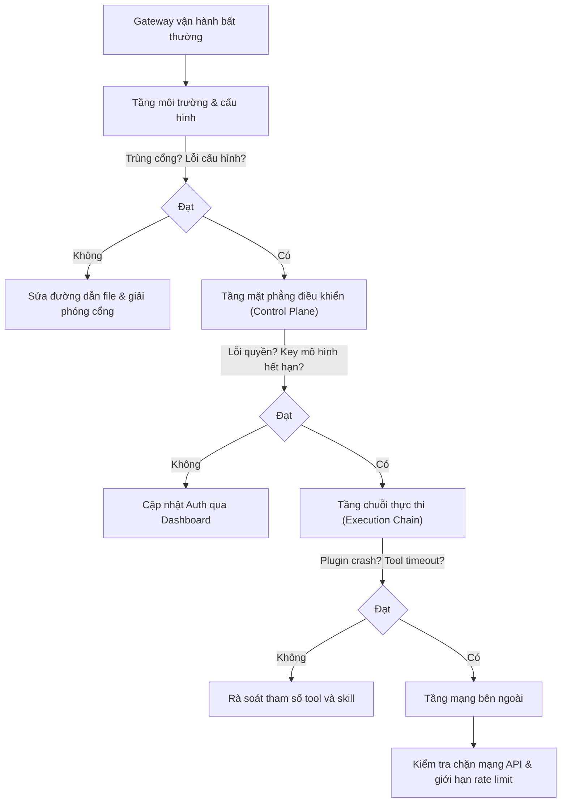

## 2.4 Dịch vụ Gateway daemon & Nghiệm thu tính khả dụng

> **Thời lượng ước tính**: 5–10 phút

Sau khi cài đặt xong, bạn có 2 cách để vận hành OpenClaw: (1) Mỗi lần dùng đều phải gõ lệnh mở terminal thủ công, hoặc (2) Cho phép nó tự động chạy ngầm trong hệ thống và tự phục hồi khi tiến trình gặp sự cố. Trong môi trường sản xuất, chắc chắn bạn sẽ chọn cách thứ 2; nhưng ngay cả trên máy tính cá nhân của lập trình viên, việc đưa dịch vụ vào tiến trình chạy ngầm (Daemon) cũng giảm thiểu đáng kể thao tác phiền toái — không cần mỗi sáng mở máy tính lên lại phải nhớ gõ lệnh khởi động. Mục này hướng dẫn cách cấu hình cơ chế tự khởi động qua tham số `--install-daemon`, cũng như cách nghiệm thu toàn diện để xác nhận hệ sinh thái cơ sở đã thông suốt.

### 2.4.1 Kiểm tra trước khi khởi động & Chạy thử ở tiền cảnh (Foreground)

Nếu chưa cài đặt daemon hoặc cần gỡ lỗi trực tiếp, bạn có thể chạy Gateway ở chế độ tiền cảnh (Foreground):

```bash
# Khởi động Gateway ở foreground và xuất log trực tiếp ra console theo thời gian thực
openclaw gateway run --port 18789
```

Mặc định Gateway yêu cầu trong tệp cấu hình phải có trường `gateway.mode=local` thì mới cho phép khởi động; các lệnh `openclaw onboard --mode local`, `openclaw onboard --install-daemon` hoặc `openclaw setup` thông thường sẽ tự ghi trường này. Trong các tình huống phát triển tạm thời hoặc cứu hộ sự cố, bạn có thể thêm cờ `--allow-unconfigured` để vượt qua lớp bảo vệ khởi động, tuy nhiên cờ này không tự sửa file cấu hình; trong môi trường chính thức bạn nên chủ động bổ sung giá trị `gateway.mode` còn thiếu.

Kiểm tra cấu hình & Khám sức khỏe hệ thống: Hãy để lỗi lộ ra ở tầng ngoài cùng:

```bash
openclaw doctor
```

Nếu lệnh kiểm tra báo lỗi chưa nạp được cấu hình hoặc sai cú pháp, hãy ưu tiên kiểm tra lại đường dẫn tệp và định dạng JSON. Bạn cũng có thể dùng các biến môi trường như `OPENCLAW_HOME` và `OPENCLAW_CONFIG_PATH` để ghi đè đường dẫn mặc định.

### 2.4.2 Quản lý dịch vụ chạy ngầm & Kiểm tra trạng thái

Khi bạn đã triển khai ở chế độ `--install-daemon`, OpenClaw có thể được quản lý trạng thái nền trực tiếp qua các câu lệnh CLI tích hợp sẵn mà không cần cài đặt thêm các công cụ quản lý tiến trình bên ngoài như `pm2`. Thao tác chuẩn mực sau khi thay đổi cấu hình là dùng `openclaw gateway restart`; trên macOS, tránh việc gọi tuần tự máy móc `gateway stop` rồi `gateway start` như một thao tác khởi động lại. Chỉ khi bạn dùng rõ ràng lệnh `openclaw gateway stop --disable`, hệ thống mới hiểu là bạn muốn vô hiệu hóa vĩnh viễn tính năng tự khởi động của LaunchAgent.

```bash
# Xem trạng thái vận hành chạy ngầm và các cổng kết nối quan trọng của Gateway
openclaw gateway status
```

Nếu trạng thái tiến trình hiển thị bất thường, bạn có thể kiểm tra nhật ký log tương ứng theo từng hệ điều hành.

> **Gợi ý**: Tên dịch vụ đăng ký tự động trên các môi trường có thể khác nhau; bản cài đặt có giám sát trên Linux/WSL2 mặc định dùng dịch vụ systemd người dùng mang tên `openclaw-gateway.service`, trong tình huống đa profile có thể là `openclaw-gateway-<profile>.service`. Hãy ưu tiên dùng các lệnh bọc của CLI; khi cần can thiệp systemd có thể chạy `systemctl --user status openclaw-gateway.service`.

Sau khi xác nhận dịch vụ đã chạy, khuyến nghị bạn kiểm tra sâu hơn việc vận hành của mặt phẳng điều khiển Gateway:

```bash
openclaw logs --limit 200

# Tùy chọn: Theo dõi liên tục log có cấu trúc dạng JSON theo thời gian thực
openclaw logs --follow --json
```

Nếu trong log xuất hiện các tín hiệu bất thường như tiến trình liên tục khởi động lại hoặc xác thực thất bại, hãy dừng lại để tiến hành chẩn đoán phân tầng.

### 2.4.3 Checklist nghiệm thu tính khả dụng tối thiểu

Việc nghiệm thu tính năng của Gateway hoàn toàn không phụ thuộc vào bất kỳ kênh chat bên ngoài nào. Hãy lần lượt thực hiện danh sách kiểm tra dưới đây để đảm bảo chuỗi liên kết cục bộ hoạt động trơn tru:

1. **Kiểm tra tính khả dụng của CLI**

```bash
openclaw --version
```

Xác nhận OpenClaw CLI đã được cài đặt chính xác.

2. **Kiểm tra cấu hình & Phụ thuộc**

```bash
openclaw doctor
```

Đầu ra không được chứa cảnh báo mức ERROR, toàn bộ các phụ thuộc trọng yếu đều đã sẵn sàng.

3. **Kiểm tra sức khỏe tiến trình**

```bash
openclaw health --json
```

Nhận được bản chụp snapshot sức khỏe hoặc kết quả đầu dò probe là đạt yêu cầu. Định dạng trường dữ liệu giữa các phiên bản có thể khác nhau, khi nghiệm thu không nên xem đây là hợp đồng JSON cố định; trọng tâm là xác nhận trạng thái tổng thể bình thường, không có lỗi nghiêm trọng và Dashboard cục bộ có thể kết nối được.

4. **Xác nhận dịch vụ chạy ngầm**

```bash
openclaw gateway status
```

Xác nhận tiến trình daemon đang chạy và cổng dịch vụ đã được liên kết (Port bound).

5. **Kiểm tra khả năng truy cập Bảng điều khiển (Dashboard)**

```bash
openclaw dashboard
```

Trình duyệt sẽ tự động mở giao diện Control UI. Nếu trình duyệt không tự mở, hãy truy cập thủ công địa chỉ giao diện điều khiển cục bộ và điền gateway token tương ứng theo phương thức xác thực của phiên bản hiện tại.


Hình 2-2: Cổng vào Dashboard khi nghiệm thu lần đầu

6. **Kiểm tra năng lực phản hồi của mô hình AI**

Trong ô chat của giao diện Dashboard Control UI, hãy nhập "Xin chào" và xác nhận nhận được phản hồi bình thường từ mô hình ngôn ngữ lớn (LLM). Điều này chứng minh toàn bộ chuỗi từ nạp tiến trình đến động cơ suy luận đã hoàn toàn thông suốt.

7. **Kiểm tra tính bình thường của nhật ký Log**

```bash
openclaw logs --limit 10
```

Xác nhận trong các dòng log xuất ra không tồn tại mục nào ở mức ERROR. Nếu phát hiện log ở mức cảnh báo nguy hiểm, hãy tham khảo Mục 2.4.4 "Sơ đồ kiến trúc chẩn đoán phân tầng" để khoanh vùng xử lý.

---

Sau khi hoàn thành các bước nghiệm thu trên, chuỗi vận hành cơ sở tại máy cục bộ đã được khẳng định hoạt động tốt. Cấu hình và xác minh kết nối các kênh chat bên ngoài (như Telegram, WhatsApp, Lark/Feishu...) sẽ được trình bày chi tiết tại [Chương 7](../07_multi_agent/README.md).

### 2.4.4 Sơ đồ kiến trúc chẩn đoán phân tầng

Khi lần chạy đầu tiên thất bại, hãy tiến hành định vị sự cố nhanh theo 4 tầng từ gần đến xa như sau:



Các cấu hình nâng cao tiếp theo (bao gồm thay thế mô hình và kết nối kênh chat) có thể tham khảo từ Chương 4 đến Chương 7.
