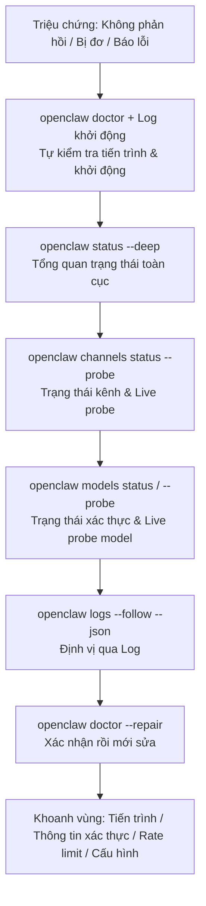

## 3.2 Các lệnh chẩn đoán thông dụng & Xử lý sự cố qua Logs

Tư duy xử lý sự cố cốt lõi: Trước tiên xác nhận tiến trình và Gateway còn sống hay không, sau đó lần lượt kiểm tra các phụ thuộc về kênh chat và mô hình AI, cuối cùng thông qua nhật ký log để định vị chính xác nguyên nhân lỗi.

> Bảng tra cứu tham số đầy đủ và quy trình xử lý sự cố nâng cao xem tại [Phụ lục E: Sổ tay tra cứu lệnh nhanh](../appendix/command_cheatsheet.md) và [Phụ lục C: Bảng kiểm tra xử lý sự cố](../appendix/troubleshooting_checklist.md).

### 3.2.1 Trình tự chẩn đoán 4 tầng & Các thao tác bổ trợ

Chương này khuyến nghị cố định quy trình chẩn đoán theo "4 tầng tuần tự": **Tiến trình / Gateway → Kênh chat → Mô hình AI → Nhật ký Log**. Trong đó `status --deep` và `doctor --repair` là hai thao tác bổ trợ quan trọng: Lệnh đầu dùng để bổ sung bức tranh toàn cục, lệnh sau dùng để thực hiện sửa chữa có định hướng sau khi đã có bằng chứng rõ ràng, tránh việc sửa bừa ngay từ đầu.

| Tầng chẩn đoán | Câu lệnh | Mục tiêu kiểm tra |
|---|---|---|
| **Tầng 1: Tiến trình & Gateway** | `openclaw doctor` + Log khởi động | Tiến trình có chạy được không, cấu hình có bị hỏng không, phụ thuộc có thiếu không |
| **Tầng 2: Kênh chat** | `openclaw channels status --probe` | Trạng thái hoạt động của kênh và live probe |
| **Tầng 3: Mô hình AI** | `openclaw models status` / `--probe` | Trạng thái xác thực và đầu dò live provider |
| **Tầng 4: Nhật ký Log** | `openclaw logs --follow --json` | Định vị lỗi chi tiết, dấu vết trace và ngữ cảnh sự cố |
| **Bổ trợ 1: Bức tranh toàn cục** | `openclaw status --deep` | Trạng thái hiện thời kèm live probe các kênh |
| **Bổ trợ 2: Công cụ sửa chữa** | `openclaw doctor --repair` | Thực hiện sửa lỗi có hướng dẫn sau khi đã xác định rõ nguyên nhân |



Hình 3-4: Trình tự chẩn đoán 4 tầng và các câu lệnh bổ trợ

### 3.2.2 Các câu lệnh ví dụ

**Lệnh 1: Kiểm tra sức khỏe**

```bash
openclaw health --json
```

Lệnh `openclaw health --json` thông thường sẽ trả về cờ `ok` ở cấp cao nhất cùng một số thông tin sức khỏe lồng nhau; cấu trúc trường dữ liệu giữa các phiên bản có thể thay đổi, không nên xem `status: "ok"` hay `errors` là hợp đồng cứng. Khi nghiệm thu chỉ cần chú trọng xem hệ thống tổng thể có khỏe mạnh và còn lỗi nghiêm trọng nào không.

**Lệnh 2: Tổng quan trạng thái**

```bash
openclaw status --deep
```

Xem toàn bộ trạng thái trong một màn hình và thực hiện live probe đối với các kênh chat. Lệnh này rất thích hợp làm điểm khởi đầu ở bước thứ 2: Nếu ở đây đã hiển thị kênh chat bị mất kết nối, bạn tuyệt đối không nên vội vàng đi sửa prompt hay workflow; muốn xem thống kê lượng dùng và hạn mức API của nhà cung cấp thì dùng lệnh `openclaw status --usage`.

**Lệnh 3: Đầu dò kênh chat (Channel probe)**

```bash
openclaw channels status --probe
```

`channels status --probe` là lối kiểm tra live an toàn nhất cho các kênh chat hiện nay, dùng để xác nhận trạng thái tài khoản, trạng thái truyền tải và kết quả thăm dò khi Gateway có thể kết nối được. Lệnh `channels capabilities` thích hợp hơn để xem năng lực hỗ trợ, phạm vi quyền hạn và gợi ý liên kết của từng kênh; nếu cần xác minh end-to-end sâu hơn, hãy kết hợp với log có cấu trúc và tin nhắn thực tế gửi trên kênh.

**Lệnh 4: Đầu dò mô hình (Model probe)**

```bash
openclaw models status
openclaw models status --check
openclaw models status --probe
```

Cờ `--check` dùng để phát hiện các hồ sơ xác thực bị thiếu, hết hạn hoặc sắp hết hạn; cờ `--probe` sẽ thực sự gửi gói tin thăm dò live auth tới các nhà cung cấp đã cấu hình. Nếu đầu dò trả về lỗi xác thực hoặc lỗi vượt hạn mức (Rate limit), hãy kết hợp xem trang quản trị của nhà cung cấp và log có cấu trúc để phân định rõ nguyên nhân do sai key, hết tiền trong tài khoản hay nhà cung cấp đang gặp sự cố.

**Lệnh 5: Theo dõi nhật ký Log**

```bash
openclaw logs --json --limit 500
```

Đầu ra có cấu trúc giúp lọc dữ liệu cực kỳ dễ dàng qua `jq`. Ưu tiên lấy một bản snapshot có giới hạn dòng, lọc theo `level` và `message` để phán đoán lỗi thuộc nhóm xác thực (auth), giới hạn tần suất (rate limit), timeout hay chặn quyền (allowlist):

```bash
openclaw logs --json --limit 500 \
  | jq -r 'select(.type=="log") | select((.level=="error") or ((.message // "")|test("auth|rate|timeout|blocked|allowlist";"i"))) | .message'
```

**Lệnh 6: Tự động sửa chữa và cấu hình chẩn đoán**

```bash
openclaw doctor --repair
```

Sau khi các lệnh chẩn đoán trên đã chỉ rõ nguyên nhân (ví dụ quyền truy cập thư mục bị sai, tệp trạng thái bị hỏng), hãy chạy `openclaw doctor --repair` để công cụ hướng dẫn sửa chữa từng bước một cách an toàn.

> **Bài học thực tế: Tiến trình khỏe không đồng nghĩa tin nhắn gửi tới nơi**
>
> Lệnh `openclaw health --json` trả về `ok: true`, nhưng gửi tin nhắn trên Telegram thì bot im lặng hoàn toàn. Nguyên nhân là tầng liên kết kênh chat và tầng tiến trình hoàn toàn tách biệt: Tiến trình đang chạy không có nghĩa là tin nhắn từ Telegram đã được chuyển phát thành công. Với các sự cố về kênh, trước tiên hãy dùng `channels status --probe` xem trạng thái live, sau đó dùng `channels capabilities` xác nhận quyền hạn, cuối cùng đối chiếu với log có cấu trúc — đó mới là con đường chẩn đoán bài bản nhất.
