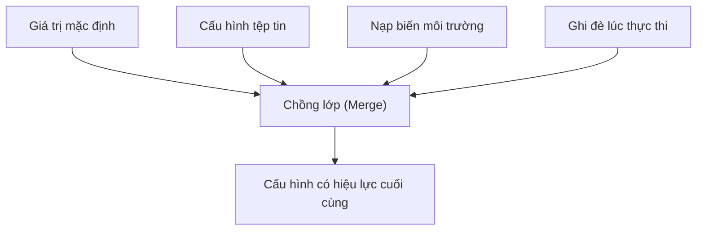

## 4.1 Cấu trúc openclaw.json & Thứ tự ưu tiên cấu hình

Mục này hệ thống hóa chuỗi thực thi của hệ thống cấu hình OpenClaw, bao gồm các nguồn cấu hình cụ thể, quy tắc đánh giá mức độ ưu tiên, cơ chế ghi đè và quy trình kiểm toán. Mục tiêu cốt lõi là đảm bảo mọi hành vi runtime của hệ thống đều có thể truy vết về các cấu hình đầu vào xác định, đồng thời cung cấp phương pháp cụ thể để xác minh tham số cuối cùng có hiệu lực.

### 4.1.1 Bản chất của cấu hình: Biến hành vi hệ thống thành đầu vào có thể truy vết

Cấu hình trong OpenClaw không đơn thuần là "tập hợp các tham số", mà chính là dữ liệu đầu vào quyết định hành vi của hệ thống. Việc đưa hành vi vào cấu hình mang lại ý nghĩa to lớn: Cùng một hệ thống khi chạy trên các máy tính khác nhau, kênh chat khác nhau hay tài khoản khác nhau vẫn có thể tái hiện và giải thích được hành vi một cách nhất quán.

Dưới góc nhìn chuỗi hệ thống, cấu hình quyết định ít nhất 3 nhóm kết quả:

- **Kết quả cổng vào**: Tin nhắn nào được phép đi vào hệ thống, tin nhắn nào sẽ bị từ chối hoặc bỏ qua.
- **Kết quả thực thi**: Tác vụ do Agent nào xử lý, những công cụ nào sẽ được gọi, kết quả xuất ra được bơm ngược vào phiên hội thoại như thế nào, và khi cần thiết thì kết nối năng lực ngoại vi từ node bên ngoài ra sao.
- **Kết quả quản trị**: Ranh giới quyền hạn, nhật ký kiểm toán và chiến lược xử lý sự cố có thể vận hành ổn định khi phát sinh ngoại lệ hay không.

Trong thực tế, tệp cấu hình chính thường gặp nhất nằm tại `~/.openclaw/openclaw.json` (các mẫu cấu hình thông dụng xem tại [Phụ lục B: Bản mẫu cấu hình & Ví dụ](../appendix/config_templates.md)). Bên cạnh việc sửa trực tiếp file, trên thẻ **Config** của Control UI bạn cũng có thể duyệt và chỉnh sửa cấu hình đang chạy theo từng phân loại:


Hình 4-1: Khung nhìn cấu hình toàn cục trên giao diện Config

Trong môi trường sản xuất, cấu hình bắt buộc phải thỏa mãn 2 điều kiện: **Có thể giải thích được** (định vị được trường dữ liệu và nguồn gốc sinh ra) và **Có thể truy vết được** (mọi thay đổi đều có lịch sử lưu lại và có thể hoàn tác).

Dưới đây là một ví dụ cấu hình an toàn; thay vì dùng các "công tắc bật tắt" đơn giản, chúng tôi khuyến nghị dùng cấu trúc JSON hoàn chỉnh để định nghĩa hành vi:

```json5
{
  "gateway": {
    "port": 18789,
    "auth": {
      "mode": "token",
      "token": "${OPENCLAW_GATEWAY_TOKEN}"
    },
    "controlUi": {
      "allowedOrigins": [
        "http://localhost:18789",
        "http://127.0.0.1:18789"
      ]
    }
  },
  "channels": {
    "telegram": {
      "enabled": true,
      "dmPolicy": "pairing",
      "groupPolicy": "allowlist"
    }
  },
  "messages": {
    "ackReactionScope": "group-mentions"
  }
}
```

Điểm mấu chốt ở đây là: **Phương thức xác thực do `gateway.auth` quyết định, việc ghép nối (Pairing) và phê duyệt thiết bị là hành vi thuộc mặt phẳng điều khiển (Control Plane), không nên viết lẫn lộn thành các cờ kiểu cũ như `requirePairing`.**

### 4.1.2 Phân tách phạm vi tác động (Scope): Gateway, Agent, Kênh chat, Công cụ quản lý những gì

Rất nhiều trường hợp "cấu hình không có hiệu lực" thực chất không phải do thứ tự ưu tiên, mà do viết sai phạm vi tác động (Scope). Cách làm chuẩn xác nhất là phân tách cấu hình thành 4 tầng trách nhiệm rõ ràng trước khi bàn đến việc ghi đè:

- **Cấp Gateway**: Các hành vi thuộc Control Plane như kết nối, xác thực, ghép nối, định tuyến và quản trị trạng thái.
- **Cấp Agent**: Thư mục workspace mặc định, chiến lược tác vụ, phương thức phối hợp năng lực (cách thức mô hình, công cụ và bộ nhớ cộng tác với nhau).
- **Cấp Kênh chat (Channel)**: Thông tin định danh kênh và ranh giới truy cập, ví dụ Telegram bot token, nguồn gửi tin nhắn được phép trên WhatsApp...
- **Cấp Công cụ (Tool)**: Kích hoạt công cụ, phân quyền tối thiểu, giới hạn timeout và quy chuẩn kết quả trả về (cách thức đầu ra của tool đi vào ngữ cảnh).

Quy tắc phán đoán nhanh trong thực tế:

- Các vấn đề liên quan đến cổng vào "Ai có quyền kích hoạt bot" thuộc cấp Kênh chat hoặc cấp Gateway.
- "Cách thức làm việc, sử dụng năng lực gì" thuộc cấp Agent và cấp Công cụ.
- "Xử lý thế nào khi thất bại, kiểm toán ra sao" thường trải dài qua 2 tầng Gateway và Tool, nhưng điểm rơi cấu hình khác nhau.

### 4.1.3 Mô hình mức độ ưu tiên: Cách thức chồng lớp giữa Giá trị mặc định, Tệp tin, Biến môi trường và Tham số thực thi

Không cần phụ thuộc vào chi tiết cài đặt bên dưới, bạn có thể hiểu thứ tự ưu tiên qua một mô hình ổn định: **Càng gần thời điểm thực thi (Runtime), mức độ ưu tiên càng cao**. Các nguồn cấu hình phổ biến gồm:

1. **Giá trị mặc định (Defaults)**: Được nhúng sẵn bên trong mã nguồn chương trình, bảo đảm hệ thống tối thiểu có thể khởi động được (ví dụ cổng mặc định của Gateway là 18789).
2. **Cấu hình tệp tin (File Config)**: Nội dung định dạng JSON5 trong `~/.openclaw/openclaw.json`.
3. **Nạp biến môi trường (Environment Injection)**: Các chuỗi giữ chỗ có dạng `${VAR_NAME}` bên trong cấu hình sẽ được đọc giá trị thực tế từ môi trường lúc phân giải (thường dùng cho API key, token bí mật). Chỉ các tên viết hoa theo quy tắc `[A-Z_][A-Z0-9_]*` mới được thay thế; biến bị thiếu hoặc rỗng sẽ gây báo lỗi khi nạp, có thể dùng cú pháp `$${VAR}` để escape thành chuỗi ký tự thông thường. Cần phân biệt các giai đoạn nạp môi trường: Trình nạp cấu hình sẽ xử lý file dotenv trước (file `.env` ở thư mục hiện tại, `~/.openclaw/.env`...), sau đó mới xử lý khối `env` trong file cấu hình; khi chạy thực tế runtime còn có thể hợp nhất thêm môi trường từ shell hoặc daemon.
4. **Ghi đè lúc thực thi (Runtime Overrides)**: Các tham số dòng lệnh truyền vào khi khởi động (ví dụ chạy `--port 19091`), dùng cho các thử nghiệm một lần và giúp hoàn tác nhanh chóng.

Sơ đồ dưới đây thể hiện mối quan hệ "chồng lớp thay vì thay thế hoàn toàn":



Hình 4-2: Mô hình chồng lớp thứ tự ưu tiên cấu hình

Cùng một trường dữ liệu có thể xuất hiện ở nhiều nơi, giá trị cuối cùng phụ thuộc vào nguồn ghi đè có ưu tiên cao hơn, chứ không phải "ai nằm ở cuối file". Do đó khi quản trị cấu hình, cần tránh định nghĩa lặp lại các trường có cùng ngữ nghĩa, đặc biệt là khi sao chép cấu hình giữa các môi trường khác nhau.

### 4.1.4 Bằng chứng có hiệu lực: Làm thế nào chứng minh "Giá trị cuối cùng đang chạy"

Chỉ khi quy việc "cấu hình có hiệu lực" về một chuỗi bằng chứng xác thực, bạn mới hình thành được phương pháp xử lý sự cố vững chắc. Khuyến nghị thu thập 4 nhóm bằng chứng theo thứ tự:

- **Bằng chứng đường dẫn (Path evidence)**: Xác nhận dòng log khởi động ghi rõ `Loading config from ~/.openclaw/openclaw.json`.
- **Bằng chứng nội dung (Content evidence)**: Bản chụp đã ẩn thông tin nhạy cảm của các trường cốt lõi. Chạy `openclaw status --deep` để đối soát xem các cấu hình then chốt đã được nạp hay chưa (ví dụ Agent mặc định, mô hình đã chọn, chính sách kênh và chính sách công cụ).
- **Bằng chứng vận hành (Runtime evidence)**: Nhật ký log bắt buộc phải giải thích lý do vì sao một hành vi bị từ chối. Ví dụ: `[Channel/WhatsApp] Message rejected: sender +19999999999 not in allowFrom list`.
- **Bằng chứng hành vi (Behavioral evidence)**: Dùng một thử nghiệm có thể tái hiện để xác minh trường cấu hình đã có tác dụng thực sự.

Thử nghiệm hành vi nên ưu tiên các kết quả nhị phân (Đạt / Không đạt). Ví dụ:

- Danh sách trắng kênh chat: Gửi tin nhắn từ một số điện thoại chưa cấp quyền, kỳ vọng bị từ chối; gửi từ số đã cấp quyền, kỳ vọng được tiếp nhận bình thường.
- Chính sách công cụ: Thử kích hoạt một công cụ đã bị cấm, kỳ vọng nhật ký log in ra `Tool 'execute_shell' denied by policy: minimum clearance level required`.

Để chuỗi bằng chứng mang tính nhị phân rõ nét, bạn có thể cố định bộ lệnh nghiệm thu tối thiểu: Trước tiên chạy `doctor` để xác nhận file cấu hình đọc được, sau đó chạy `status --deep` để xác nhận đã nạp vào bộ nhớ, cuối cùng dùng `logs --follow --json` để phát lại một chuỗi xử lý cụ thể.
