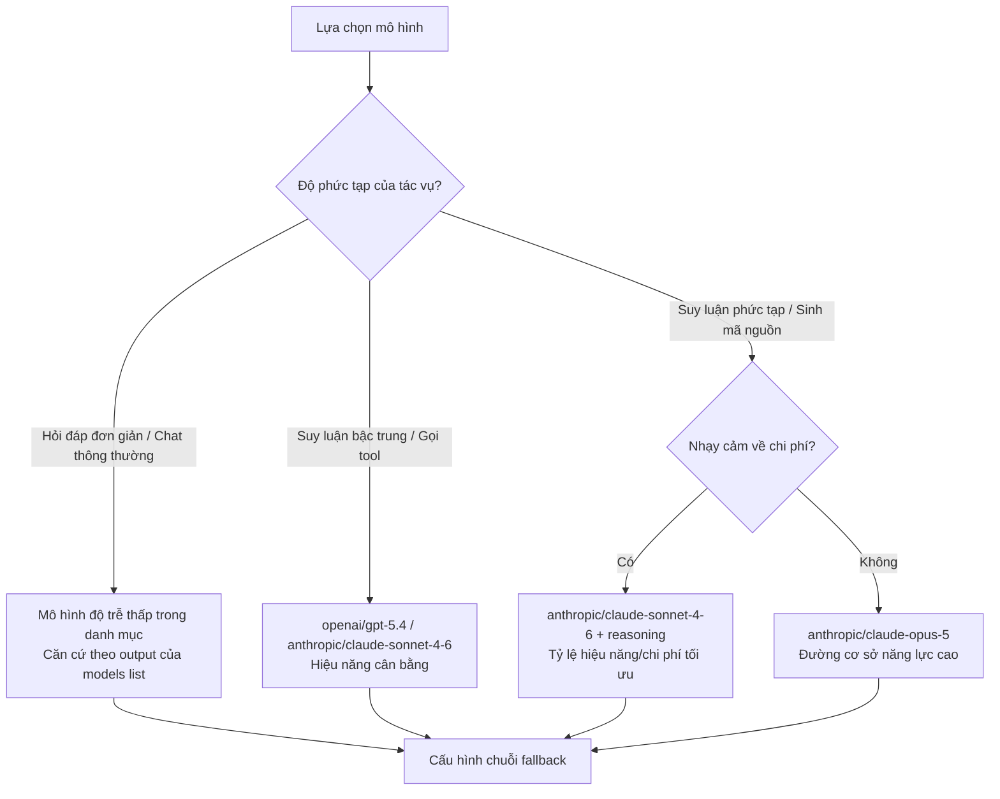

## 4.3 Lựa chọn mô hình & Chiến lược mặc định

Mục này xoay quanh khối `agents.defaults.model` để làm rõ các điểm then chốt khi lựa chọn mô hình: Cách thiết lập mô hình chính mặc định; cách ghi đè giá trị mặc định cho từng Agent riêng biệt; và trong các kịch bản gọi công cụ (Tool calling) hay ngữ cảnh dài cần đặc biệt lưu ý những ràng buộc năng lực nào. Cuối cùng là phương pháp xác minh dựa trên `models status` kết hợp bộ ca kiểm thử hồi quy, giúp biến việc chọn mô hình từ "cảm tính" thành "có thể đo lường và so sánh".

### 4.3.1 Các chiều kích ra quyết định: Chất lượng, Chi phí, Độ trễ, Độ tin cậy

Khi chọn mô hình, đừng chỉ nhìn vào hiệu ứng đối thoại hào nhoáng. Đối với một hệ thống vận hành thực tế, bắt buộc phải đồng thời cân nhắc 4 chiều kích sau:

- **Chất lượng**: Độ hoàn thành tác vụ, tính chính xác về mặt sự thật, độ chuẩn xác khi gắn kết gọi tool.
- **Chi phí**: Chi phí trên từng lượt yêu cầu và chi phí phát sinh khi thất bại phải gọi lại.
- **Độ trễ**: Độ trễ trung bình và độ trễ đuôi (Tail latency - p95/p99).
- **Độ tin cậy**: Tỷ lệ lỗi, tần suất chạm rate limit, thời gian phục hồi sau các đợt rung lắc mạng.

**Ví dụ thực tế: So sánh lựa chọn mô hình cho 3 kịch bản nghiệp vụ**

| Kịch bản nghiệp vụ | Yêu cầu chất lượng | Mức độ chịu đựng độ trễ | Độ nhạy cảm về chi phí | Chiến lược khuyến nghị |
|---|---|---|---|---|
| **Hệ thống CSKH** | Trung bình (Hỏi đáp chuẩn) | Thấp (Khách hàng đợi online) | Cao (Tính phí trên từng tin nhắn) | Lấy mô hình nhẹ / độ trễ thấp làm chủ lực; model lớn đứng sau dự phòng |
| **Trợ lý phân tích dữ liệu** | Cao (Suy luận phức tạp) | Trung bình (Có thể đợi 30 giây) | Trung bình | Mô hình lớn làm chủ lực (như `openai/gpt-5.5` hoặc `anthropic/claude-sonnet-4-6`), chú trọng độ dài context window |
| **Báo cáo tuần tra định kỳ** | Cao (Xuất dữ liệu có cấu trúc) | Cao (Chạy ngầm bất đồng bộ) | Thấp | Mô hình lớn làm chủ lực, thất bại thì tự động thử lại thay vì hạ cấp chất lượng |

Đối chiếu theo bảng trên: Trong bài toán CSKH, việc đặt một mô hình có độ trễ thấp trong danh mục làm `primary`, đồng thời đưa `openai/gpt-5.5` hoặc `anthropic/claude-sonnet-4-6` vào mảng `fallbacks` sẽ vừa tối ưu chi phí vừa đảm bảo không bị gãy khi gặp các câu hỏi hóc búa; ngược lại với kịch bản phân tích dữ liệu nội bộ, mô hình lớn phải là lực lượng nòng cốt.

Bốn chiều kích trên chắc chắn sẽ có sự xung đột và đánh đổi. Cách tiếp cận kỹ thuật an toàn là cố định một mô hình chính mặc định, sau đó bọc lót bằng chuỗi fallback dự phòng (xem Mục 4.4), thay vì thường xuyên đổi model thủ công.

**Cây quyết định lựa chọn mô hình**

Sơ đồ dưới đây thể hiện quy trình ra quyết định lựa chọn mô hình và cấu hình fallback xuất phát từ độ phức tạp của bài toán:



Các bước áp dụng cây quyết định:

1. **Đánh giá độ phức tạp tác vụ**: Xác định kịch bản thuộc nhóm hỏi đáp đơn giản, suy luận bậc trung hay suy luận phức tạp/sinh code.
2. **Chọn mô hình chính**: Đi theo nhánh tương ứng để tìm model được khuyến nghị.
3. **Cấu hình chuỗi fallback**: Thiết lập ít nhất một mô hình hạ cấp dự phòng cho mô hình chính, xem chi tiết tại Mục 4.4.

Cấu hình mẫu (Kịch bản suy luận bậc trung):

```javascript
{
  agents: {
    defaults: {
      model: {
        primary: "openai/gpt-5.4",
        fallbacks: [
          "anthropic/claude-sonnet-4-6",
        ],
      },
    },
  },
}
```

Cấu hình mẫu (Kịch bản suy luận phức tạp, nhạy cảm chi phí):

```javascript
{
  agents: {
    defaults: {
      model: {
        primary: "anthropic/claude-sonnet-4-6",
        fallbacks: [
          "openrouter/anthropic/claude-sonnet-4-6",
          "openai/gpt-5.4",
        ],
      },
    },
  },
}
```

### 4.3.2 Mô hình chính mặc định: agents.defaults.model.primary

Mô hình chính mặc định nên được khai báo tại `agents.defaults.model.primary`, và hãy xem nó là "đường cơ sở của hệ thống" thay vì một công tắc bật tắt tùy tiện: Cố định giá trị mặc định trước, bọc lót bằng chuỗi fallback (xem Mục 4.4), tránh đổi thủ công liên tục làm đứt gãy chuỗi bằng chứng kiểm thử.

```javascript
{
  agents: {
    defaults: {
      model: {
        primary: "openai/gpt-5.4",
      },
    },
  },
}
```

### 4.3.3 Ghi đè cho từng Agent riêng biệt: agents.entries

Khi các Agent khác nhau đảm nhận các trọng trách khác nhau, bạn có thể ghi đè lựa chọn mô hình bên trong `agents.entries`, đồng bộ với chính sách công cụ và không gian làm việc cách ly:

```javascript
{
  agents: {
    entries: {
      assistant: {
        model: {
          primary: "openai/gpt-5.4",
        },
      },
      fast: {
        model: {
          primary: "<provider/low-latency-model>",  // Giữ chỗ cho mô hình nhẹ, thay bằng output của models list
        },
      },
    },
  },
}
```

### 4.3.4 Ghi đè tham số danh mục mô hình: agents.defaults.models

Khối `agents.defaults.model` quyết định mô hình chính và chuỗi fallback; trong khi `agents.defaults.models` là nơi ghi đè các tham số runtime cho từng model cụ thể dựa trên ID đầy đủ `provider/model`, hiện tại phù hợp để ghi đè `alias`, `params`, `agentRuntime` và `streaming`. Cửa sổ ngữ cảnh, metadata chi phí và danh mục hiển thị vẫn phải bắt nguồn từ catalog của provider hoặc đo lường thực tế; nếu muốn bổ sung provider tùy biến hoặc danh mục model mới, hãy khai báo trong `models.providers.<provider>.models[]`.

```javascript
{
  agents: {
    defaults: {
      model: { primary: "openai/gpt-5.4" },
      models: {
        "anthropic/claude-sonnet-4-6": {
          params: { context1m: true },
        },
        "<provider/low-latency-model>": {
          alias: "fast-review",
          streaming: true,
          params: { reasoningEffort: "low" },
        },
      },
    },
  },
}
```

### 4.3.5 Các điểm gắn kết với Ngữ cảnh và Công cụ

Khi chọn mô hình, khuyến nghị bạn kiểm tra thêm 3 ràng buộc then chốt:

- **Cửa sổ ngữ cảnh (Context Window)**: Liệu có đủ sức chứa dung lượng ngữ cảnh của tác vụ mục tiêu hay không.
- **Năng lực gọi công cụ (Tool Calling)**: Liệu có tuân thủ ổn định chữ ký hàm (Signatures) và hợp đồng đầu ra của tool hay không.
- **Định dạng đầu ra**: Liệu có xuất ra cấu trúc dữ liệu ổn định để thuận tiện cho việc kiểm toán và phát lại (Replay) sau này hay không.

Nếu hệ thống phụ thuộc nhiều vào kết quả thực thi của công cụ và cơ chế bơm ngược dữ liệu có cấu trúc, thì "tỷ lệ tuân thủ định dạng" của mô hình thường quan trọng hơn nhiều so với việc trả lời văn chương mượt mà.

### 4.3.6 Phương pháp xác minh: Thăm dò kết hợp kiểm thử hồi quy

Ví dụ thao tác: Xác nhận mô hình khả dụng trước, sau đó chạy bộ ca kiểm thử hồi quy tối thiểu:

```bash
openclaw models status
openclaw models status --probe
```

Mỗi khi thay đổi `primary` hoặc điều chỉnh chuỗi fallback, nên chạy lại một bộ kiểm thử hồi quy cố định, tối thiểu bao gồm:

- Ca kiểm thử về tính chính xác của sự thật (Factuality test).
- Ca kiểm thử về khả năng gọi công cụ (Tool execution test).
- Ca kiểm thử về ngữ cảnh hội thoại nhiều vòng (Multi-turn context test).

Hãy ghi nhận kết quả hồi quy song song với chi phí Token và độ trễ, tránh rơi vào cái bẫy hồi quy "mô hình trông có vẻ thông minh hơn nhưng vận hành lại kém ổn định hơn".
