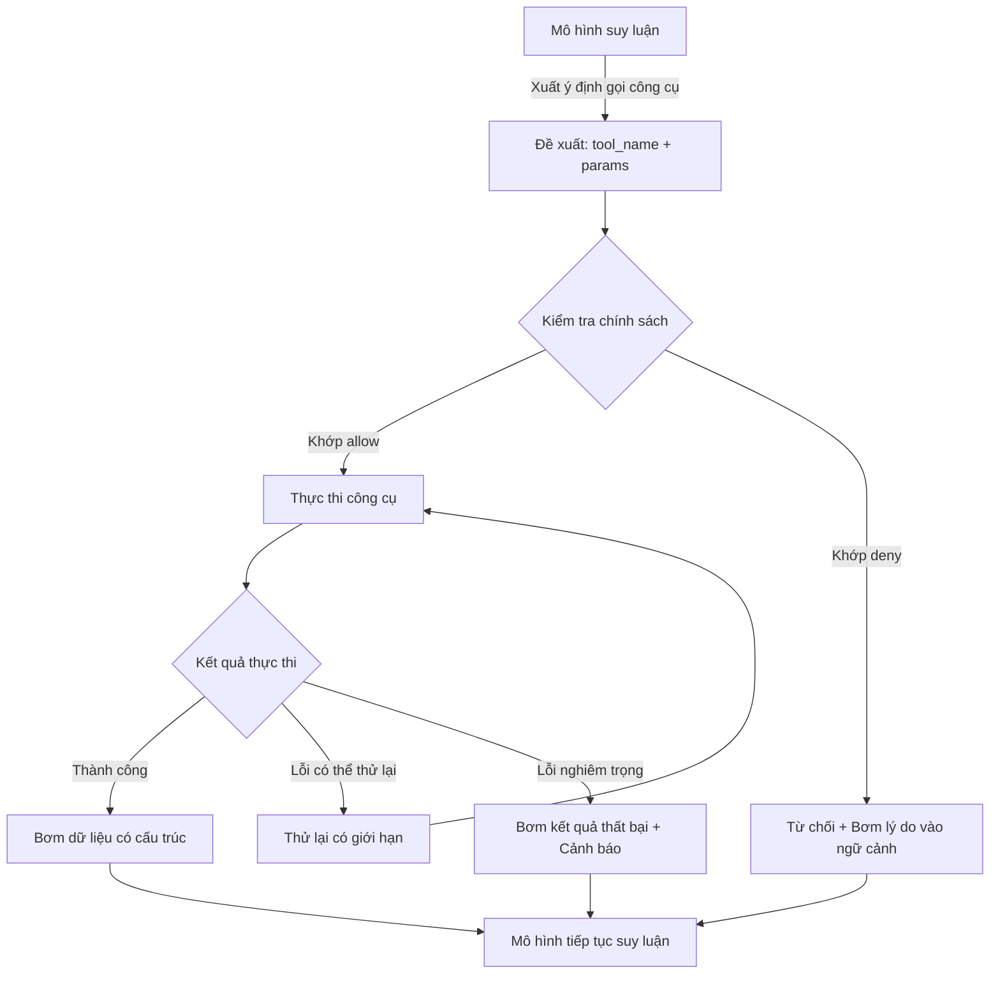
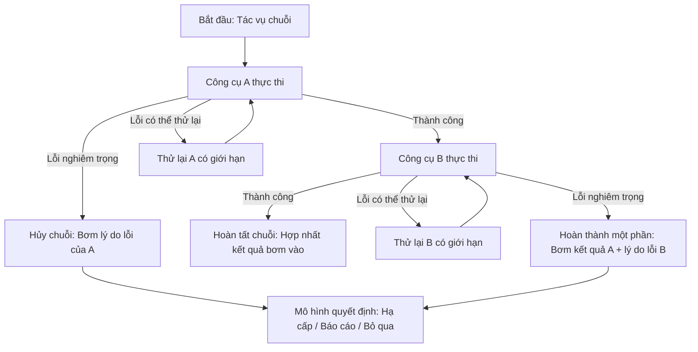

## 5.1 Danh mục Tool & Mô hình gọi thực thi

Mục này tiếp cận từ góc nhìn kỹ thuật phần mềm để khám phá cách thức xây dựng và quản trị danh mục công cụ (Tool Inventory), bao gồm các khái niệm nòng cốt như hợp đồng công cụ (Tool Contract), ngữ nghĩa lỗi (Failure Semantics), ranh giới đọc/ghi (Read-only vs Mutating), và cách thức bảo đảm tính tái hiện, khả năng phát lại (Replayability) của từng lượt gọi công cụ (hỗ trợ thực hành kiểm chứng trực tiếp trên instance cục bộ).

### 5.1.1 Rà soát danh mục công cụ: Nguồn gốc, Phân nhóm & Bảng đối soát

Xây dựng danh mục công cụ không phải để học vẹt một danh sách tĩnh (danh sách công cụ khả dụng sẽ thay đổi theo phiên bản, mẫu cấu hình, plugin và phương thức triển khai), mà là để bạn có thể trả lời rõ 3 câu hỏi trên hệ thống của mình:

1. **Tập hợp công cụ ứng viên đến từ đâu**: Tập hợp cơ sở từ `tools.profile` + Các công cụ mới do các plugin đã kích hoạt mang lại.
2. **Những công cụ nào bị chính sách cắt tỉa**: Cấu hình `tools.allow`/`tools.deny` cùng các chính sách công cụ theo nhóm, phòng chat hay peer trên từng kênh sẽ thu hẹp tập hợp ứng viên về tập hợp có thể thực thi.
3. **Một lượt gọi được kiểm toán như thế nào**: Khi một công cụ được cho phép, bị từ chối hoặc thực thi thất bại, bạn có thể kiểm tra qua lệnh `/tools`, kiểm tra runtime của plugin, Gateway deep status và nhật ký log có cấu trúc để biết "đã chạm vào quy tắc nào, thất bại ở khâu nào".

Khuyến nghị chuẩn hóa "Danh mục công cụ cục bộ của bạn" thành một bảng có thể tái sử dụng (dùng cho việc viết chính sách, nghiệm thu và gỡ lỗi sau này):

| Phân loại công cụ | Mẫu công cụ điển hình (Ví dụ) | Mức độ rủi ro | Khuyến nghị chính sách mặc định | Trọng tâm nghiệm thu |
|---|---|---|---|---|
| **Truy vấn chỉ đọc (Read-only)** | `group:web`, `read`, `memory_search` | Thấp | Mặc định cho phép (Áp dụng rate limit khi cần) | Độ chính xác, độ trễ, tính khả dụng |
| **Ghi có tác dụng phụ (Mutating Write)** | `write`, `edit`, `apply_patch`, `group:messaging` | Trung bình | Mặc định từ chối (Mở theo cổng vào/vai trò cụ thể) | Tính bất biến (Idempotency), khả năng rollback, ranh giới quyền |
| **Thực thi lệnh / Runtime** | `group:runtime` (`exec`, `process`, `code_execution`) | Cao | Mặc định từ chối (Chỉ mở trong phạm vi tối thiểu) | Danh sách trắng, kiểm toán, bán kính ảnh hưởng sự cố |
| **Tự động hóa giao diện (UI)** | `group:ui` (`browser`, `canvas`) | Cao | Mặc định từ chối (Chỉ mở khi thực sự cần thiết) | Từng bước có thể kiểm chứng, lỗi có thể khoanh vùng |
| **Công cụ mở rộng (Extension)** | `plugins.*` (Do các plugin cung cấp) | Tùy thuộc năng lực | Áp dụng whitelist cho plugin trước, rồi thu hẹp bằng chính sách tool | Bật/tắt, phát hành thử nghiệm (Canary), bằng chứng phát lại được |

> Lưu ý: Cột "Mẫu công cụ" ở bảng trên dùng để mô tả phương pháp quản trị và phân tầng rủi ro; định danh tool ID cụ thể và câu lệnh khả dụng vui lòng căn cứ theo đầu ra thực tế từ `/tools` / `/tools verbose`, lệnh `openclaw plugins inspect <id> --runtime --json`, Gateway deep status, nhật ký log có cấu trúc và tham số `--help` của từng lệnh.

Quy trình tạo/xác minh danh mục công cụ tối giản và có thể tái lập (dựa trên bằng chứng thực tế, không dựa vào trí nhớ):

1. **Bằng chứng tĩnh (Static evidence)**: Kiểm tra các khai báo `tools.profile`, `tools.allow`, `tools.deny` trong cấu hình và các chính sách phân tầng theo kênh xem ý định thu hẹp quyền hạn đã rõ ràng chưa.
2. **Bằng chứng runtime (Runtime evidence)**: Ưu tiên dùng lệnh `/tools` hoặc `/tools verbose` bên trong phiên chat để xem các công cụ khả dụng của session hiện tại; sau đó dùng `openclaw gateway status --deep --require-rpc` để xác nhận Gateway runtime sẵn sàng, kết hợp đối chiếu nhật ký log có cấu trúc khi có sự kiện cho phép/từ chối công cụ để đảm bảo quy tắc đã kích hoạt có thể truy vết được.
3. **Bằng chứng mở rộng (Extension evidence)**: Nếu đưa vào plugin, trước tiên hãy xem các tệp `openclaw.plugin.json#configSchema`, `plugins.entries.<id>.config`, `api.pluginConfig` / `api.config` và log runtime để xác nhận "plugin đã nạp chưa, đã bật chưa, có khỏe mạnh không"; sau đó dùng `openclaw plugins inspect <id> --runtime --json` / `plugins doctor` để bổ sung kiểm chứng.

Mục tiêu của mục này là chuyển đổi "công cụ là năng lực hộp đen" thành "công cụ là đối tượng kỹ thuật có thể rà soát, phân tầng và nghiệm thu". Các tiểu mục tiếp theo sẽ lần lượt giải quyết: Hợp đồng công cụ, Mô hình gọi, Bơm kết quả vào ngữ cảnh và Khả năng quan sát.

### 5.1.2 Bản chất của công cụ: Hợp đồng, Ranh giới & Ngữ nghĩa thất bại

Trong OpenClaw, "Công cụ" cần được xem là một đơn vị thực thi dưới sự kiểm soát chặt chẽ: Nó có dữ liệu đầu vào rõ ràng, dữ liệu đầu ra rõ ràng, ngữ nghĩa thất bại minh bạch, và các tác dụng phụ (Side effects) của nó bắt buộc phải kiểm toán được.

Ý nghĩa cốt lõi của việc coi công cụ là công dân hạng nhất (First-class citizen) là đưa hệ thống chuyển từ "làm việc theo cảm tính" sang "làm việc theo hợp đồng kỹ thuật". Hợp đồng tối thiểu phải trả lời được 4 câu hỏi:

- **Đầu vào là gì**: Cấu trúc tham số, các trường bắt buộc, phạm vi giá trị hợp lệ.
- **Đầu ra là gì**: Các trường dữ liệu có cấu trúc, kết luận then chốt và nguồn gốc bằng chứng.
- **Thất bại là gì**: Những lỗi nào được phép thử lại (Retryable), những lỗi nào bắt buộc phải báo thất bại ngay lập tức để cấp trên xử lý.
- **Tác dụng phụ là gì**: Thao tác có ghi vào hệ thống bên ngoài không, có khả năng hoàn tác (Rollback) không, và lộ trình rollback cụ thể là gì.

Dưới đây là một ví dụ mang tính khái niệm về hợp đồng công cụ (dùng để minh họa nguyên tắc thiết kế; tên trường và giá trị khả dụng căn cứ theo thực tế máy bạn):

```json
{
  "name": "create_ticket",
  "description": "Create a support ticket",
  "parameters": {
    "type": "object",
    "properties": {
      "title": { "type": "string" },
      "priority": { "enum": ["P1", "P2", "P3"] }
    },
    "required": ["title"]
  },
  "failure_semantics": {
    "retryable_errors": ["NetworkTimeout", "RateLimitExceeded"],
    "fatal_errors": ["Unauthorized", "InvalidFormat"]
  }
}
```

Bất cứ khi nào tác dụng phụ tồn tại, "ngữ nghĩa thất bại" bắt buộc phải được thiết kế ngay ở phía công cụ, chứ không thể trông chờ vào việc viết prompt để cứu vãn sau khi sự cố đã xảy ra.

### 5.1.3 Các mô hình gọi công cụ: Truy vấn chỉ đọc, Ghi có tác dụng phụ, Điều phối dạng chuỗi

Dựa trên ranh giới quyền hạn và luồng nghiệm thu, việc gọi công cụ có thể chia thành 3 mô hình:

- **Truy vấn chỉ đọc (Read-only Query)**: Tìm kiếm, đọc file, thống kê dữ liệu. Nghiệm thu tập trung vào "Độ chính xác, độ trễ và tính ổn định".
- **Ghi có tác dụng phụ (Mutating Write)**: Gửi tin nhắn, tạo ticket hỗ trợ, sửa cấu hình, xóa dữ liệu. Nghiệm thu tập trung vào "Phân quyền, tính bất biến (Idempotency) và khả năng hoàn tác".
- **Điều phối dạng chuỗi (Chaining Orchestration)**: Xâu chuỗi nhiều công cụ liên tiếp để hoàn thành một nhiệm vụ lớn. Nghiệm thu tập trung vào "Trạng thái trung gian có thể giải thích được, lỗi có thể khoanh vùng, và tiến trình có thể phát lại được".

Sơ đồ dưới đây mô tả vòng đời hoàn chỉnh của một lượt gọi công cụ, từ khi mô hình đề xuất đến lúc kết quả được bơm ngược vào ngữ cảnh:



Hình 5-1: Vòng đời hoàn chỉnh của một lượt gọi công cụ

Dưới góc độ kỹ thuật, chúng tôi khuyến nghị phân rã việc xâu chuỗi công cụ thành các giai đoạn có thể kiểm tra được: Mỗi bước đều phải sản sinh ra kết quả trung gian có cấu trúc và được ghi lại vào phiên hoặc nhật ký log. Bằng cách đó khi xảy ra sự cố, bạn có thể chỉ đích danh bước bị lỗi thay vì chỉ nhìn thấy một thông báo mơ hồ "Tác vụ thất bại".

**Lan truyền và xử lý lỗi trong chuỗi công cụ (Chaining)**

Khi nhiều công cụ được ghép nối tuần tự, việc xử lý lỗi ở các bước trung gian đòi hỏi chiến lược lan truyền rõ ràng. Sơ đồ dưới đây minh họa kịch bản gọi chuỗi 2 bước điển hình:



Hình 5-2: Lan truyền và xử lý lỗi trong chuỗi công cụ

Các nguyên tắc kỹ thuật cốt lõi khi xâu chuỗi công cụ:

- **Lưu trữ trạng thái trung gian (State Persistence)**: Đầu ra có cấu trúc của từng bước cần được ghi vào bản ghi phiên, bảo đảm khi gặp sự cố sẽ không làm mất phần việc đã hoàn thành trước đó.
- **Cô lập lỗi (Fault Isolation)**: Lỗi nghiêm trọng của công cụ A không nên khiến hệ thống vứt bỏ toàn bộ ngữ cảnh đã thu thập; mô hình AI cần có khả năng dựa trên kết quả từng phần để đưa ra quyết định hạ cấp (Graceful degradation) phù hợp.
- **Chuyển giao trạng thái (State Handoff)**: Một số kịch bản chuỗi đòi hỏi chia sẻ trạng thái xuyên qua các bước (chẳng hạn trạng thái đăng nhập trên trình duyệt), hợp đồng công cụ cần quy định rõ trạng thái nào được phép chuyển giao và vòng đời của chúng kéo dài bao lâu.

### 5.1.4 Nguyên tắc bơm ngược kết quả (Result Injection): Biến dữ liệu thô thành bằng chứng có thể tái sử dụng

Nếu kết quả thực thi của công cụ được bơm nguyên xi (Raw output) vào ngữ cảnh, hậu quả thường thấy là làm bùng nổ dung lượng context và thất thoát bằng chứng cốt lõi. Cách bơm kết quả an toàn và vững chắc là cấu trúc "3 phần rõ ràng":

1. **Tóm tắt kết luận**: Kết luận mấu chốt thu được từ lượt gọi công cụ lần này (có thể dùng trực tiếp để phản hồi người dùng).
2. **Trích dẫn bằng chứng**: Các trường dữ liệu cốt lõi, dấu thời gian (Timestamp), định danh nguồn (để dễ dàng truy vết).
3. **Đầu ra nguyên bản**: Chỉ giữ lại khi thực sự cần thiết, tránh đưa khối lượng văn bản rác khổng lồ vào ngữ cảnh.

Dưới đây là một ví dụ nhật ký bơm kết quả chuẩn hóa:

```json
{
  "summary": "User account is active but password expired.",
  "evidence": {
    "account_id": "u_12345",
    "status": "active",
    "last_login": "YYYY-MM-DDTHH:MM:SSZ"
  },
  "raw_output": "{\"db_record\": {...}}"
}
```

Mục tiêu của cấu trúc này là giúp các vòng suy luận tiếp theo có thể trực tiếp trích dẫn "bằng chứng xác thực", thay vì phải đọc lại một đoạn văn bản dài đầy nhiễu.

> [!TIP]
> Cơ chế bơm kết quả 3 phần ảnh hưởng trực tiếp đến chất lượng xây dựng ngữ cảnh và ngân sách Token sau này. Khi phiên hội thoại kéo dài, cách thức cắt tỉa và nén kết quả công cụ trong cửa sổ ngữ cảnh giới hạn được trình bày chi tiết tại [Chương 6: Ngữ cảnh và bộ nhớ](../06_context_memory/README.md).

### 5.1.5 Khả năng quan sát (Observability): Làm thế nào để một lượt gọi công cụ có thể tái hiện và phát lại

Độ tin cậy của hệ thống công cụ bắt nguồn từ khả năng quan sát. Chúng tôi khuyến nghị cố định thông tin tối thiểu của một lượt gọi công cụ thành một bản ghi gồm:

- **Tóm lược đầu vào**: Các trường tham số then chốt (đã ẩn thông tin nhạy cảm).
- **Phán quyết quyền hạn**: Lý do vì sao cho phép hoặc từ chối (đã chạm vào quy tắc chính sách nào).
- **Kết quả thực thi**: Thành công / Thất bại, thời gian tiêu tốn, phân loại lỗi.
- **Nội dung bơm vào ngữ cảnh**: Bản tóm tắt và các định danh bằng chứng đã được ghi vào context.

Khi phát sinh hiện tượng "cùng một tác vụ nhưng thỉnh thoảng lại thất bại ngẫu nhiên", phản xạ đầu tiên không nên là vội vàng đi sửa câu chữ trong prompt, mà hãy phát lại (Replay) trường hợp lỗi đó trên chính bản ghi gọi công cụ, tái hiện được vấn đề rồi mới tiến hành tìm kiếm nguyên nhân gốc rễ.
