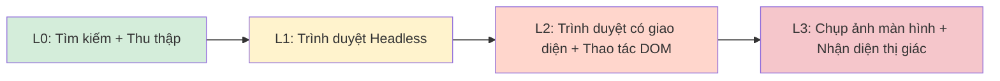

## 5.4 Công cụ trình duyệt (Browser Tool) & Tự động hóa web

Công cụ trình duyệt (Browser Tool) dùng để chuyển đổi các tương tác như "truy cập web, đăng nhập, click chuột, thu thập dữ liệu (cào web)" thành các lệnh gọi công cụ có thể kiểm soát, giúp Agent chủ động lấy thông tin từ web hoặc thực thi các tác vụ tự động. Mục này làm rõ ranh giới an toàn, phương thức sử dụng và cách đưa tự động hóa web vào chính sách công cụ cũng như quy trình xử lý sự cố khép kín.

### 5.4.1 Ranh giới an toàn: Ưu tiên cô lập, xem trạng thái đăng nhập là thông tin nhạy cảm

Công cụ trình duyệt là một trong những bề mặt tấn công lớn nhất đối với hệ thống Agent: Khả năng truy cập xuyên trang (Cross-site), đọc nội dung trang web, kích hoạt các tác dụng phụ bên ngoài, và thậm chí có thể thực thi mã JavaScript tùy ý. **Trước khi bàn đến bất kỳ câu lệnh hay phân tầng nào, bắt buộc phải thiết lập ranh giới an toàn trước.**

Tài liệu [Browser chính thức](https://docs.openclaw.ai/tools/browser) nhấn mạnh các nguyên tắc sau:

- **Luôn sử dụng hồ sơ trình duyệt `openclaw` tách biệt**: Hệ thống mặc định tạo một Browser Profile độc lập, cách ly hoàn toàn với trình duyệt cá nhân của bạn. Tuyệt đối không bao giờ gắn Agent vào profile trình duyệt mà bạn đang sử dụng hàng ngày.
- **Xem trạng thái đăng nhập là dữ liệu nhạy cảm**: Profile `openclaw` có thể lưu giữ các phiên đăng nhập (Cookie, Token). Một profile đang duy trì phiên đăng nhập tương đương với việc nắm giữ chứng thư xác thực, cần được quản lý như tài nguyên nhạy cảm và tránh lộ ra ở các cổng vào không đáng tin cậy.
- **Hồ sơ `user` chỉ dùng khi có người ngồi giám sát trực tiếp**: Profile `user` sẽ gắn trực tiếp vào phiên Chrome thực tế của bạn, mang theo toàn bộ trạng thái đăng nhập của bạn. Bạn chỉ nên kích hoạt nó khi đang ngồi trước màn hình máy tính và có thể phê duyệt từng hành động theo thời gian thực.
- **Cổng điều khiển trình duyệt chỉ lắng nghe trên loopback**: Cổng giao thức Chrome DevTools Protocol (CDP) mặc định chỉ lắng nghe trên `127.0.0.1`, không mở ra ngoài mạng. Nếu dùng CDP từ xa, bắt buộc phải đi qua đường hầm SSH/Tunnel bảo mật, tuyệt đối không mở thẳng ra Internet công cộng.
- **Phòng thủ tấn công SSRF**: Mặc định kích hoạt chính sách SSRF nghiêm ngặt, ngăn chặn trình duyệt truy cập vào các dải địa chỉ IP nội bộ / mạng riêng.
- **Thận trọng khi cho phép thực thi JavaScript**: Các lệnh như `browser act kind=evaluate`, `openclaw browser evaluate` và `wait --fn` có thể thực thi mã JS tùy ý, tiềm ẩn nguy cơ bị tấn công Prompt Injection để chạy mã độc. Nếu không thực sự cần thiết, nên vô hiệu hóa thông qua cấu hình `browser.evaluateEnabled=false`.

> [!WARNING]
> Đường cơ sở an toàn cho công cụ trình duyệt gồm 3 tuyến phòng thủ bất di bất dịch: **Cô lập Profile + Ràng buộc Loopback + Chính sách chống SSRF**. Thiếu bất kỳ tuyến nào cũng có thể biến Agent của bạn thành bàn đạp để kẻ tấn công xâm nhập hệ thống.

### 5.4.2 Năng lực & Chính sách: Biến thao tác web thành công cụ có ranh giới

Trên nền tảng ranh giới an toàn, bạn dùng chính sách công cụ để kiểm soát Agent nào được phép dùng trình duyệt; quy tắc từ chối luôn ưu tiên hơn quy tắc cho phép. Chi tiết xem tại [Mục 5.2 Chính sách Tool](5.2_tool_policy.md) và [Tài liệu Tools chính thức](https://docs.openclaw.ai/tools).

Cần lưu ý: Cấu hình `tools.profile: "coding"` mặc định bao gồm `web_search`/`web_fetch`, nhưng **không chứa** `browser`. Khi muốn bật tự động hóa trình duyệt hoàn chỉnh, bạn phải mở quyền tường minh qua `tools.alsoAllow: ["browser"]` hoặc `agents.entries.*.tools.alsoAllow: ["browser"]`, đồng thời xác nhận plugin trình duyệt đã nằm trong danh sách `plugins.allow`.

Về mặt quy trình tương tác: Hãy phân rã thao tác web thành từng bước có thể kiểm chứng, mỗi bước đều có điều kiện thành công rõ ràng, và khi thất bại phải xuất ra được câu lệnh chẩn đoán cho bước tiếp theo.

### 5.4.3 Phân tầng năng lực trình duyệt: 4 cấp độ từ tìm kiếm đến thị giác

Không phải tương tác web nào cũng cần bật cả một trình duyệt đầy đủ. Trong thực tế, các năng lực liên quan đến web được chia thành 4 cấp độ tăng dần dựa trên chi phí, độ phức tạp và kịch bản áp dụng. **Nguyên tắc vàng: Ưu tiên dùng cấp độ thấp, chỉ nâng cấp lên tầng cao hơn khi tầng dưới không đáp ứng nổi.**



**Bảng chi tiết 4 tầng năng lực**

| Cấp độ | Năng lực | Kịch bản áp dụng | Phụ thuộc | Hiệu năng & Chi phí |
|---|---|---|---|---|
| **L0** | Công cụ tìm kiếm + Thu thập web | Tra cứu thông tin thường ngày (Bao phủ 80% trường hợp) | `web_search` / `web_fetch` + Readability; có thể cấu hình Firecrawl dự phòng | Thấp nhất |
| **L1** | Trình duyệt không giao diện (Headless Chrome) | Các trang Single Page App (SPA) cần JavaScript render | Headless Chrome | Thấp |
| **L2** | Trình duyệt có giao diện + Thao tác DOM | Cần đăng nhập, điền form, click nút bấm | Chrome + Màn hình ảo (Xvfb) | Trung bình, cần RAM ≥ 4GB |
| **L3** | Chụp màn hình + Nhận diện thị giác | Thông tin chỉ nằm trong ảnh (ảnh sản phẩm, biểu đồ, bảng thông số) | Trình duyệt có giao diện + Mô hình đa phương thức (Multimodal LLM) | Cao nhất, tốc độ chậm nhất |

**Quy tắc ra quyết định**:

1. Trước tiên hãy thử L0: Nếu lấy được thông tin qua tìm kiếm + cào web thuần túy thì tuyệt đối không khởi động trình duyệt.
2. L0 cào về trang trắng (triệu chứng điển hình: trang SPA chỉ có khung HTML rỗng) → Nâng cấp lên L1.
3. L1 vẫn không hoàn thành được (cần đăng nhập, click chuột, điền form biểu mẫu) → Nâng cấp lên L2.
4. Thông tin L2 không lấy được bằng text (nằm nhúng trong ảnh hoặc đồ thị phức tạp) → Cuối cùng mới dùng tới L3.

> [!NOTE]
> Trên máy chủ đám mây chạy Linux, khi dùng L2 và L3 ở chế độ có giao diện thì mới cần dịch vụ màn hình ảo (như Xvfb). Mặc định Linux sẽ tự thoái lui về headless nếu không phát hiện màn hình hiển thị; gói `chromium-browser` trên Ubuntu đôi khi chỉ là vỏ bọc Snap, trong môi trường sản xuất khuyến nghị cài đặt trực tiếp gói Google Chrome `.deb` chính thức và cài bổ sung gói font `fonts-noto-cjk`.

### 5.4.4 Các câu lệnh thông dụng: Khởi động, Kiểm tra & Mở trang web

Dưới đây là các điểm điều khiển trình duyệt thường dùng; bên cạnh `doctor`, `status`, `start`, `stop`, `tabs`, `open`, `snapshot`, CLI hiện tại còn cung cấp các lệnh chụp ảnh màn hình, xem console/lỗi/request, xuất PDF, điều hướng, click, nhập liệu, kéo thả, chờ đợi, thực thi JS, quản lý Cookie/Storage và giả lập thiết bị di động:

```bash
openclaw browser status
openclaw browser doctor
openclaw browser start
```

Khi dịch vụ trình duyệt đã sẵn sàng, bạn có thể dùng `browser open` để mở nhanh trang web mục tiêu nhằm xác minh môi trường mạng có thông suốt hay không:

```bash
openclaw browser open "https://example.com"
```

Khi muốn tắt dịch vụ trình duyệt để giải phóng tài nguyên:

```bash
openclaw browser stop
```

### 5.4.5 Phối hợp với công cụ Web: Ưu tiên công cụ đọc, chỉ dùng trình duyệt khi bắt buộc

Các năng lực liên quan đến web chia làm 2 nhóm:

1. **Nhóm lấy dữ liệu và đọc nội dung**: Phù hợp dùng công cụ web thuần (`web_fetch`), kết quả trả về có cấu trúc và dễ bơm ngược vào ngữ cảnh hơn.
2. **Nhóm bắt buộc phải có tương tác**: Như trang web sau khi đăng nhập, biểu mẫu phức tạp hoặc trang cần chạy script thì mới đưa công cụ trình duyệt vào.

Về mặt công nghệ, hãy ưu tiên các công cụ đọc thông tin trước, chỉ dùng trình duyệt khi các công cụ đọc không thể đáp ứng, nhằm giảm thiểu bề mặt phát sinh sự cố từ các tương tác bất định.

Công cụ `web_fetch` tích hợp sẵn dùng HTTP GET kết hợp bóc tách Readability, phù hợp cho đa số kịch bản đọc tin tức và bài viết nhưng không chạy JavaScript (các trang SPA sẽ bị trắng). Nếu gặp hạn chế này, bạn có thể cấu hình Firecrawl làm backend provider dự phòng cho `web_fetch` trong `plugins.entries.firecrawl.config.webFetch.*`, thay vì xem Firecrawl là một skill tự viết.

### 5.4.6 Nghiệm thu & Xử lý sự cố: Dùng lệnh trạng thái và nhật ký log để định vị phân tầng

Quy trình khoanh vùng sự cố liên quan đến trình duyệt:

1. Dùng `browser status` để xem dịch vụ trình duyệt có đang online không.
2. Dùng `browser open` để kiểm tra kết nối mạng và khả năng tải trang web mục tiêu.
3. Dùng nhật ký log của hệ thống để xác định nguyên nhân có phải do chính sách công cụ (Tool policy), định tuyến hoặc phiên hội thoại hay không.

```bash
openclaw browser status
openclaw status --deep
openclaw logs --follow --json
```

Khi gặp hiện tượng "Mở được trang web nhưng Agent không chịu thực hiện nhiệm vụ", hãy ưu tiên kiểm tra xem chính sách công cụ có vô tình từ chối các tool trình duyệt không; khi gặp lỗi "Trình duyệt không thể khởi động", hãy kiểm tra môi trường phụ thuộc bằng lệnh `doctor` để nhận kết quả tự kiểm tra có cấu trúc:

```bash
openclaw doctor
```
