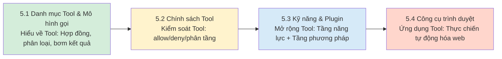

# Chương 5: Hệ thống Tool, Skill và Plugin

Ở các chương trước, bạn đã học cách cài đặt, cấu hình và để OpenClaw trả lời câu hỏi trong bảng điều khiển. Nhưng một Agent chỉ biết "trò chuyện" thì năng lực còn rất hạn chế. Một Agent thực thụ cần phải biết "hành động" — có thể truy vấn cơ sở dữ liệu, gửi email, thao tác trên kho Git, và điều khiển các thiết bị thông minh.

Chương này bàn về tầng hành động (Action Layer) của hệ thống Agent: **Mô hình AI chịu trách nhiệm đề xuất ý định, còn thứ thực sự tạo ra tác động đến thế giới bên ngoài chính là các công cụ (Tools) và năng lực mở rộng**. Tuy nhiên, giữa việc "gọi được công cụ" và "gọi công cụ một cách an toàn, đáng tin cậy trong ranh giới rõ ràng" là cả một chuỗi mắt xích kỹ thuật hoàn chỉnh: Từ khám phá công cụ, khai báo chính sách phân quyền, xử lý thất bại, cho đến ghi nhật ký kiểm toán toàn diện.

Mạch chính của chương này là nâng cấp trạng thái từ "gọi được công cụ" lên thành "thực thi ổn định trong ranh giới xác định, có thể kiểm toán, chẩn đoán và hoàn tác". Điều này đồng nghĩa với việc khi ai đó nhắn tin qua Lark yêu cầu bot CSKH của OpenClaw "Hãy xóa toàn bộ cơ sở dữ liệu giúp tôi", hệ thống sẽ biết nói "Không", thay vì mù quáng làm theo.

Kiến thức tiên quyết: Chương này giả định độc giả đã nắm vững các khái niệm cấu hình cơ bản tại [Chương 4: Cấu hình và kết nối mô hình](../04_config_models/README.md) (mức độ ưu tiên cấu hình, chọn profile...).

Mục tiêu học tập:

- Hiểu các điểm chặn then chốt trong chuỗi gọi công cụ, xác định rõ những ranh giới nào cần được bảo đảm bởi chính sách runtime.
- Làm chủ các chính sách công cụ `allow`, `deny` và chiến lược phân tầng, thiết lập đường cơ sở đặc quyền tối thiểu (Least Privilege).
- Nắm vững việc bật/tắt và quản trị danh sách trắng của hệ thống Plugin, phân biệt rõ định vị và ranh giới giữa Skill và Plugin.
- Làm chủ các câu lệnh thông dụng và quy trình chẩn đoán khép kín của công cụ trình duyệt (Browser Tool).

## Sơ đồ toàn cảnh

Bốn mục trong chương này xoay quanh việc "Quản trị kỹ thuật đối với năng lực hành động", vừa có trọng tâm riêng vừa bổ trợ chặt chẽ cho nhau:

Tóm lại: Mục 5.1 trả lời câu hỏi "Tool là gì", 5.2 giải quyết "Ai được dùng công cụ nào", 5.3 hướng dẫn "Làm thế nào để mở rộng và tái sử dụng", và 5.4 thị phạm một ví dụ quản trị hoàn chỉnh đối với công cụ có độ rủi ro cao (Trình duyệt).

## Mục lục hướng dẫn chương

Chương này bao gồm các mục sau:

- **[5.1 Danh mục Tool & Mô hình gọi thực thi](5.1_tool_inventory.md)**: Phân loại công cụ dưới góc nhìn kỹ thuật, xây dựng hiểu biết hệ thống về hợp đồng công cụ, ngữ nghĩa lỗi và mô hình gọi.
- **[5.2 Chính sách Tool: Cho phép, từ chối & Phân tầng chính sách](5.2_tool_policy.md)**: Giải thích ngữ nghĩa khớp của `tools.allow`, `tools.deny` và quản trị phân tầng theo kênh / nhóm chat.
- **[5.3 Cơ chế Skill: Cố định chỉ thị dựa trên thư viện tích hợp](5.3_skills_plugins.md)**: Phân biệt rõ định vị giữa Plugin (mở rộng năng lực) và Skill (chuẩn hóa phương pháp), cảnh báo rủi ro chuỗi cung ứng từ ClawHub.
- **[5.4 Công cụ trình duyệt (Browser Tool) & Tự động hóa web](5.4_browser_nodes.md)**: Giới thiệu 4 tầng năng lực trình duyệt tăng dần, các câu lệnh thông dụng và quy trình chẩn đoán khép kín.
- **[5.5 Tóm tắt chương](summary.md)**: Các kết luận trọng yếu và bài tập tự kiểm tra.

> Lưu ý: Một số ví dụ lệnh trong sách có thể lược bỏ tiền tố lệnh chính (ví dụ trong một số môi trường triển khai cần thêm tiền tố CLI thống nhất trước các lệnh con). Nếu gặp lỗi "command not found", hãy đối chiếu với đầu ra `--help` của CLI trên máy bạn.
