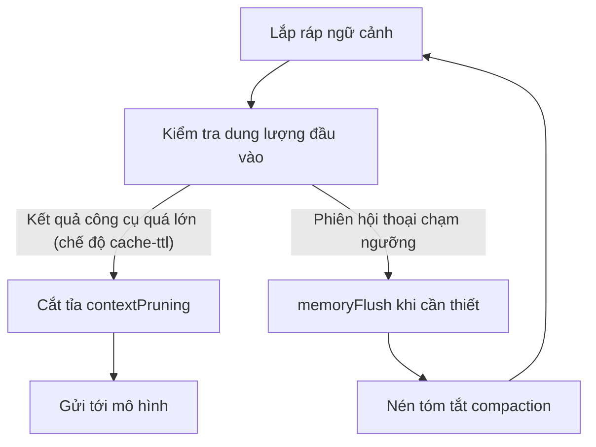

## 6.4 Nén và cắt tỉa: Chiến lược thu gọn và loại bỏ ngữ cảnh

Mục này là tài liệu tham khảo duy nhất cho các cơ chế và tham số quản trị các phiên hội thoại dài. [Mục 6.2](6.2_context_building.md) đã giải thích "Cách thức lắp ráp thông tin vào ngữ cảnh", còn mục này sẽ giải quyết câu hỏi: "Khi ngữ cảnh phình to vượt quá sức chứa thì xử lý như thế nào?". Hai cơ chế có thể cấu hình là: **Cắt tỉa kết quả công cụ (Pruning)**, do `agents.defaults.contextPruning` kiểm soát, nhằm cắt bớt các kết quả tool cũ để giảm dung lượng đầu vào gửi cho mô hình; và **Nén phiên làm việc (Compaction)**, do `agents.defaults.compaction` kiểm soát, nhằm sinh bản tóm tắt tinh gọn và xả bộ nhớ dài hạn khi phiên chạm ngưỡng dung lượng. Hai cơ chế này phối hợp chặt chẽ để vừa duy trì tính khả dụng vừa bảo đảm khả năng phát lại (Replayability) trong các phiên hội thoại dài.

### 6.4.1 Phân biệt khái niệm cốt lõi: Nén (Compaction) vs Cắt tỉa (Pruning)

Khi xử lý bài toán bùng nổ ngữ cảnh, người mới rất dễ nhầm lẫn giữa hai cơ chế này. Sự khác biệt bản chất thể hiện ở "tính bền vững trên đĩa" và "thời điểm kích hoạt trong vòng đời":

- **Cắt tỉa ngữ cảnh (Pruning, do `contextPruning` điều khiển)**:
  Diễn ra **ngay trước khi gọi mô hình ngôn ngữ lớn (LLM)**. Hệ thống tạm thời loại bỏ các kết quả công cụ quá cũ nhằm giảm tải cho một lượt request duy nhất hoặc tránh làm mất cache. Nó **hoàn toàn không sửa đổi tệp lịch sử trên đĩa**, chỉ tác động tạm thời lên cấu trúc dữ liệu trong bộ nhớ RAM.
- **Nén phiên làm việc (Compaction, do `compaction` điều khiển)**:
  Diễn ra **khi phiên hội thoại chuẩn bị chạm trần dung lượng cho phép**. Hệ thống gấp gọn toàn bộ nội dung trò chuyện dài dòng trước đó thành một bản tóm tắt súc tích, và **ghi đè bền vững ngược lại vào tệp nhật ký `JSONL`**, giúp giải phóng không gian để các vòng đối thoại mới tiếp tục diễn ra trơn tru.

Tài liệu tham khảo chính thức:
- Cắt tỉa kết quả công cụ: [Session Pruning & contextPruning](https://docs.openclaw.ai/concepts/session-pruning)
- Khái niệm nén: [Compaction](https://docs.openclaw.ai/concepts/compaction)

> [!IMPORTANT]
> Cơ chế Cắt tỉa (Pruning) hiện tại xoay quanh chế độ `mode: "cache-ttl"`, và thường phát huy giá trị lớn nhất trên lộ trình Anthropic; tuy nhiên điều này không có nghĩa là "chỉ có tác dụng với Anthropic". Cấu hình hiện tại cho phép bật tường minh `contextPruning` trên các provider khác. Còn Nén phiên (Compaction) là cơ chế quản trị phiên dài mang tính tổng quát hơn. Hai cơ chế bổ trợ cho nhau nhưng vận hành độc lập.

### 6.4.2 Luồng kích hoạt: Cắt tỉa kết quả công cụ trước, Nén phiên sau

Sơ đồ dưới đây thể hiện trình tự kích hoạt điển hình:



Hình 6-2: Trình tự kích hoạt điển hình giữa Cắt tỉa và Nén

### 6.4.3 Cắt tỉa kết quả công cụ (Pruning): Tham số & Cơ chế nội bộ

Hiểu rõ các tham số cắt tỉa sẽ giúp bạn tinh chỉnh chính xác trong môi trường sản xuất. Các tham số mặc định của `agents.defaults.contextPruning`:

| Tham số | Giá trị mặc định | Giải thích ý nghĩa |
|---|---|---|
| `mode` | `"cache-ttl"` | Chế độ cắt tỉa |
| `ttl` | `"5m"` | Thời gian sống TTL của bộ nhớ đệm |
| `tools` | `{allow, deny}` | Giới hạn phạm vi cắt tỉa theo tên công cụ (gồm 2 danh sách allow/deny) |
| `hardClear.enabled` | `true` | Có bật cơ chế xóa cứng hay không |
| `hardClear.placeholder` | `"[Old tool result content cleared]"` | Văn bản giữ chỗ điền vào sau khi xóa cứng |

Cắt tỉa được thực thi qua **2 giai đoạn**: Giai đoạn một (softTrim) sẽ cắt ngắn kết quả công cụ quá dài thành "1500 ký tự đầu + `...` + 1500 ký tự cuối"; Giai đoạn hai (hardClear) sẽ dùng chuỗi giữ chỗ `[Old tool result content cleared]` để thay thế toàn bộ kết quả.

**Ba ràng buộc an toàn then chốt** (Quy tắc cố định trong mã nguồn):

- **Khối hình ảnh được thay thế trước khi cắt tỉa**: Kết quả công cụ chứa hình ảnh sẽ không được giữ nguyên; mã nguồn sẽ thay hình ảnh bằng văn bản giữ chỗ trước, sau đó tin nhắn đó vẫn có thể tiếp tục đi vào soft-trim hoặc hard-clear.
- **Bảo vệ tin nhắn khởi tạo (Bootstrap)**: Toàn bộ nội dung xuất hiện trước tin nhắn đầu tiên của người dùng (đọc tệp SOUL.md, USER.md...) tuyệt đối không tham gia vào quá trình cắt tỉa.
- **Bộ lọc tên công cụ**: Dùng mẫu glob trong `tools.deny` để loại trừ các công cụ không được phép cắt tỉa; trong khi `tools.allow` là danh sách các công cụ được phép cắt tỉa.

**Ước lượng Token**: Mã nguồn dùng `CHARS_PER_TOKEN_ESTIMATE = 4` làm cơ sở ước lượng (tiếng Anh khoảng 4 ký tự ≈ 1 token), đồng thời bộ ước lượng nhận biết CJK sẽ phóng đại các văn bản phi Latinh theo tỷ lệ gần 1 ký tự ≈ 1 token; hình ảnh được tính vào ngân sách theo `IMAGE_CHAR_ESTIMATE = 8000` ký tự (tương đương khoảng 2000 token cho một bức ảnh).

Lưu ý: Một số tùy chọn đã được tinh gọn và cố định bên trong mã nguồn từ phiên bản v2026.8.1 (như bảo vệ số lượng tin nhắn trợ lý gần nhất, ngưỡng kích hoạt soft-trim khoảng 4.000 ký tự, ngưỡng hard-clear khoảng 50.000 ký tự); các tham số này không còn cần khai báo thủ công trong cấu hình.

Tiêu chí nghiệm thu:
- Dung lượng đầu vào của phiên dài duy trì ổn định, chi phí Token và độ trễ không tăng tuyến tính theo thời gian.
- Việc cắt tỉa không làm mất các đoạn bằng chứng quan trọng, tính nhất quán khi phát lại ở mức chấp nhận được.

### 6.4.4 Bảo toàn định danh & Lọc an toàn trong quá trình nén (Compaction)

Bản chất của Nén (Compaction) là yêu cầu LLM đọc lại lịch sử cuộc trò chuyện và tạo ra một bản tóm tắt. Tuy nhiên, LLM khi tóm tắt thường có xu hướng nguy hiểm: **Vô tình làm sai lệch các định danh bất biến (Opaque identifiers)** — tự ý rút ngắn chuỗi UUID, bỏ bớt ký tự trong API Key, hoặc lược bỏ tham số trên URL. Điều này sẽ dẫn đến các lỗi ngầm cực kỳ khó chẩn đoán trong các lượt gọi công cụ tiếp theo.

Mã nguồn (`compaction.ts`) tích hợp sẵn **Chỉ thị bảo toàn định danh** (`IDENTIFIER_PRESERVATION_INSTRUCTIONS`), tự động chèn vào mỗi yêu cầu nén tóm tắt:

> "Preserve opaque identifiers exactly as written, including UUIDs, hashes, IDs, hostnames, IPs, ports, URLs, and file names."
> *(Bảo toàn nguyên vẹn tuyệt đối các định danh không trong suốt như UUID, hash, ID, tên miền máy chủ, địa chỉ IP, cổng, URL và tên tệp).*

Chỉ thị này hỗ trợ 3 chế độ: `"strict"` (mặc định, luôn chèn), `"off"` (tắt), và `"custom"` (dùng chỉ thị tự viết).

**Chiến lược tóm tắt phân đoạn (Batch Summarization)**: Khi cuộc đối thoại quá dài không thể tóm tắt một lần, hệ thống sẽ tự động cắt tin nhắn thành N đoạn bằng nhau (mặc định 2 đoạn) theo tỷ lệ token, tóm tắt độc lập từng đoạn rồi mới gộp lại. Quá trình gộp bắt buộc phải bảo tồn trạng thái tác vụ đang chạy, tiến độ công việc (ví dụ: "Đã hoàn thành 5/17"), yêu cầu cuối cùng của người dùng, lý do đưa ra quyết định và danh sách việc cần làm.

**Lọc an toàn kết quả công cụ**: Trước khi nén, hàm `stripToolResultDetails()` sẽ bóc tách loại bỏ toàn bộ trường `details` trong các kết quả công cụ. Ghi chú trong mã nguồn chỉ rõ: "Trường details của công cụ có thể chứa payload không đáng tin cậy hoặc quá rườm rà; tuyệt đối không đưa vào ngữ cảnh nén của LLM." Điều này vừa tiết kiệm Token vừa triệt tiêu nguy cơ tấn công Prompt Injection ẩn trong đầu ra của công cụ.

**Hạ cấp tin nhắn siêu lớn**: Nếu một tin nhắn đơn lẻ chiếm hơn 50% cửa sổ ngữ cảnh, nó sẽ được loại khỏi bản tóm tắt và thay bằng một dòng chú thích (ví dụ: `[Large assistant (~45K tokens) omitted from summary]`).

### 6.4.5 Cơ chế xả bộ nhớ trước khi nén (Pre-compaction Memory Flush)

Trước khi thực hiện nén và thu gọn hội thoại, OpenClaw sẽ tạo cơ hội cho Agent chủ động lưu lại các thông tin trọng yếu. Tham số `softThresholdTokens` đóng vai trò là "khoảng đệm kích hoạt sớm": Điểm kích hoạt thực tế diễn ra khi dung lượng chạm mốc `contextWindowTokens - effectiveReserveTokens - softThresholdTokens`. Khi chạm ngưỡng này, hệ thống sẽ chèn một **vòng chạy ngầm của Agent**, cho phép mô hình lưu trữ nội dung cốt lõi vào bộ nhớ bền vững.

Quy trình 6 bước xả bộ nhớ trước khi nén:

1. **Giám sát liên tục**: Theo dõi sát sao mức tiêu thụ Token của phiên hiện tại theo thời gian thực.
2. **Kích hoạt cảnh báo mềm**: Khi ngân sách còn lại chạm ngưỡng cảnh báo, quy trình xả bộ nhớ được khởi động.
3. **Bơm chỉ thị nội bộ**: Gửi chỉ thị nội bộ cho mô hình: "Ngữ cảnh sắp bị nén, vui lòng lưu trữ các thông tin quan trọng".
4. **Ghi nhớ xuống đĩa**: Agent thực hiện hành động ghi nhớ, lưu các sự thật và ngữ cảnh then chốt vào tệp bền vững (như `memory/YYYY-MM-DD.md`).
5. **Xác nhận ngầm**: Agent phản hồi chuỗi ký tự đặc trưng `NO_REPLY` để kết thúc vòng; chuỗi này hoàn toàn vô hình trước mắt người dùng.
6. **Nén chính thức**: Sau khi ký ức đã hạ cánh an toàn xuống đĩa cứng, hệ thống mới tiến hành nén và gấp gọn lịch sử.

Cơ chế memory flush trước khi nén được bật mặc định:

```jsonc
{
  agents: {
    defaults: {
      compaction: {
        memoryFlush: {
          // Mặc định bật; chỉ đặt false khi cần tắt
          softThresholdTokens: 4000 // Ngưỡng dung lượng kích hoạt sớm trong im lặng
        }
      }
    }
  }
}
```

Lưu ý: Nếu chính sách bảo mật giới hạn quyền ghi vào thư mục workspace (ví dụ đặt `workspaceAccess: "ro"` hoặc `"none"`), quy trình xả bộ nhớ thông minh này sẽ tự động được bỏ qua.

### 6.4.6 Câu lệnh chẩn đoán sự cố: Ưu tiên trạng thái, theo sát log sự kiện

Kiểm tra trạng thái hệ thống:

```bash
openclaw status --deep
openclaw logs --limit 500 --json
```

Thống kê số lần kích hoạt cắt tỉa kết quả công cụ để đánh giá tần suất:

```bash
cat runtime.log | rg "Tool result trimmed" | wc -l
```
