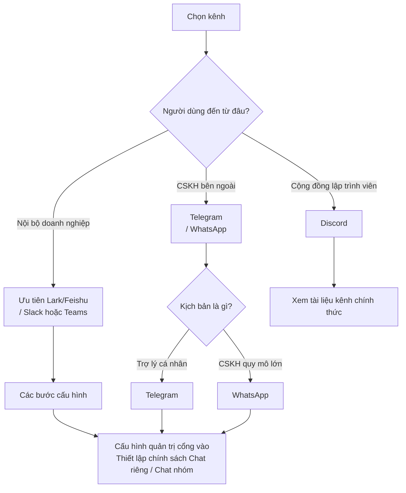

## 7.1 Kết nối kênh liên lạc & Quản trị cổng vào (Telegram, WhatsApp)

Khi OpenClaw của bạn mở rộng từ môi trường phát triển cục bộ ra môi trường sản xuất thực tế, quyết định đầu tiên bạn phải đối mặt là: Nên kết nối vào kênh nào? Bot chat riêng trên Telegram, trợ lý CSKH 24/7 trên WhatsApp, hay trợ lý nhóm làm việc nội bộ trên Lark/Feishu? Mỗi kênh đều mang tâm lý người dùng, rủi ro bảo mật và mô hình tương tác hoàn toàn khác nhau. Mục này sẽ giúp bạn làm sáng tỏ các lựa chọn đó.

**Cây quyết định lựa chọn kênh liên lạc**

Sơ đồ dưới đây giúp bạn nhanh chóng đánh giá thứ tự ưu tiên:



Mục này lấy Telegram và WhatsApp làm ví dụ điển hình để thông suốt quy trình từ cấu hình thông tin định danh đến nhận gửi tin nhắn, sau đó phân tích chiến lược cách ly đa tài khoản. Cần lưu ý: **Kênh Telegram đã được kiểm chứng thực tế trong môi trường live**; phần WhatsApp được tổng hợp dựa trên tài liệu chính thức và các mô hình triển khai phổ biến, bạn nên kiểm chứng lại trong môi trường của mình trước khi áp dụng. Việc kết nối Lark/Feishu do liên quan đến quy trình ủy quyền Nền tảng mở (Open Platform) nên được trình bày độc lập tại [Mục 7.2](7.2_lark_integration.md).

### 7.1.1 Nguyên tắc đầu tiên của quản trị cổng vào: Tách biệt Chat riêng và Chat nhóm

Dù kết nối vào bất kỳ kênh nào, việc quản trị cổng vào đều bắt đầu từ 2 trường chính sách: `dmPolicy` (Chat riêng) và `groupPolicy` (Chat nhóm). Hai trường này được cấu hình hoàn toàn độc lập và không can thiệp lẫn nhau.

Khuyến nghị lấy nguyên tắc "Khởi đầu thận trọng" làm mặc định: Nhóm chat chỉ phản hồi khi được @ nhắc tên, còn chat riêng thu hẹp về danh sách trắng (Allowlist) hoặc phê duyệt ghép nối (Pairing approval).

### 7.1.2 Telegram: Bot Token và chính sách Chat riêng / Chat nhóm

**Vì sao chọn Telegram**

Telegram phù hợp nhất với 2 kịch bản: (1) Trợ lý chat riêng cho cá nhân lập trình viên hoặc nhóm nhỏ — không vướng quy trình phê duyệt rườm rà của doanh nghiệp, không bị tường lửa chặn; (2) Nhóm thảo luận kỹ thuật của cộng đồng nguồn mở — API mở, dễ phát triển mở rộng, tệp người dùng thân thiện với bot. Nếu bài toán của bạn không thuộc 2 nhóm này, bạn nên cân nhắc chuyển sang các kênh khác phù hợp hơn.

**Phương thức kết nối**

Kênh Telegram kết nối dựa trên Bot Token (tương ứng với [Telegram Bot API](https://core.telegram.org/bots/api)). `dmPolicy` hỗ trợ 4 tùy chọn: `pairing`, `allowlist`, `open`, `disabled`; chúng tôi khuyến nghị lấy danh sách trắng và điều kiện tag tên làm điểm khởi đầu an toàn. Chi tiết xem tại [Tài liệu Telegram chính thức của OpenClaw](https://docs.openclaw.ai/channels/telegram).

Ví dụ cấu hình:

```jsonc
{
  channels: {
    telegram: {
      botToken: '${TELEGRAM_BOT_TOKEN}',
      dmPolicy: 'allowlist',
      allowFrom: ['tg:987654321'],
      groupPolicy: 'allowlist',
      groupAllowFrom: ['tg:987654321'],
      groups: { '*': { requireMention: true } },
    },
  },
  messages: {
    groupChat: {
      mentionPatterns: ['@openclaw'],
    },
  },
}
```

### 7.1.3 WhatsApp: Ưu tiên thu hẹp bề mặt kích hoạt

**Vì sao chọn WhatsApp**

WhatsApp sở hữu tệp người dùng khổng lồ toàn cầu, đặc biệt tại thị trường Châu Âu, Mỹ Latinh và Châu Á. Người chọn WhatsApp thường có mục tiêu thương mại rõ ràng: Hệ thống CSKH quy mô lớn hoặc trợ lý nghiệp vụ B2C. Khác với Telegram đòi hỏi người dùng chủ động vào xem, người dùng WhatsApp phản xạ rất nhạy với thông báo tin nhắn, phù hợp cho các bài toán đòi hỏi thời gian phản hồi nhanh. Tuy nhiên, bề mặt kích hoạt của WhatsApp rộng hơn rất nhiều nên rủi ro cũng cao hơn, đòi hỏi việc quản trị cổng vào phải vô cùng nghiêm ngặt.

**Phương thức kết nối**

Kênh WhatsApp chạy trên chính tài khoản người dùng nên bề mặt kích hoạt tự nhiên sẽ rộng hơn. Nội dung dưới đây được tổng hợp từ tài liệu chính thức. Khuyến nghị nên dùng một số điện thoại chuyên dụng riêng; việc dùng số cá nhân kết hợp chế độ `selfChatMode: true` là phương án dự phòng được hỗ trợ:

- **Số điện thoại chuyên dụng (Khuyến nghị)**: Dùng một danh tính WhatsApp độc lập cho OpenClaw, chính sách DM sẽ rõ ràng và an toàn hơn.
- **Dùng số cá nhân dự phòng**: Đặt `selfChatMode` thành `true` và thêm số điện thoại cá nhân vào `allowFrom`.

Chi tiết xem tại [Tài liệu WhatsApp chính thức](https://docs.openclaw.ai/channels/whatsapp).

Ví dụ cấu hình:

```jsonc
{
  channels: {
    whatsapp: {
      dmPolicy: 'pairing',
      allowFrom: ['+15555550123'],
      groupPolicy: 'allowlist',
      groupAllowFrom: ['+15555550123'],
      groups: { '*': { requireMention: true } },
    },
  },
  messages: {
    groupChat: {
      mentionPatterns: ['@openclaw'],
    },
  },
}
```

Quy trình ghép nối đề xuất đưa vào nghiệm thu vận hành:

```bash
openclaw pairing list whatsapp
openclaw pairing approve whatsapp <CODE> --notify
```

### 7.1.4 Cách ly đa tài khoản: Tách biệt cổng nội bộ và cổng bên ngoài

Giá trị của việc chạy đa tài khoản không nằm ở việc "chạy cho nhiều", mà nằm ở sự cô lập: Tách biệt cổng CSKH bên ngoài và cổng vận hành nội bộ vào các tài khoản khác nhau, giúp mỗi cổng áp dụng các chính sách kiểm soát riêng biệt. WhatsApp hỗ trợ cấu hình đa tài khoản qua trường `accounts`:

```jsonc
{
  channels: {
    whatsapp: {
      accounts: {
        support: {
          dmPolicy: 'pairing',
          allowFrom: ['+15555550123'],
          groupPolicy: 'allowlist',
          groupAllowFrom: ['+15555550123'],
          groups: { '*': { requireMention: true } },
        },
        ops: {
          dmPolicy: 'allowlist',
          allowFrom: ['+15555550999'],
          groupPolicy: 'allowlist',
          groupAllowFrom: ['+15555550999'],
          groups: { '*': { requireMention: true } },
        },
      },
    },
  },
}
```

Đăng nhập tài khoản chỉ định:

```bash
openclaw channels login --channel whatsapp --account support
```

Khi triển khai đa tài khoản, hãy coi định danh tài khoản như một chiều dữ liệu cấp một trong nhật ký log và hệ thống cảnh báo để tiện cho việc kiểm toán và quy trách nhiệm.

### 7.1.5 Nghiệm thu & Chẩn đoán sự cố: Thăm dò trước, Phát lại sau

Trình tự gỡ lỗi cho các sự cố liên quan đến kênh liên lạc gồm 3 bước:

1. **Tự kiểm tra & Trạng thái**: Dùng `doctor` và `status --deep` để xác nhận các phụ thuộc và tệp cấu hình đã được nạp đúng.
2. **Kiểm tra kênh**: Dùng `channels capabilities` để xác nhận năng lực và cấu hình cổng vào của kênh đang bình thường.
3. **Phát lại chuỗi yêu cầu**: Dùng nhật ký log có cấu trúc để phát lại một chuỗi xử lý dựa trên `traceId`.

```bash
openclaw doctor
openclaw status --deep
openclaw channels capabilities
openclaw logs --follow --json
```

Tra cứu nhanh các lỗi thường gặp:
- **Nhóm chat không kích hoạt**: Ưu tiên kiểm tra `groups.*.requireMention` và `messages.groupChat.mentionPatterns`.
- **Thực thi vượt quyền**: Kiểm tra xem chính sách công cụ có vô tình mở các nhóm tool nguy hiểm hay không.
- **Nhóm chat bị kích hoạt nhầm**: Kiểm tra lại điều kiện tag tên và danh sách trắng người gửi.

Đối với tài khoản quản trị viên, nhóm chat trọng yếu hoặc số nghiệp vụ cố định, chúng tôi khuyến nghị dùng cơ chế ràng buộc định tuyến (Routing Binding) để chỉ định Agent tiếp quản cố định — đây là nội dung trọng tâm của [Mục 7.3 Cơ sở định tuyến](7.3_routing_basics.md).
