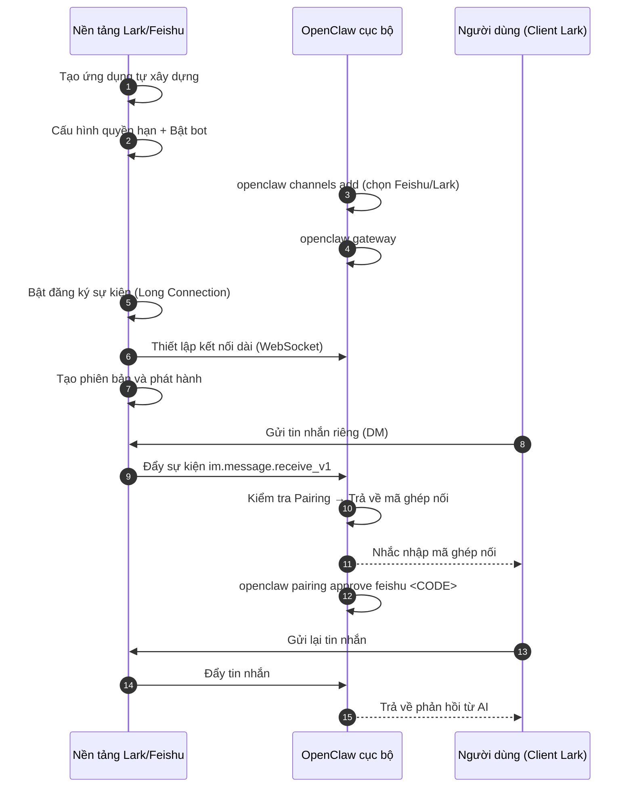

## 7.2 Hướng dẫn kết nối Lark/Feishu: Đưa Bot trò chuyện trong nhóm làm việc

Việc kết nối Lark/Feishu không chỉ cần cấu hình ở phía OpenClaw, mà còn đòi hỏi hoàn tất một chuỗi thao tác ủy quyền trên Nền tảng mở (Open Platform) của Lark/Feishu. Rất nhiều người mới bắt đầu thường vấp ngã ngay từ bước đầu tiên "Đăng ký sự kiện qua kết nối dài (Long Connection)". Mục này sẽ hệ thống hóa một quy trình kết nối "end-to-end" vững chắc nhất.

> [!NOTE]
> Mục này được tổng hợp dựa trên tài liệu chính thức và quy trình thực tiễn. **Instance audit trực tiếp hiện tại chưa cấu hình kênh Feishu**, do đó thứ tự trang, tên trường và câu chữ nút bấm trên giao diện nền tảng mở của Feishu/Lark cần được bạn đối soát lại trong môi trường thực tế của mình.

### 7.2.1 Trình tự tổng thể & Cảnh báo cạm bẫy

Lưu ý: Việc kết nối Lark sẽ đưa vào các biến số từ nền tảng bên ngoài. Nếu bạn vẫn đang trong giai đoạn dựng môi trường cơ sở, hãy hoàn thành các cấu hình cơ bản tại [Chương 3](../03_minimal_loop/README.md) trước khi bắt đầu mục này.

Tra cứu nhanh các điểm lỗi thường gặp (Nên đọc qua trước khi thao tác):

- **Đăng ký kết nối dài thất bại**: Ưu tiên kiểm tra xem bạn đã chạy `openclaw channels add` chọn Feishu/Lark để hoàn tất gắn kết kênh, và đảm bảo Gateway đang ở trạng thái chạy hay chưa; nếu Gateway chưa chạy thì việc lưu kết nối dài trên trang quản trị Feishu sẽ báo lỗi ngay.
- **Tin nhắn không kích hoạt bot**: Kiểm tra xem tính năng chat nhóm đã bật chưa, có yêu cầu @ tag tên không, nhóm chat có nằm trong danh sách trắng cho phép không; sau đó xem lại nhật ký log để kiểm tra quy tắc chặn.
- **Chat riêng phải qua phê duyệt**: Nếu bật chính sách pairing, lần đầu nhắn tin riêng thường sẽ nhận được mã ghép nối, sau khi quản trị viên phê duyệt thì mới bắt đầu trò chuyện bình thường.

Bất kể kết nối với nền tảng nào cũng đều tuân theo một quy trình, nhưng **Lark/Feishu có một thứ tự các bước cực kỳ dễ làm sai**:

1. ✅ **Phía Lark/Feishu**: Tạo ứng dụng tự xây dựng → Cấu hình quyền hạn → Bật năng lực Robot.
2. ✅ **Phía OpenClaw**: Chạy `openclaw channels add`, trong wizard chọn Feishu/Lark và điền App ID / App Secret.
3. ✅ **Phía OpenClaw**: Khởi động Gateway (`openclaw gateway` hoặc kiểm tra bằng `openclaw gateway status`).
4. ✅ **Phía Lark/Feishu**: Quay lại trang quản trị bật "Đăng ký sự kiện (Kết nối dài - Long Connection)" và thêm sự kiện.
5. ✅ **Phía Lark/Feishu**: Tạo phiên bản và phát hành ứng dụng.

Sơ đồ tuần tự dưới đây thể hiện luồng tương tác end-to-end khi kết nối Lark:



Hình 7-1: Luồng tương tác end-to-end khi kết nối Lark/Feishu

**Bài học đắt giá**: Cái bẫy dễ mắc phải nhất không phải là "phát hành trước hay đăng ký trước", mà là **khi OpenClaw chưa cấu hình kênh Feishu và Gateway còn chưa chạy, bạn đã vội vàng lên trang quản trị Feishu để bật kết nối dài**. Lúc này trang "Đăng ký sự kiện" sẽ lập tức báo lỗi khi lưu. Phát hành ứng dụng là bước bắt buộc trước khi đưa vào sử dụng, nhưng không phải là điều kiện tiên quyết duy nhất khiến việc lưu kết nối dài bị thất bại.

### 7.2.2 Cấu hình ứng dụng trên Nền tảng mở Lark/Feishu

1. Mở [Trang quản trị nhà phát triển Feishu](https://open.feishu.cn/app) (hoặc trang Lark tương ứng), tạo ứng dụng doanh nghiệp tự xây dựng (Custom App), trong trang "Thông tin xác thực & Thông tin cơ bản" lấy `App ID` và `App Secret`.
2. **Cấu hình quyền hạn (Khuyến nghị dùng nhập hàng loạt)**: Bấm vào mục "Quản lý quyền hạn" ở cột bên trái, chọn "Nhập quyền hàng loạt" và dán nội dung sau để tránh sót quyền:

```json
{
  "scopes": {
    "tenant": [
      "aily:file:read",
      "aily:file:write",
      "application:application.app_message_stats.overview:readonly",
      "application:application:self_manage",
      "application:bot.menu:write",
      "cardkit:card:read",
      "cardkit:card:write",
      "contact:user.employee_id:readonly",
      "corehr:file:download",
      "event:ip_list",
      "im:chat.access_event.bot_p2p_chat:read",
      "im:chat.members:bot_access",
      "im:message",
      "im:message.group_at_msg:readonly",
      "im:message.p2p_msg:readonly",
      "im:message:readonly",
      "im:message:send_as_bot",
      "im:resource"
    ],
    "user": [
      "aily:file:read",
      "aily:file:write",
      "im:chat.access_event.bot_p2p_chat:read"
    ]
  }
}
```

Tập hợp scope này đồng nhất với ví dụ nhập hàng loạt chính thức của Feishu/Lark, bao gồm tin nhắn văn bản, nhóm chat, thẻ tương tác (Cardkit), tài nguyên và một phần quyền đọc tập tin/tổ chức. Nếu bot của bạn chỉ làm nhiệm vụ hỏi đáp văn bản thông thường, hãy chủ động thu hẹp các quyền không cần thiết trước khi gửi phê duyệt nội bộ; sau này khi cần quy trình xử lý file hay tri thức thì bổ sung sau.

3. Trong mục "Năng lực ứng dụng", tìm thẻ **Robot** và bật tính năng này lên.
4. Tạm thời chưa cần vội phát hành, tiếp tục hoàn tất cấu hình kênh trên OpenClaw và đăng ký kết nối dài; việc tạo phiên bản và phát hành sẽ hoàn tất ở Mục 7.2.4.

### 7.2.3 Hoàn tất liên kết phía OpenClaw

Kênh Feishu / Lark hiện nay được tích hợp sẵn trong gói chính của OpenClaw; đối với các bản cài đặt cũ hoặc tùy biến nếu có cảnh báo thiếu plugin Feishu thì mới cài đặt thủ công qua `@openclaw/feishu`. Lộ trình ưu tiên là sử dụng wizard thêm kênh:

```bash
# Chỉ chạy khi bản cài đặt cũ báo thiếu plugin Feishu
openclaw plugins install @openclaw/feishu

openclaw channels add
```

> [!NOTE]
> **Điểm chẩn đoán**: Nếu chưa chắc chắn plugin đã cài đặt hay chưa, hãy dùng `openclaw doctor --fix` hoặc `openclaw plugins list` để kiểm tra.

- Ưu tiên làm theo hướng dẫn quét mã QR để ủy quyền và cấu hình.
- Nếu không thể quét mã, hãy nhập `App ID` và `App Secret` đã thu thập ở bước trước.
- Với phiên bản Feishu nội địa chọn `domain: "feishu"`; với phiên bản quốc tế chọn `domain: "lark"`. Nếu dùng endpoint tùy biến bắt buộc phải điền đầy đủ URI `https://...`, không điền tên miền trần.
- Khuyến nghị khi mới cài đặt: **Phần Chat nhóm (Group Chat) tạm thời chọn disabled, sau khi cấu hình thông luồng chat riêng rồi mới bật lên**.

Sau khi cấu hình xong, kiểm tra trạng thái kết nối:

```bash
openclaw channels list
openclaw gateway status
```

### 7.2.4 Bật đăng ký sự kiện & Thực hiện phiên đối thoại đầu tiên trên Lark

1. Khởi động Gateway trên terminal: `openclaw gateway`.
2. Quay lại trang quản trị nhà phát triển Feishu, vào mục "Sự kiện & Callback", **Bật chế độ kết nối dài (Long Connection)**, và thêm sự kiện `im.message.receive_v1` (Tiếp nhận tin nhắn).
3. Sau khi xác nhận việc đăng ký sự kiện đã được lưu thành công, chuyển sang mục "Quản lý phiên bản & Phát hành" để tạo phiên bản mới và phát hành ứng dụng.
4. Mở ứng dụng Lark/Feishu trên máy tính, tìm kiếm tên bot của bạn và gửi một tin nhắn riêng "Xin chào".
5. Nếu bạn bật chính sách pairing, lúc này bạn sẽ nhận được một mã ghép nối (Pairing code). Hãy sao chép mã này và quay lại terminal chạy lệnh `openclaw pairing approve feishu <CODE>` để hoàn tất phê duyệt.
6. Nếu bot vẫn không phản hồi, hãy kiểm tra `openclaw gateway status` và `openclaw logs --follow` để xác nhận kết nối dài đã được thiết lập và sự kiện đã đi vào Gateway thành công.
