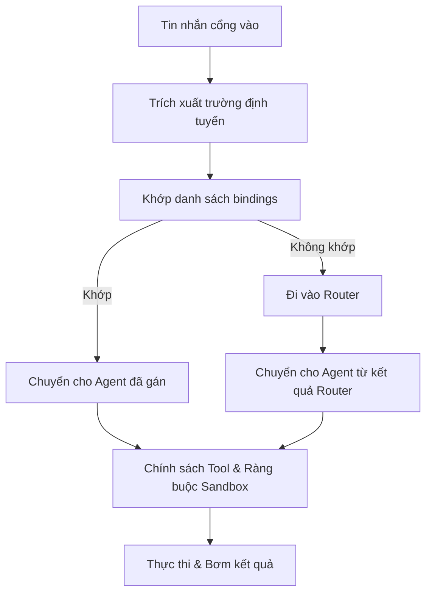

## 7.3 Cơ sở định tuyến (Routing): Từ đơn Agent đến đa Agent

Định tuyến không giải quyết câu hỏi "Mô hình có làm được không", mà trả lời cho câu hỏi: "Tin nhắn này nên được giao cho Agent nào tiếp quản, và Agent đó được phép làm những gì". Mục này lấy cơ chế định tuyến đa Agent của OpenClaw làm mạch chính để giải thích chuỗi ra quyết định định tuyến, thứ tự ưu tiên của các quy tắc ràng buộc (Bindings), và cách sử dụng các công cụ quan sát để biến định tuyến thành một năng lực kỹ thuật có thể phát lại, kiểm toán và xử lý sự cố.

### 7.3.1 Bài toán cốt lõi mà định tuyến giải quyết: Quyền sở hữu, Thẩm quyền & Cách ly trạng thái

Trong một hệ thống đa Agent, khi một tin nhắn đi vào, hệ thống bắt buộc phải xác định thật nhanh 3 điều: Ai xử lý (Quyền sở hữu), Được làm gì (Công cụ và phân quyền), và Trạng thái ghi vào đâu (Phiên và bộ nhớ). Nếu không phân tách rạch ròi 3 điều này, hệ thống sẽ gặp 2 lỗi nghiêm trọng:

1. **Trách nhiệm bất minh**: Nhiều Agent cùng đồng thời phản hồi hoặc ghi đè trạng thái của nhau, dẫn đến câu trả lời bị mâu thuẫn và bất nhất.
2. **Thực thi vượt quyền**: Một cổng vào có độ tin cậy thấp lại kích hoạt các công cụ có độ rủi ro cao, sự cố từ mức "nói sai một câu" sẽ nâng cấp thành "ghi đè sai cơ sở dữ liệu".

OpenClaw hiện thực hóa việc phân định "ai tiếp quản" một cách xác định thông qua cơ chế định tuyến và ràng buộc (Routing Bindings), đồng thời giao nhiệm vụ "được làm gì" cho Chính sách công cụ và Hộp cát (Sandbox) bọc lót. Mục tiêu tối cao của tầng định tuyến là quy tụ quyền xử lý tin nhắn về một Agent xác định, sau đó giữ toàn bộ tiến trình thực thi trong ranh giới an toàn. Nhóm phát sóng (Broadcast group) của WhatsApp là một ngoại lệ rõ ràng: Khi đối tác gửi tin nhắn được cấu hình `broadcast[peerId]`, tin nhắn sau khi qua cổng kiểm soát sẽ được gửi fan-out đồng loạt tới nhiều agent được chỉ định, bỏ qua luồng binding đơn lẻ hoặc agent mặc định. Xem chi tiết tại [Khái niệm đa Agent](https://docs.openclaw.ai/concepts/multi-agent) và [Quy tắc định tuyến](https://docs.openclaw.ai/channels/channel-routing).

### 7.3.2 Chuỗi ra quyết định: Khớp ràng buộc trước, định tuyến sau; trúng ràng buộc thì tiếp quản ngay

Chuỗi ra quyết định điển hình của OpenClaw có thể tóm gọn là: **"Khớp danh sách Bindings trước, sau đó mới đi vào Router"**. Ràng buộc định tuyến (Routing Bindings) dùng để giao các tin nhắn từ các nguồn xác định cho một Agent chỉ định xử lý một cách ổn định, giảm thiểu sự bất định khi để mô hình tự phân loại. Khi một quy tắc binding khớp, hệ thống lập tức chuyển tin nhắn cho Agent đó tiếp quản.

Sơ đồ dưới đây minh họa các nhánh rẽ then chốt trong chuỗi định tuyến:



Hình 7-2: Các nhánh rẽ then chốt theo nguyên tắc "Ưu tiên Bindings" trong định tuyến đa Agent

Lời khuyên kỹ thuật: Hãy ưu tiên đưa các cổng vào có độ rủi ro cao hoặc có tính xác định cao vào danh sách Bindings cố định, chỉ để các cổng vào cần hiểu ý định tự nhiên đi qua Router.

### 7.3.3 Triển khai Ràng buộc định tuyến (Bindings): Dùng quy tắc tối thiểu cố định cổng rủi ro vào Agent kiểm soát

Lợi ích của Bindings là biến "tính chính xác của định tuyến" từ một bài toán xác suất thành một bài toán quy tắc chắc chắn. Trong cấu hình chính thức, `bindings` là một **mảng ở cấp cao nhất (Top-level array)** (cùng cấp với `agents` và `channels`), mỗi mục binding trỏ tới một Agent qua `agentId`, và mô tả điều kiện khớp qua đối tượng `match`. Trong thực tế, bạn nên quy tụ các năng lực có tác dụng phụ ra bên ngoài vào một số lượng ít các Agent được kiểm soát nghiêm ngặt, và chỉ cấp danh sách công cụ tối thiểu cho chúng; cách viết chính sách tool xem tại [Mục 5.2 Chính sách Tool](../05_tools_skills/5.2_tool_policy.md).

```jsonc
{
  // bindings là mảng cấp cao nhất, không lồng bên trong khối agents
  bindings: [
    {
      agentId: "work",
      match: {
        channel: "whatsapp",
        peer: { kind: "direct", id: "+15551234567" },
      },
    },
    {
      agentId: "work",
      match: {
        channel: "telegram",
        peer: { kind: "direct", id: "987654321" },
      },
    },
  ],

  agents: {
    entries: {
      work: {
        name: "Trợ lý công việc",
        workspace: "~/.openclaw/workspace-work",
        agentDir: "~/.openclaw/agents/work/agent",
      },
    },
  },
}
```

> [!WARNING]
> Khối `bindings` bắt buộc phải nằm ở **cấp cao nhất** của tệp cấu hình, không được lồng bên trong đối tượng agent của `agents.entries`. Việc lồng sai vị trí sẽ khiến hệ thống không nhận diện được và làm cơ chế binding bị vô hiệu hóa trong im lặng.

Khi quy mô hệ thống mở rộng sang "nhiều tài khoản, nhiều nhóm chat, nhiều cổng vào", bạn nên phân tách định tuyến thành 2 tầng:

1. **Ràng buộc định tuyến tầng cổng vào (Ingress Bindings)**: Dựa trên `channel`, `peer`, `accountId` để gắn vào Agent cổng vào, chịu trách nhiệm quản trị quy tắc kích hoạt và tiền xử lý ngữ cảnh.
2. **Định tuyến tầng tác vụ (Task Routing)**: Agent cổng vào tiếp tục chuyển giao tác vụ cho các Agent chuyên môn, hoặc gọi Sub-agent để xử lý song song. Chi tiết cơ chế Sub-agent xem tại [Tài liệu Sub-agents](https://docs.openclaw.ai/tools/subagents).

Khi kiểm tra xem Bindings có hiệu lực hay không, đừng chỉ "gửi thử vài tin nhắn để xem". Cách làm đáng tin cậy là dùng câu lệnh kiểm tra danh sách binding trước, sau đó xác nhận trạng thái kênh:

```bash
openclaw agents bindings
openclaw channels capabilities
```

#### Ví dụ cấu hình đa Agent hoàn chỉnh

Dưới đây là một kịch bản thực tế: Đội ngũ vừa dùng Telegram vừa dùng WhatsApp, cần dựa vào nguồn tin nhắn và mức độ rủi ro để định tuyến công việc tới các Agent khác nhau.

**Mô tả kịch bản**
- `assistant`: Trợ lý mặc định, xử lý các câu hỏi thường ngày, không có quyền dùng công cụ can thiệp hệ thống.
- `devops`: Agent vận hành hệ thống, gắn cố định vào nhóm Telegram của đội kỹ thuật (DevOps-team), sở hữu công cụ thực thi lệnh `exec` và kết nối từ xa `ssh`.
- `writer`: Agent biên tập nội dung, gắn cố định vào số WhatsApp của biên tập viên, sở hữu công cụ chỉnh sửa văn bản `document`, không có quyền chạy lệnh hệ thống.

**Cấu hình hoàn chỉnh**

```jsonc
{
  agents: {
    entries: {
      assistant: {
        default: true,                    // Đánh dấu là Agent mặc định
        name: "Trợ lý mặc định",
        workspace: "~/.openclaw/workspace-assistant",
        agentDir: "~/.openclaw/agents/assistant/agent",
        model: "anthropic/claude-sonnet-4-6",
        tools: { allow: ["group:fs", "group:web"], deny: ["group:runtime"] },
      },
      devops: {
        name: "Agent Vận hành DevOps",
        workspace: "~/.openclaw/workspace-devops",
        agentDir: "~/.openclaw/agents/devops/agent",
        model: "anthropic/claude-sonnet-4-6",
        tools: { allow: ["group:runtime", "group:fs", "group:web"] },
        sandbox: { mode: "all", scope: "agent" },
      },
      writer: {
        name: "Agent Soạn thảo nội dung",
        workspace: "~/.openclaw/workspace-writer",
        agentDir: "~/.openclaw/agents/writer/agent",
        model: "anthropic/claude-sonnet-4-6",
        tools: { allow: ["group:fs", "group:web"], deny: ["group:runtime"] },
      },
    },
  },

  // bindings là mảng cấp cao nhất, khớp điều kiện để chuyển tới agentId tương ứng
  bindings: [
    {
      agentId: "devops",
      match: {
        channel: "telegram",
        peer: { kind: "group", id: "-1001234567890" },  // ID nhóm Telegram DevOps-team
      },
    },
    {
      agentId: "writer",
      match: {
        channel: "whatsapp",
        peer: { kind: "direct", id: "+8615600000000" },  // Số điện thoại của biên tập viên
      },
    },
  ],

  channels: {
    telegram: { enabled: true },
    whatsapp: { enabled: true },
  },
}
```

**Thứ tự ưu tiên khi khớp Ràng buộc định tuyến**

Tài liệu chính thức quy định rõ thứ tự ưu tiên khi khớp binding (quy tắc nào chi tiết và cụ thể hơn sẽ được ưu tiên khớp trước):

1. **Khớp chính xác đối tác (Peer match)**: `peer: { kind, id }` khớp hoàn toàn, mức ưu tiên cao nhất. Dùng cho DM hoặc các đối tác cố định đã biết.
2. **Khớp thừa kế theo Thread (parentPeer match)**: Khớp với đối tác của tin nhắn cha, dùng cho việc thừa kế định tuyến theo thread.
3. **Khớp đối tác bằng ký tự đại diện (Peer wildcard)**: Dạng `peer: { kind, id: "*" }`, khớp toàn bộ đối tác của loại đó.
4. **guildId + roles (Discord Role match)**: Đồng thời khớp máy chủ Discord và danh sách vai trò.
5. **guildId (Discord Server match)**: Chỉ khớp ID máy chủ Discord.
6. **teamId (Slack Workspace match)**: Khớp ID workspace của Slack.
7. **Khớp tài khoản (accountId match)**: Khớp instance tài khoản cụ thể của một kênh; trong môi trường đa tài khoản cần viết rõ `accountId` để tránh nhầm tài khoản mặc định thành quy tắc cho toàn kênh.
8. **Khớp cấp kênh (Channel-level fallback)**: Chỉ khi `accountId: "*"` mới khớp toàn bộ tài khoản của kênh đó. Nếu bỏ qua `accountId`, chỉ khớp tài khoản mặc định của kênh.
9. **Mặc định dự phòng (Fallback)**: Khi toàn bộ bindings đều không khớp, hệ thống sử dụng Agent được đánh dấu `default: true` trong `agents.entries`; nếu không có thì lấy mục đầu tiên; nếu không có agent nào thì thoái lui về `main`.

> [!NOTE]
> Khi một mục binding chứa nhiều trường `match`, tất cả các trường đều phải đồng thời thỏa mãn (ngữ nghĩa AND). Quy tắc đầu tiên khớp thành công sẽ lập tức có hiệu lực và hệ thống dừng kiểm tra các quy tắc phía sau.

**Xác minh nạp Bindings và thứ tự ưu tiên**

```bash
# Xem toàn bộ các Agent và các ràng buộc định tuyến của chúng
openclaw agents bindings

# Xem chi tiết ràng buộc của một Agent cụ thể
openclaw agents bindings --agent devops

# Theo dõi nhật ký log có cấu trúc để xác minh quyết định định tuyến
openclaw logs --follow --json
```

### 7.3.4 Khả năng quan sát & Chống mất kiểm soát: Ghi lý do định tuyến vào Log

Điểm khó nhất khi gỡ lỗi hệ thống đa Agent là "Hiện tượng trông như lỗi của mô hình, nhưng thực chất là lỗi do định tuyến và chính sách". Hãy ghi nhận 2 nhóm thông tin vào log có thể tra cứu:

1. Lý do định tuyến: Khớp với binding nào hoặc vì sao Router lại chọn Agent đó.
2. Ranh giới thực thi: Lượt request đó của Agent được áp dụng những chính sách công cụ và ràng buộc hộp cát nào.

```bash
openclaw status --deep
openclaw logs --follow --json
```

Về mặt công nghệ phần mềm, bạn cần chủ động phòng chống hiện tượng vòng lặp định tuyến vô tận (Routing Loops). Nếu hệ thống cho phép các Agent chuyển giao tác vụ qua lại lẫn nhau, bắt buộc phải giới hạn số bước nhảy (Max hops) hoặc khử trùng lặp chuỗi gọi; khi phát hiện một chuỗi bị lặp đi lặp lại giữa các Agent, hãy ngắt ngay lập tức và trả về thông báo lỗi rõ ràng.

### 7.3.5 Không gian làm việc, Bộ nhớ & Trạng thái phiên: Hiểu ranh giới thực sự của sự "Cách ly"

Sau khi định tuyến đã đưa tin nhắn về đúng Agent, yếu tố thực sự quyết định "Agent nhìn thấy cái gì và ghi dữ liệu vào đâu" chính là **Workspace** và **Thư mục trạng thái**. Theo tài liệu chính thức, bộ nhớ dài hạn của OpenClaw bản chất là các tệp Markdown trong workspace, còn lịch sử phiên và trạng thái vận hành được lưu trong thư mục riêng của từng Agent dưới `$OPENCLAW_STATE_DIR` (mặc định tại `~/.openclaw`):

```text
~/.openclaw/                               # Thư mục trạng thái (Mặc định)
├── agents/
│   ├── main/
│   │   └── sessions/
│   └── work/
│       └── sessions/
└── credentials/

~/.openclaw/workspace-main/                # Workspace của Agent main
├── AGENTS.md
├── MEMORY.md
└── memory/
    └── 2026-03-22.md

~/.openclaw/workspace-work/                # Workspace của Agent work
├── AGENTS.md
├── MEMORY.md
└── memory/
    └── 2026-03-22.md
```

Điều này đồng nghĩa với việc sự "cách ly" giữa các Agent có ít nhất 2 tầng:

- **Cách ly không gian làm việc (Workspace Isolation)**: Mỗi Agent có thể cấu hình một `workspace` riêng biệt, các tệp `AGENTS.md`, `MEMORY.md`, `memory/YYYY-MM-DD.md` hoàn toàn độc lập với nhau.
- **Cách ly trạng thái phiên (Session State Isolation)**: Lịch sử hội thoại, metadata phiên và trạng thái runtime của từng Agent được lưu độc lập tại `~/.openclaw/agents/<agentId>/sessions/`, không bao giờ bị ghi đè sang tên của Agent khác.

Tuy nhiên, có một điểm cốt tử rất dễ bị hiểu lầm: **Workspace không phải là hộp cát cứng (Hard Sandbox)**. Tài liệu chính thức chỉ rõ workspace chỉ là thư mục làm việc hiện tại (cwd) mặc định và điểm neo bộ nhớ; nếu không kích hoạt tính năng Sandbox, các công cụ vẫn hoàn toàn có thể đọc ghi ra các đường dẫn tuyệt đối khác trên máy chủ. Do đó, trong môi trường đa Agent, bạn phải phân biệt rạch ròi giữa "Phân tách đường dẫn" và "Cách ly an toàn":

- Định tuyến và `workspace` giải quyết câu hỏi "Đọc ghi mặc định rơi vào đâu".
- `agents.defaults.sandbox` hoặc cấu hình `sandbox` của từng Agent mới thực sự giải quyết câu hỏi "Có được phép vượt ranh giới hay không".

Lời khuyên: Luôn thiết kế đồng bộ 3 mắt xích này: Dùng Bindings xác định quyền sở hữu → Dùng Workspace độc lập phân tách bộ nhớ và chỉ thị → Dùng Sandbox và Chính sách công cụ để chặn đứng mọi con đường vượt quyền xuyên thư mục, xuyên công cụ và xuyên phiên làm việc.
