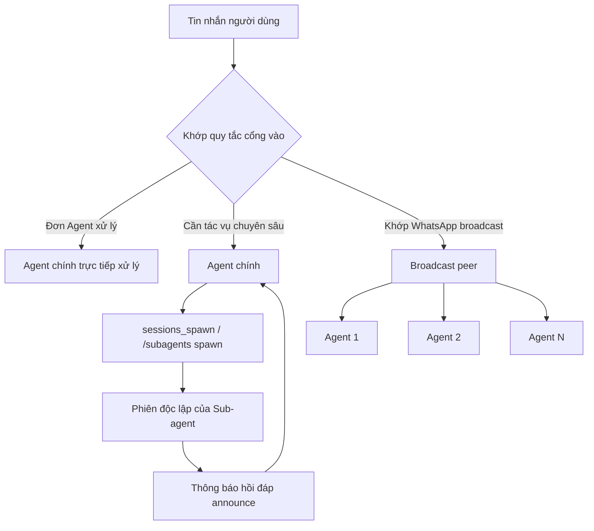

## 7.4 Mô hình cộng tác: Sub-agent (Agent phụ) & Nhóm broadcast

Trong Mục 7.3, chúng ta đã giải quyết câu hỏi "Tin nhắn trước hết giao cho ai". Mục này tiếp tục đi sâu hơn để trả lời 2 câu hỏi kỹ thuật thực tế: Khi một Agent đơn lẻ không đủ sức đảm đương thì làm sao ủy quyền tác vụ cho các Agent khác; và khi cùng một tin nhắn đòi hỏi nhiều Agent đồng thời đưa ra góc nhìn chuyên môn thì làm sao xử lý song song mà không bị lẫn lộn ngữ cảnh. OpenClaw hiện tại phân chia năng lực cộng tác thành 2 tuyến độc lập: **Sub-agent (Agent phụ)** chịu trách nhiệm "tạo một phiên làm việc mới độc lập để làm việc rồi báo cáo lại", và **Nhóm Broadcast (Phát sóng)** chịu trách nhiệm "cùng một cổng vào kích hoạt đồng thời nhiều Agent".

Sơ đồ quan hệ tổng quan dưới đây giúp bạn phân biệt rõ 2 tuyến cộng tác này:



Hình 7-3: Tổng quan mối quan hệ giữa ủy quyền Sub-agent và xử lý song song qua Nhóm Broadcast

### 7.4.1 Sub-agent: Dùng `sessions_spawn` để phái sinh phiên làm việc độc lập

Giao diện thực thi thực tế của năng lực Sub-agent trong OpenClaw là `sessions_spawn`. Tài liệu chính thức định nghĩa cơ chế này là: Khởi tạo một lượt chạy của Sub-agent bên trong một **phiên làm việc cách ly hoàn toàn**, và sau khi hoàn thành sẽ thông báo hồi đáp (Announce) kết quả về lại kênh chat của người yêu cầu.

Các tham số trọng yếu khả dụng:

- `task`: Nội dung tác vụ con, bắt buộc điền.
- `agentId`: ID của Agent mục tiêu; việc có cho phép gọi xuyên agent hay không do `agents.entries.*.subagents.allowAgents` kiểm soát.
- `model`, `thinking`: Ghi đè mô hình và cường độ suy luận (Thinking effort) của Sub-agent.
- `runTimeoutSeconds`: Thời gian timeout tối đa của tác vụ con.
- `thread`, `mode`: Yêu cầu chuyển phát gắn kết theo thread trên các kênh hỗ trợ.
- `cleanup`: Quyết định xóa hay giữ lại phiên con sau khi chạy xong.
- `sandbox`: Nhận `inherit` (kế thừa) hoặc `require` (bắt buộc), dùng để giới hạn xem phiên con có bắt buộc phải chạy trong môi trường Sandbox hay không.
- `attachments`: Hỗ trợ đính kèm tệp, do `tools.sessions_spawn.attachments.*` kiểm soát.

Các ràng buộc runtime quan trọng:

- Sub-agent luôn được khởi động từ một phiên mới tinh có định dạng `agent:<agentId>:subagent:<uuid>`.
- Sub-agent mặc định kế thừa "toàn bộ công cụ của Agent cha trừ đi các công cụ session và system"; bạn có thể dùng `tools.subagents.tools.allow/deny` để thu hẹp hơn nữa; Sub-agent đóng vai trò orchestrator lồng nhau chỉ được khôi phục các công cụ `sessions_spawn`, danh sách và lịch sử cần thiết.
- Mặc định hệ thống chỉ cho phép phái sinh 1 tầng; nếu bạn chỉnh `agents.defaults.subagents.maxSpawnDepth` lên 2, Sub-agent ở độ sâu 1 có thể tiếp tục sinh tiếp Sub-agent cấp dưới, nhưng Sub-agent lá ở độ sâu 2 tuyệt đối không được gọi `sessions_spawn`.
- Sub-agent sẽ tự động được lưu trữ lưu trữ (Archive) sau khoảng thời gian cấu hình tại `agents.defaults.subagents.archiveAfterMinutes` (mặc định 60 phút).

Khi gỡ lỗi thủ công hoặc thị phạm, bạn có thể dùng các lệnh gạch chéo (Slash commands) để quan sát tiến trình:

```bash
/subagents spawn <agentId> <task>
/subagents list
/subagents log <id>
/subagents kill <id|all>
```

Kịch bản điển hình nhất cho Sub-agent là "Agent chính chịu trách nhiệm phán đoán ý định, Sub-agent thực thi tác vụ chuyên sâu". Chẳng hạn Agent cổng vào nhận diện xem người dùng đang báo lỗi hệ thống, hỏi thủ tục hoàn tiền hay cần tra cứu log; còn các tác vụ tra cứu log chi tiết, xác minh hóa đơn, kiểm tra tệp cấu hình sẽ được bàn giao cho các Sub-agent có ranh giới hẹp và thẩm quyền công cụ bị kiểm soát chặt chẽ.

### 7.4.2 Nhóm Broadcast: Để một tin nhắn kích hoạt đồng thời nhiều Agent

Nhóm Broadcast hoàn toàn khác biệt với Sub-agent. Nó không phải là "giao việc ra ngoài rồi đợi kết quả", mà là kích hoạt chạy đồng thời nhiều Agent cho **cùng một đối tác (Peer) gửi tin nhắn đến**. Tài liệu chính thức lấy WhatsApp peer làm ví dụ chủ đạo; mã nguồn hiện tại cũng hỗ trợ broadcast dispatch cho nhóm Lark/Feishu.

Cấu hình thông qua trường `broadcast` ở cấp cao nhất:

- `broadcast.strategy`: Chế độ chạy song song `parallel` hoặc tuần tự `sequential`.
- `broadcast.<peerId>`: Mảng danh sách các Agent ID tương ứng với WhatsApp peer mục tiêu.

Ý nghĩa định danh khóa rất rõ ràng:
- Khóa nhóm chat dùng JID của nhóm WhatsApp, ví dụ: `120363403215116621@g.us`.
- Khóa chat riêng dùng số điện thoại định dạng chuẩn E.164, ví dụ: `+15551234567`.

```jsonc
{
  broadcast: {
    strategy: "parallel",
    "120363403215116621@g.us": ["reviewer", "writer"],
    "+15551234567": ["assistant", "logger"],
  },
}
```

Cần lưu ý: Broadcast không vượt qua các quy tắc kiểm soát cổng vào. Nó chỉ phát huy tác dụng khi "OpenClaw vốn dĩ đã thỏa mãn điều kiện để phản hồi tin nhắn đó" (ví dụ đã qua điều kiện tag tên trong nhóm, nằm trong danh sách trắng, kênh đang kích hoạt). Khi khớp broadcast, hệ thống sẽ kích hoạt độc lập từng Agent trong danh sách thay vì chỉ chọn một Agent duy nhất.

Quy tắc chia sẻ và cách ly trong Broadcast:
- **Được cách ly**: Mỗi Agent sở hữu Session Key, lịch sử hội thoại, workspace, chính sách công cụ và tệp bộ nhớ hoàn toàn độc lập.
- **Được chia sẻ**: Bộ đệm ngữ cảnh gần nhất của cùng peer đó sẽ được các Agent trong nhóm broadcast cùng nhìn thấy.

Điều này có nghĩa là Broadcast rất phù hợp cho các bài toán "Nhiều góc nhìn cùng phản biện (Multi-perspective review)" hoặc "Phối hợp đa vai trò cùng trả lời", nhưng không thích hợp để mô phỏng việc phát tán một tin nhắn xuyên qua các kênh khác nhau.

### 7.4.3 Hàng đợi tin nhắn & Thông báo hồi đáp (Announce Step): `messages.queue`

Khi sự cộng tác diễn ra đồng thời, vấn đề đầu tiên phát sinh thường là tin nhắn chồng chéo, phản hồi trùng lặp hoặc xung đột kết quả. OpenClaw phân tách bài toán này thành 2 tầng:

1. **Hàng đợi tin nhắn đầu vào (Inbound Message Queue)**: Kiểm soát cách thức các tin nhắn gửi liên tiếp trong cùng một phiên được xếp hàng xử lý.
2. **Bước thông báo hồi đáp của Sub-agent (Announce Step)**: Kiểm soát cách thức kết quả của tác vụ con được báo cáo ngược lại cho người yêu cầu.

Cấu hình hàng đợi thực tế nằm tại `messages.queue`:

- `steer`: Bơm tin nhắn mới vào phiên đang chạy để bẻ hướng suy luận ngay trong vòng lặp của trợ lý.
- `followup`: Không can thiệp vào vòng chạy hiện tại, xếp tin nhắn mới thành lượt đối thoại tiếp theo sau khi vòng hiện tại kết thúc.
- `collect`: Gom cụm các tin nhắn tương thích sau khoảng thời gian chờ (Debounce) thành một lượt followup duy nhất; tin nhắn xuyên kênh hoặc xuyên thread sẽ được tách riêng để bảo toàn định tuyến.
- `interrupt`: Ngắt ngay tác vụ đang hoạt động trong phiên và ưu tiên xử lý tin nhắn mới nhất.

Chế độ mặc định hiện tại là `steer` với thời gian debounce khoảng `500ms`.

Các khóa cấu hình đi kèm:

```jsonc
{
  messages: {
    queue: {
      mode: "collect",
      cap: 20,
      drop: "summarize",
      byChannel: {
        discord: "collect",
        whatsapp: "steer",
      },
    },
  },
}
```

Nếu muốn thay đổi hành vi tạm thời cho từng phiên, bạn có thể dùng lệnh `/queue`:

```bash
/queue collect
/queue collect debounce:2s cap:25 drop:summarize
/queue reset
```

Sau khi Sub-agent chạy xong, hệ thống sẽ thực hiện một bước **Announce step**:
- Kết quả được chuyển phát ngược về kênh chat nơi phát sinh yêu cầu.
- Nếu phản hồi announce chính xác bằng chuỗi `ANNOUNCE_SKIP`, hệ thống sẽ giữ im lặng không gửi tin nhắn.
- Nội dung hồi đáp được chuẩn hóa thành khối sự kiện ổn định gồm trạng thái chạy, nội dung kết quả và chỉ thị phản hồi tiếp theo.
- Nếu không có văn bản đầu ra hiển thị, hệ thống sẽ thoái lui lấy nội dung của kết quả tool gần nhất sau khi làm sạch để làm nội dung trả về.

### 7.4.4 Khung cấu hình mẫu: Cụm cộng tác tối thiểu chạy được

Dưới đây là một bộ khung cấu hình mẫu hoàn chỉnh: Trợ lý mặc định có quyền phái sinh `reviewer` và `writer`, toàn bộ Sub-agent đều chạy trong tập công cụ bị thu hẹp; một nhóm WhatsApp chỉ định khi nhận tin nhắn sẽ đồng thời kích hoạt cả `reviewer` và `writer` qua Broadcast:

```jsonc
{
  agents: {
    defaults: {
      subagents: {
        archiveAfterMinutes: 60,
        runTimeoutSeconds: 120,
      },
    },
    entries: {
      assistant: {
        default: true,
        workspace: "~/.openclaw/workspace",
        subagents: { allowAgents: ["reviewer", "writer"] },
      },
      reviewer: {
        workspace: "~/.openclaw/workspace-reviewer",
      },
      writer: {
        workspace: "~/.openclaw/workspace-writer",
      },
    },
  },

  tools: {
    subagents: {
      tools: {
        deny: ["group:runtime"],
      },
    },
    sessions_spawn: {
      attachments: {
        enabled: true,
        maxFiles: 5,
      },
    },
  },

  messages: {
    queue: {
      mode: "collect",
      debounceMs: 1000,
      cap: 20,
      drop: "summarize",
    },
  },

  broadcast: {
    strategy: "parallel",
    "120363403215116621@g.us": ["reviewer", "writer"],
  },
}
```

Cụm cấu hình này thể hiện 3 nguyên tắc kỹ thuật cốt lõi:
1. Danh sách Sub-agent được phép gọi phải khai báo tường minh, không mở `["*"]`.
2. Phạm vi công cụ của Sub-agent bắt buộc phải hẹp hơn Agent chính, không được rộng hơn.
3. Broadcast chỉ áp dụng cho một số ít đối tác chỉ định rõ ràng, tránh việc một tin nhắn bị khuếch đại thành quá nhiều phản hồi đồng thời.

### 7.4.5 Nghiệm thu & Chẩn đoán sự cố: 3 bước tuần tự

Khi xử lý sự cố trong hệ thống cộng tác đa Agent, hãy chẩn đoán theo 3 tầng:

1. **Cổng vào có trúng đúng Agent hay không**: Kiểm tra quy tắc Bindings và Broadcast.
2. **Các tác vụ đồng thời có được xếp hàng đúng kỳ vọng hay không**: Kiểm tra chế độ `messages.queue`.
3. **Kết quả của tác vụ con có hồi đáp thành công hay không**: Kiểm tra Announce step và nhật ký log có cấu trúc.

Cụm lệnh chẩn đoán thông dụng:

```bash
openclaw agents list --bindings
openclaw channels capabilities
openclaw status --deep
openclaw logs --follow --json
```

Nếu gặp hiện tượng "chỉ có 1 Agent phản hồi", hãy kiểm tra xem peer đó đã nằm trong `broadcast` chưa; nếu gặp lỗi "Sub-agent đã làm xong nhưng không thấy kết quả hiển thị trên màn hình chat chính", hãy tìm kiếm các mục liên quan đến `announce` trong log và kiểm tra xem có bị dính cờ `ANNOUNCE_SKIP` hay không.

### 7.4.6 Tóm tắt mục

Năng lực cộng tác của OpenClaw không phải là một khái niệm trừu tượng, mà được định hình bởi các cơ chế thực tế có ranh giới rõ ràng:
- `sessions_spawn`: Khởi tạo phiên con độc lập và thông báo hồi đáp sau khi hoàn thành.
- `broadcast`: Kích hoạt đồng thời nhiều Agent trên các peer chỉ định.
- `messages.queue`: Quản lý việc xếp hàng và đồng thời của các tin nhắn gửi đến trong cùng một phiên.

Phân biệt rạch ròi 3 cơ chế này sẽ giúp bạn trả lời dứt khoát 3 câu hỏi khi thiết kế hệ thống cộng tác: Ai làm, Xử lý đồng thời thế nào, và Kết quả quay về đâu.
