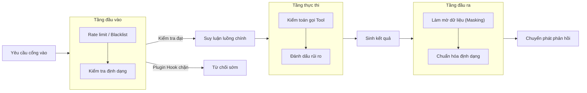

## 8.1 Hooks Vòng đời & Các điểm xen sự kiện (Interception Points)

Mục này bàn luận về điểm rơi kỹ thuật của Hooks: Tách rời logic quản trị ra khỏi chuỗi thực thi chính, đồng thời bảo đảm bản thân Hook không trở thành một nguồn phát sinh lỗi mới. Chúng ta sẽ bắt đầu từ các năng lực Hook cụ thể do OpenClaw cung cấp, sau đó mở rộng sang các mẫu thiết kế và ràng buộc về tính ổn định.

### 8.1.1 Ranh giới trách nhiệm của Hooks

Hooks phù hợp để đảm nhận các năng lực cắt ngang (Cross-cutting concerns), chứ không gánh vác luồng nghiệp vụ chính. Các kịch bản phổ biến gồm:

- **Quản trị đầu vào**: Giới hạn tần suất (Rate limit), danh sách trắng/đen, kiểm tra định dạng dữ liệu.
- **Quan sát thực thi**: Kiểm toán các lượt gọi công cụ, gắn nhãn rủi ro, ghi nhận chính sách.
- **Quản trị đầu ra**: Làm mờ dữ liệu nhạy cảm (Data masking), thu hẹp định dạng, bổ sung trường kiểm toán.

Nguyên tắc ranh giới: Hook chịu trách nhiệm "quản trị và quan sát", còn luồng chính chịu trách nhiệm "thúc đẩy tiến trình tác vụ".

### 8.1.2 Cơ chế Hook của OpenClaw & Cổng cấu hình hiện tại

Trong phiên bản hiện tại, Hook là điểm mở rộng dựa trên thư mục gắn với các sự kiện nội bộ của Gateway. Một Hook hoàn chỉnh bao gồm tệp `HOOK.md` và `handler.ts`, có thể đến từ mã nguồn tích hợp sẵn của OpenClaw, từ plugin, từ thư mục cài đặt có giám sát hoặc từ thư mục workspace; các câu lệnh kiểm tra, kích hoạt và chẩn đoán được quản lý tập trung qua `openclaw hooks`:

Các câu lệnh thông dụng:

- `openclaw hooks list`
- `openclaw hooks info <hook>`
- `openclaw hooks check`
- `openclaw hooks enable <hook>`
- `openclaw hooks disable <hook>`

Nói cách khác, cách hiểu đúng đắn nhất hiện nay là: **Hook là các điểm xen có thể khám phá (Discoverable interception points) trong vòng đời của Gateway; khối cấu hình `hooks.internal.entries` chỉ đại diện cho một phần trạng thái kích hoạt, không nên hiểu lầm rằng "hệ thống chỉ có cố định 2 mục tích hợp sẵn"**.

Dạng cấu hình tối thiểu quan sát được trực tiếp trên hệ thống:

```jsonc
{
  hooks: {
    internal: {
      enabled: true,
      entries: {
        "session-memory": { enabled: true },
        "boot-md": { enabled: true }
      }
    }
  }
}
```

Bên cạnh đó, chính sách công cụ (`tools.deny`/`tools.allow`, xem [Mục 5.2](../05_tools_skills/5.2_tool_policy.md)) và các sự kiện log có cấu trúc (`openclaw logs --follow --json`) cung cấp thêm năng lực quản trị và quan sát bổ trợ, phối hợp nhịp nhàng với cơ chế Hook.

> [!NOTE]
> Việc nạp Hook phụ thuộc vào trạng thái bật/tắt, cấu hình hoặc cơ chế tự động khám phá. Khi gỡ lỗi, hãy dùng `openclaw hooks list/info/check` để xác nhận trạng thái phát hiện và kích hoạt thực tế, kết hợp với `doctor` và log có cấu trúc để định vị lỗi.

### 8.1.3 Mô hình điểm xen sự kiện: Định vị theo sự kiện chính thức, Ánh xạ trách nhiệm quản trị

Các Hook nội bộ của OpenClaw không phải là sự phân chia 3 đoạn cố định "Đầu vào / Thực thi / Đầu ra", mà được kích hoạt xoay quanh các sự kiện cụ thể của hệ thống. Các sự kiện nội bộ hiện tại bao gồm: `command:new`, `command:reset`, `command:stop`, `command`, `session:compact:before`, `session:compact:after`, `session:patch`, `agent:bootstrap`, `gateway:startup`, `gateway:shutdown`, `gateway:pre-restart`, `message:received`, `message:transcribed`, `message:preprocessed`, `message:sent`. Dưới góc nhìn kỹ thuật, bạn có thể ánh xạ các trách nhiệm quản trị thành 3 nhóm lớn: Quản trị đầu vào, Quan sát thực thi và Quản trị đầu ra.



Hình 8-1: Các điểm xen của Hooks trong 3 giai đoạn của vòng đời thực thi

| Giai đoạn | Mục tiêu | Điều cấm kỵ |
|---|---|---|
| **Tầng đầu vào** | Giảm nhiễu, kiểm tra điều kiện tiếp nhận; nếu dùng Plugin Hook thì có thể từ chối sớm | Gọi API bên ngoài tốn nhiều thời gian, thực hiện thao tác ghi không thể hoàn tác |
| **Tầng thực thi** | Ghi nhận các quyết định trọng yếu, chặn đứng rủi ro | Sửa đổi trạng thái nghiệp vụ cốt lõi |
| **Tầng đầu ra** | Làm mờ dữ liệu nhạy cảm và chuẩn hóa định dạng | Mở rộng quyền hạn tạm thời, vượt qua chính sách để cho phép lệnh cấm |

### 8.1.4 Các ràng buộc về tính ổn định: Timeout, Hạ cấp, Tính bất biến

Bản thân Hook bắt buộc phải chịu sự ràng buộc chặt chẽ, nếu không nó sẽ kéo sập cả chuỗi xử lý chính:

- **Giới hạn Timeout**: Mỗi Hook đều phải có ngưỡng timeout độc lập, khi hết giờ thì hạ cấp theo chính sách.
- **Ngữ nghĩa thất bại**: Hook nội bộ trả về `void`, chủ yếu bổ sung tin nhắn hoặc sửa đổi nội dung sự kiện để quan sát/bổ trợ; ngoại lệ sẽ được ghi log lại và không được làm gián đoạn các handler tiếp theo. Khi cần chặn (Block), hủy (Cancel) hoặc yêu cầu phê duyệt, bạn phải sử dụng các Typed Plugin Hook có hỗ trợ trả về kết quả quyết định.
- **Yêu cầu tính bất biến (Idempotency)**: Trong trường hợp hệ thống thử lại (Retry), Hook tuyệt đối không được sản sinh ra các tác dụng phụ bên ngoài trùng lặp.

Đối với các Hook nội bộ phục vụ kiểm toán, hãy giữ cho nó thật nhẹ nhàng; đối với các logic chặn vi phạm tuân thủ, hãy sử dụng Plugin Decision Hook và thiết kế rõ ràng ngữ nghĩa block / fail-open / fail-closed.

### 8.1.5 Sự kiện có cấu trúc: Đảm bảo tính kiểm toán và khả năng phát lại

Khuyến nghị toàn bộ các sự kiện Hook đều sử dụng cấu trúc thống nhất, tối thiểu bao gồm: Thời gian, Định danh chuỗi (Trace), Giai đoạn, Hành động, Kết quả:

```jsonc
{
  "ts": "YYYY-MM-DDTHH:MM:SSZ",
  "traceId": "t-YYYYMMDD-001",
  "stage": "input",
  "hook": "rate_limit_guard",
  "event": "rejected",
  "reason": "rate_limit_exceeded"
}
```

### 8.1.6 Nghiệm thu & Chẩn đoán sự cố

Sau khi triển khai lên hệ thống, bạn nên thực hiện 2 bài kiểm tra:

1. **Lưu lượng bình thường**: Xác nhận Hook không gây ra độ trễ đáng kể.
2. **Lưu lượng bất thường**: Xác nhận hành vi chặn và hạ cấp hoạt động chuẩn xác như kỳ vọng.

```bash
openclaw status --deep
openclaw logs --json --limit 500 \
  | jq -r 'select(.type=="log") | (.raw | fromjson? // {}) | .event // empty' \
  | sort | uniq -c | sort -nr | head
```

> Lưu ý: Tên trường thực tế căn cứ theo đầu ra của `logs --json`. Bạn nên in một dòng log thô không kèm bộ lọc trước để nắm cấu trúc trường rồi mới áp dụng `jq`.
