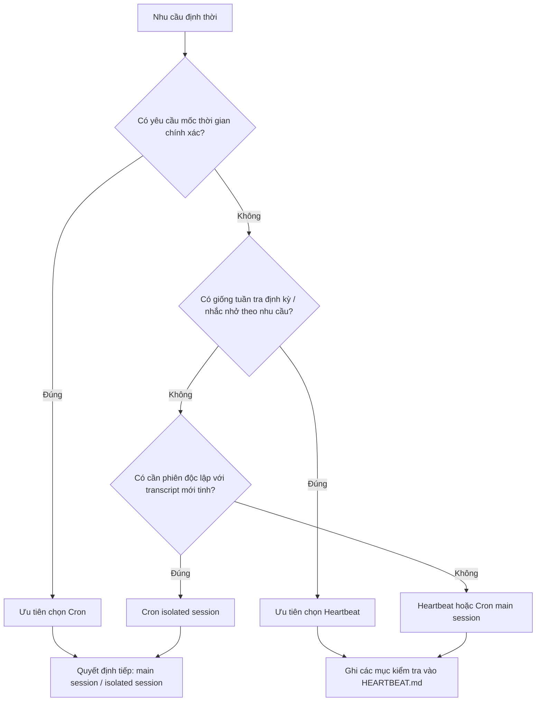

## 8.2 Thiết kế tác vụ định kỳ & Chiến lược lên lịch (Cron jobs)

Mục này tập trung vào các tác vụ tự động hóa không người trực tại **các mốc thời gian chính xác**. Kịch bản điển hình gồm: Đúng 15h hàng ngày sinh báo cáo, đúng 9h sáng thứ Hai gửi bản tóm tắt tuần, ngày mùng 1 hàng tháng chạy quyết toán chi phí. Điểm chung của các tác vụ này là "bắt buộc phải thực thi vào đúng mốc thời gian đó, không được sớm hơn cũng không được muộn hơn". OpenClaw cung cấp 2 tầng năng lực định thời:

- **Cron tích hợp sẵn (Builtin Cron)**: Bộ điều phối gốc bên trong Gateway, không phụ thuộc công cụ ngoài, khuyến nghị dùng cho đa số trường hợp.
- **Tích hợp Crontab bên ngoài**: Bộ điều phối ở cấp máy chủ OS, dùng khi cần ghép nối với đường ống DevOps sẵn có.

Dù sử dụng tầng nào, mục tiêu cốt lõi không chỉ là "kích hoạt đúng giờ một lần", mà là "thực thi lặp lại nhiều lần cũng không bị mất kiểm soát" — đòi hỏi thiết kế trọn vẹn về tính bất biến (Idempotency), khả năng phục hồi sự cố và tính quan sát.

> [!NOTE]
> **Tên lệnh chính đã được chuẩn hóa**: Tài liệu chính thức hiện lấy `openclaw automations` làm lệnh chính cho cụm năng lực điều phối này, và giữ `openclaw cron` làm bí danh tương đương; cả hai cách viết đều dùng được cho mọi lệnh con. Mục này giữ cách viết `cron` để tương thích với biểu thức Cron quen thuộc.

**Cron vs Heartbeat: Logic lựa chọn vòng đầu**

Nếu bạn đang phân vân giữa Cron và Heartbeat, câu hỏi đầu tiên cần đặt ra là: **"Tác vụ có đòi hỏi mốc thời gian chính xác tuyệt đối hay không?"**. Nếu có, chọn Cron; nếu không (ví dụ "cứ mỗi nửa tiếng kiểm tra xem có ticket mới không, có thì báo"), hãy chọn Heartbeat.



Hình 8-2: Sơ đồ phân luồng lựa chọn ban đầu giữa Cron và Heartbeat

### 8.2.1 Cron tích hợp sẵn: Điều phối gốc của Gateway

OpenClaw tích hợp sẵn bộ lập lịch Cron, hỗ trợ biểu thức cron 5 đoạn tiêu chuẩn, cũng như biểu thức 6 đoạn (kèm giây), và hỗ trợ cờ `--at` để tạo nhắc nhở một lần. Tác vụ chạy trực tiếp trong tiến trình Gateway mà không cần cấu hình crontab hay systemd timer của máy chủ.

Runtime hiện tại phân tách độc lập giữa định nghĩa tác vụ và trạng thái thực thi: `jobs.json` lưu trữ định nghĩa tác vụ, còn `jobs-state.json` lưu thời điểm kích hoạt gần nhất, trạng thái chạy và lịch sử thất bại. Mọi lượt chạy đều sinh bản ghi task/run để xem lại qua `cron runs`; các tác vụ một lần (`--at`) sau khi chạy thành công sẽ tự động được xóa bỏ.

Hai loại Payload cần phân biệt trong CLI:

- **Tác vụ phiên chính**: Dùng `--system-event`, thường phối hợp với `--session main`, được thực thi qua chuỗi nhịp tim của phiên chính.
- **Tác vụ cách ly**: Dùng `--message`, thường phối hợp với `--session isolated`, chạy trong phiên riêng biệt `cron:<jobId>`; tác vụ `agentTurn` cách ly tạo qua CLI mặc định dùng cơ chế `announce` để chuyển phát kết quả về, chỉ khi truyền rõ ràng `--no-deliver` mới giữ im lặng.

**Tạo tác vụ định kỳ:**

```bash
# Tác vụ phiên chính: 9:00 các ngày làm việc bơm sự kiện hệ thống và đánh thức xử lý ngay
openclaw cron add --name "daily_standup_event" \
  --cron "0 9 * * 1-5" \
  --session main \
  --system-event "Kéo tiến độ hôm qua từ Slack và Jira, sinh bản tóm tắt họp đầu ngày và ghi vào phiên chính" \
  --wake now

# Tác vụ cách ly: Nhắc nhở một lần, chạy trong phiên độc lập và chủ động gửi tóm tắt
openclaw cron add --name "review_reminder" \
  --at "2026-06-23T15:00:00" \
  --session isolated \
  --message "Nhắc nhở: 15h chiều nay họp review code" \
  --announce
```

> [!NOTE]
> Kiểm tra tham số bằng `openclaw automations --help` (hoặc `openclaw cron --help`). Khi dùng `--at` mà **không kèm múi giờ**, hệ thống sẽ hiểu theo giờ UTC; nếu muốn theo giờ địa phương, hãy truyền thêm `--tz <IANA Timezone>`.

**Quản lý & Giám sát:**

```bash
openclaw cron list              # Xem toàn bộ tác vụ đã đăng ký và thời điểm chạy kế tiếp
openclaw cron status            # Xem sức khỏe của bộ điều phối cron
openclaw cron show <jobId>      # Xem chi tiết một tác vụ
openclaw cron run <jobId>       # Ép chạy ngay lập tức (thêm --due nếu chỉ muốn chạy khi đến hạn)
openclaw cron enable <jobId>    # Kích hoạt tác vụ
openclaw cron disable <jobId>   # Tạm dừng tác vụ
openclaw cron edit <jobId> --no-deliver
openclaw cron runs --id <jobId> # Xem lịch sử các lượt chạy của tác vụ
openclaw cron remove <jobId>    # Xóa tác vụ
openclaw status --deep          # Bổ sung trạng thái Gateway toàn cục
```

Các chế độ mục tiêu phiên của Cron tích hợp:
- **Chế độ phiên chính** (`--system-event` / `--session main`): Tác vụ bơm vào phiên chính qua sự kiện hệ thống, dùng chung ngữ cảnh đầy đủ, mặc định là tác vụ tĩnh lặng chứ không chủ động spam tin nhắn.
- **Chế độ phiên cách ly** (`--message` / `--session isolated`): Chạy trong phiên `cron:<jobId>` độc lập với bản ghi transcript mới tinh, không bị ảnh hưởng bởi ngữ cảnh hội thoại xung quanh.
- **Chế độ phiên hiện tại / cố định** (`--session current` / `--session session:<id>`): Gắn vào phiên đang hoạt động hoặc một Session Key cố định, phù hợp cho các tác vụ cần tích lũy ngữ cảnh liên tục.

### 8.2.2 Tích hợp Crontab bên ngoài

Khi cần ghép nối với đường ống CI/CD hoặc các tác vụ ở cấp hệ điều hành (dọn dẹp file rác, xoay tua log, sao lưu đĩa), bạn có thể dùng crontab hoặc systemd timer của máy chủ để gọi OpenClaw qua CLI:

```bash
# Mục crontab trên máy chủ
0 9 * * 1-5 /opt/openclaw/jobs/daily_standup.sh >> /var/log/oc_jobs/standup.log 2>&1
```

Khi dùng bộ lập lịch ngoài, tính bất biến và cơ chế chống xung đột chạy đè phải do phía gọi tự bảo đảm.

### 8.2.3 Bốn ràng buộc kỹ thuật: Bất biến, Chống xung đột đè, Quan sát, Phục hồi

Dù dùng Cron trong hay ngoài, tác vụ định kỳ trong sản xuất bắt buộc phải thỏa mãn:

- **Tính bất biến (Idempotency)**: Chạy lặp lại nhiều lần không sinh thêm tác dụng phụ trùng lặp.
- **Chống chạy đè (Re-entrancy Prevention)**: Lượt chạy trước chưa xong thì lượt chạy sau không được chen ngang gây xung đột.
- **Khả năng quan sát (Observability)**: Mỗi lượt chạy đều có trạng thái, thời gian thực thi và phân loại lỗi rõ ràng.
- **Khả năng phục hồi (Recoverability)**: Thất bại phải có cơ chế thử lại hoặc quy trình chuyển giao cho con người can thiệp.

Cron tích hợp sẵn đã có cơ chế chống chạy đè (cùng một jobId sẽ không bị chạy đồng thời). Với Crontab ngoài, bạn có thể dùng khóa phân tán có TTL qua Redis:

```bash
# Lấy khóa thành công mới được chạy tác vụ
redis-cli SET oc_job_lock:daily_report "<instance_id>" NX EX 600
```

### 8.2.4 Khóa bất biến & Phân luồng xử lý lỗi

**Khóa bất biến (Idempotency Key)**: Khuyến nghị dùng công thức "Tên tác vụ + Mốc bắt đầu khung thời gian":

```text
idempotency_key = "daily_report:v2:" + window_start_ts
```

**Phân luồng lỗi**:
- Lỗi nhất thời (Timeout, 503, Rate limit): Thử lại có giới hạn kèm lùi thời gian số mũ (Exponential backoff).
- Lỗi cấu hình (401/403, sai tham số): Dừng ngay lập tức và gửi cảnh báo khẩn.
- Xung đột dữ liệu (Ghi đè không nhất quán): Đóng băng tác vụ và yêu cầu con người can thiệp.

### 8.2.5 Nghiệm thu vận hành & Tuần tra định kỳ

Lệnh kiểm tra:

```bash
openclaw cron list
openclaw cron status
openclaw status --deep
openclaw logs --follow --json
```

Trọng tâm nghiệm thu gồm 3 câu hỏi:
1. Có xảy ra hiện tượng chạy đè tài nguyên không?
2. Có phát sinh tác dụng phụ trùng lặp không?
3. Khi thất bại có phục hồi hoặc leo thang xử lý đúng hạn không?

> **Bài học thực tế: Hiện tượng "Thực thi ma" của tác vụ định kỳ**
>
> Cấu hình tác vụ tóm tắt họp vào 9:00 hàng ngày, nhưng thỉnh thoảng thấy chạy 2 lần vào 9:00 và 9:03. Kiểm tra phát hiện: Khi Gateway khởi động lại, bộ lập lịch cron được nạp lại; nếu thời điểm restart rơi đúng vào khung kích hoạt thì tác vụ sẽ bị gọi lặp. Giải pháp: Thêm bước kiểm tra tính bất biến trong logic tác vụ (ví dụ kiểm tra hôm nay đã gửi tóm tắt chưa), hoặc dùng `openclaw cron list` kiểm tra trạng thái trước khi khởi động lại dịch vụ.
