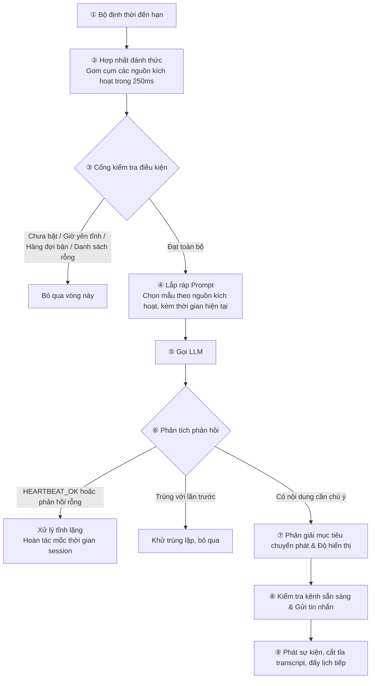

## 8.3 Cơ chế Heartbeat: Tuần tra định kỳ & Chủ động thông báo

Mục trước đã bàn về các tác vụ Cron tại mốc thời gian chính xác; mục này giới thiệu một thành phần điều phối gốc khác của OpenClaw — **Heartbeat (Cơ chế nhịp tim)**. Heartbeat giải quyết một nhóm bài toán hoàn toàn khác biệt:

Giả sử bạn có 5 nguồn thông tin khác nhau cần định kỳ kiểm tra (Hòm thư email, Việc cần làm, Lịch biểu, Slack, Bảng điều khiển giám sát). Nếu dùng Cron, bạn sẽ phải viết 5 cron job riêng lẻ, mỗi job đều phải cấu hình thử lại khi lỗi, khử trùng lặp và ghi log. Tuy nhiên trên thực tế, 5 nguồn này đa phần thời gian đều không có biến động gì mới, việc gọi liên tục chỉ làm lãng phí Token một cách vô ích.

Giải pháp của Heartbeat: Hệ thống định kỳ đánh thức Agent theo khoảng thời gian cố định (ví dụ mỗi 30 phút), Agent dựa vào một danh sách kiểm tra (`HEARTBEAT.md`) để lần lượt quét qua cả 5 nguồn thông tin, và **chỉ khi có ít nhất một nguồn có việc cần bạn chú ý, nó mới gửi một thông báo duy nhất**. Cách làm này vừa nắm bắt kịp thời các biến động, vừa tránh tình trạng dội bom tin nhắn và lãng phí Token.

**Tóm tắt cốt lõi: Cron dành cho "Việc bắt buộc phải làm tại thời điểm chính xác", Heartbeat dành cho "Việc cần định kỳ kiểm tra nhưng chỉ thông báo khi có nội dung mới".**

> [!TIP]
> Chưa chắc chắn nên chọn Heartbeat hay Cron? Quy tắc phán đoán nhanh: Cần mốc thời gian chính xác → Cron; Cần tuần tra định kỳ và chỉ thông báo khi có việc → Heartbeat. Xem bảng đối chiếu chi tiết tại Mục 8.3.8.

### 8.3.1 Các khái niệm cốt lõi

Heartbeat là một **vòng lặp Agent định kỳ** ở cấp Gateway: Hệ thống kích hoạt một lượt kiểm tra của Agent theo chu kỳ thời gian cố định. Chu kỳ mặc định thông thường là `30m`; khi hệ thống dùng phương thức xác thực Anthropic OAuth/token (bao gồm tái sử dụng Claude CLI), chu kỳ mặc định là `1h`, có thể ghi đè qua `agents.defaults.heartbeat.every` hoặc `heartbeat.every` của từng agent riêng biệt. Mặc định Heartbeat chạy ngay trong phiên chính (Main session), nhưng có thể dùng `isolatedSession: true` để mỗi lần chạy đều mở một phiên mới tinh. Mục tiêu chuyển phát mặc định là `target: "none"` (chỉ cập nhật trạng thái nội bộ mà không bắn tin nhắn ra ngoài); nếu muốn gửi vào kênh chat gần nhất, bạn phải thiết lập rõ ràng `target: "last"`.

Khi chạy, Agent đọc tệp danh sách `HEARTBEAT.md` trong workspace của mình, kiểm tra hòm thư, lịch biểu, việc cần làm, sau đó đưa ra 1 trong 2 phản hồi:

- **Bình yên vô sự**: Phản hồi từ khóa `HEARTBEAT_OK`, Gateway xem đây là tín hiệu xác nhận an toàn và xử lý tĩnh lặng (không gửi tin nhắn ra ngoài).
- **Có sự kiện cần chú ý**: Phản hồi nội dung cảnh báo cụ thể, Gateway sẽ căn cứ vào quy tắc `target`, `to`, `accountId` và độ hiển thị của kênh để chuyển phát tin nhắn đến người dùng.

Nhờ đó, bạn không phải viết hàng chục cron job — một vòng nhịp tim có thể gom cụm xử lý hàng loạt mục tuần tra và chỉ làm phiền bạn khi thực sự có việc khẩn.

### 8.3.2 Vòng đời hoàn chỉnh: Từ bộ định thời Timer đến Chuyển phát tin nhắn

Sơ đồ dưới đây thể hiện toàn bộ chuỗi mắt xích từ khi timer kích hoạt đến lúc tin nhắn được gửi đi:



Hình 8-3: Chuỗi vòng đời hoàn chỉnh của Heartbeat từ timer đến chuyển phát

Các điểm thiết kế kiến trúc then chốt:

- **Bộ định thời chạy độc lập theo từng Agent (Per-agent)**: Mỗi Agent tự duy trì chu kỳ và mốc chạy gần nhất của riêng mình, không làm nghẽn lẫn nhau.
- **Hợp nhất đánh thức chống bão sự kiện (Debounce merge)**: Khi nhiều nguồn cùng kích hoạt đánh thức trong vòng 250ms (timer đến hạn, cron bắn sự kiện, lệnh exec hoàn thành), hệ thống sẽ tự động gộp lại thành một lượt chạy duy nhất.
- **Linh hoạt chế độ phiên**: Mặc định chạy trong phiên chính; khi bật `isolatedSession: true`, mỗi nhịp tim chạy trong một phiên mới tinh, tránh kéo theo cả lịch sử chat dài dòng.
- **Chủ động trì hoãn khi bận (Defer when busy)**: Nếu Agent hiện tại đang bận chạy cron, xử lý hàng đợi hoặc chạy sub-agent ngầm, nhịp tim sẽ tự động hoãn hoặc bỏ qua, tránh tranh chấp tài nguyên và ngữ cảnh.

### 8.3.3 Giao thức HEARTBEAT_OK & Các chế độ ngữ cảnh

Giao thức phản hồi của Heartbeat rất trực quan: Agent đọc `HEARTBEAT.md`, nếu không có gì mới thì đáp `HEARTBEAT_OK` (Gateway tự hủy tin nhắn không gửi ra ngoài); nếu có việc cần báo thì đáp nội dung cảnh báo. Trong các phiên nhịp tim có hỗ trợ công cụ, OpenClaw có thể kích hoạt công cụ `heartbeat_respond` để kết quả có cấu trúc quyết định việc thông báo.

Ngữ cảnh nhồi vào lượt chạy nhịp tim tùy thuộc vào cấu hình `lightContext`:

| Chế độ | Các tệp được nạp vào Prompt | Kịch bản áp dụng |
|---|---|---|
| **Chế độ đầy đủ** (Mặc định) | Toàn bộ tệp bootstrap hiện có: `AGENTS.md`, `SOUL.md`, `TOOLS.md`, `IDENTITY.md`, `USER.md`, `HEARTBEAT.md`, `BOOTSTRAP.md`, `MEMORY.md` | Cần toàn bộ ngữ cảnh để đưa ra phán đoán |
| **Chế độ gọn nhẹ** (`lightContext: true`) | **Chỉ duy nhất tệp `HEARTBEAT.md`** | Danh sách tuần tra đã rất rõ ràng, không cần ngữ cảnh rườm rà, tiết kiệm tối đa Token |

Prompt mặc định có thể được thay thế hoàn toàn qua `heartbeat.prompt` (chú ý là thay thế toàn bộ chứ không phải ghép thêm).

### 8.3.4 Chi tiết các trường cấu hình

Cấu hình đầy đủ:

```jsonc
{
  agents: {
    defaults: {
      heartbeat: {
        every: "30m",                // Chu kỳ mặc định (với Anthropic OAuth thường là 1h; đặt "0m" để tắt)
        model: "<provider/low-cost-model>", // Tùy chọn: Chọn mô hình chi phí thấp chuyên biệt cho nhịp tim
        prompt: "Read HEARTBEAT.md if it exists...", // Prompt tùy biến (thay thế toàn bộ)
        target: "none",              // "none" | "last" | Tên kênh cụ thể
        to: "+15551234567",          // Người nhận cụ thể trong kênh
        accountId: "ops-bot",        // ID tài khoản đối với kênh đa tài khoản
        directPolicy: "allow",      // "allow" | "block" (chặn gửi tin nhắn riêng)
        lightContext: false,         // true: chỉ nạp HEARTBEAT.md để tiết kiệm Token
        isolatedSession: false,      // true: mỗi lần chạy mở một phiên mới tinh
        activeHours: {               // Khung giờ hoạt động
          start: "09:00",            // Giờ bắt đầu (bao gồm)
          end: "22:00",              // Giờ kết thúc (không bao gồm; "24:00" là nửa đêm)
          timezone: "Asia/Ho_Chi_Minh" // Múi giờ IANA
        }
      }
    }
  }
}
```

#### Phạm vi tác động & Mức độ ưu tiên

- **Theo chiều Agent**: `agents.defaults.heartbeat` đặt mặc định toàn cục; `agents.entries.*.heartbeat` ghi đè cho từng agent. **Một khi có bất kỳ Agent nào khai báo khối `heartbeat` riêng, thì CHỈ NHỮNG AGENT ĐÓ mới chạy nhịp tim**.
- **Theo chiều hiển thị kênh**: Cấu hình kiểm soát hiển thị đi từ rộng đến hẹp: `channels.defaults.heartbeatVisibility` → `channels.<channel>.heartbeatVisibility` → `channels.<channel>.accounts.<id>.heartbeatVisibility`, kiểm soát 3 công tắc: `showOk`, `showAlerts`, `useIndicator`.

Ví dụ cấu hình đa Agent:

```jsonc
{
  agents: {
    defaults: {
      heartbeat: { every: "30m", target: "none" }
    },
    entries: {
      main: { default: true },             // Không có khối heartbeat → Không chạy nhịp tim
      ops: {
        heartbeat: {                         // Chỉ duy nhất agent ops chạy nhịp tim
          every: "1h",
          target: "telegram",
          to: "12345678:topic:42",
          accountId: "ops-bot"
        }
      }
    }
  }
}
```

### 8.3.5 Danh sách HEARTBEAT.md & Khung giờ hoạt động (Active Hours)

#### Danh sách tuần tra HEARTBEAT.md

`HEARTBEAT.md` là tệp Markdown tùy chọn nằm tại thư mục gốc workspace của Agent, đóng vai trò là danh sách kiểm tra:

```markdown
# Danh sách tuần tra Heartbeat

- Quét hòm thư đến, nếu có email khẩn cấp thì tóm tắt thông báo ngay
- Kiểm tra các sự kiện lịch biểu trong vòng 2 giờ tới
- Nếu có tác vụ chạy ngầm hoàn thành, báo cáo kết quả
- Nếu hệ thống nhàn rỗi quá 8 tiếng, gửi một câu chào hỏi ngắn gọn
```

Nguyên tắc thiết kế:
- **Giữ thật tinh gọn**: Danh sách càng dài, chi phí Token cho mỗi lượt nhịp tim càng tốn kém.
- **Agent có thể tự cập nhật**: Bạn có thể yêu cầu Agent chỉnh sửa `HEARTBEAT.md` trong lúc trò chuyện, hoặc viết vào prompt nhịp tim: "Nếu danh sách đã lỗi thời, hãy tự cập nhật".
- **Tuyệt đối không lưu thông tin nhạy cảm**: Không ghi API Key, mật khẩu vào tệp này vì nó sẽ được nạp trực tiếp vào Prompt.

#### Khung giờ hoạt động (Active Hours)

`activeHours` giúp lọc thời gian nhịp tim theo múi giờ, hỗ trợ khung giờ vắt qua nửa đêm. Ngoài khung giờ này, nhịp tim sẽ bị bỏ qua và ghi log với lý do `quiet-hours`:

| Mục tiêu | Cấu hình |
|---|---|
| Chỉ chạy trong giờ hành chính | `activeHours: { start: "09:00", end: "18:00" }` |
| Chạy thường trực 24/7 | Không khai báo `activeHours` (Hành vi mặc định) |
| Tránh làm phiền ban đêm | `activeHours: { start: "08:00", end: "24:00" }` |

> [!WARNING]
> Giá trị `start` và `end` không được bằng nhau (ví dụ từ `08:00` đến `08:00`), hệ thống sẽ xem đây là khung thời gian độ rộng bằng 0 và nhịp tim sẽ bị bỏ qua vĩnh viễn.

### 8.3.6 Kiểm soát hiển thị kênh & Hệ thống sự kiện

#### Kiểm soát độ hiển thị (Visibility)

```jsonc
{
  channels: {
    defaults: {
      heartbeat: {
        showOk: false,        // Mặc định không gửi xác nhận HEARTBEAT_OK
        showAlerts: true,     // Mặc định gửi nội dung cảnh báo khi có việc
        useIndicator: true,   // Bật hiển thị chỉ báo trạng thái trên UI
      },
    },
    telegram: {
      heartbeat: {
        showOk: true,         // Trên Telegram gửi cả tin nhắn xác nhận OK
      },
    },
    whatsapp: {
      accounts: {
        work: {
          heartbeat: {
            showAlerts: false, // Tài khoản work không nhận cảnh báo
          },
        },
      },
    },
  },
}
```

#### Hệ thống sự kiện Heartbeat

Mỗi lượt nhịp tim chạy đều phát ra sự kiện để giao diện UI và giám sát tiêu thụ:

| Trạng thái | Ý nghĩa | Kịch bản phát sinh |
|---|---|---|
| `sent` | Đã gửi tin nhắn | Nội dung cảnh báo đã gửi thành công vào kênh |
| `ok-empty` | Phản hồi rỗng | LLM không xuất text, tùy chọn gửi HEARTBEAT_OK |
| `ok-token` | Xác nhận an toàn | Phản hồi chỉ chứa `HEARTBEAT_OK` (đã được bóc tách) |
| `skipped` | Bỏ qua | Bị chặn do tắt alert, trùng lặp, ngoài giờ hoạt động hoặc không có target |
| `failed` | Thất bại | Lỗi khi gọi LLM hoặc lỗi đường truyền chuyển phát |

Trong trang `Settings -> Debug` của Dashboard Control UI, bạn có thể xem bản chụp JSON của các sự kiện nhịp tim gần nhất.

### 8.3.7 Kích hoạt thủ công & Sự kiện hệ thống

Bạn không cần phải ngồi đợi đến chu kỳ tiếp theo mà có thể kích hoạt nhịp tim tức thì qua CLI:

```bash
# Đánh thức nhịp tim ngay lập tức
openclaw system event --text "Kiểm tra xem có việc gì khẩn cấp cần xử lý không" --mode now

# Đợi đến chu kỳ nhịp tim tiếp theo mới xử lý
openclaw system event --text "Kiểm tra trạng thái dự án" --mode next-heartbeat
```

Sự kiện hệ thống không chỉ đến từ lệnh gõ tay — các tác vụ Cron và các lệnh thực thi bất đồng bộ (`exec`) khi hoàn thành cũng sinh ra sự kiện hệ thống, và nhịp tim sẽ tự động gom chúng vào xử lý trong lượt chạy kế tiếp.

### 8.3.8 Bảng đối chiếu: Heartbeat vs Cron

Bảng so sánh chi tiết giúp bạn đưa ra lựa chọn kỹ thuật tối ưu:

| Chiều kích | Heartbeat | Cron (Phiên chính) | Cron (Phiên cách ly) |
|---|---|---|---|
| **Phiên làm việc** | Phiên chính (Mặc định) / Có thể chọn `isolatedSession` | Phiên chính (Qua sự kiện hệ thống) | Phiên độc lập `cron:<jobId>` |
| **Ngữ cảnh** | Mặc định đầy đủ lịch sử; khi bật `lightContext` chỉ nạp `HEARTBEAT.md` | Đầy đủ lịch sử phiên chính | Transcript mới tinh; không kế thừa lịch sử chat xung quanh |
| **Mô hình AI** | Có thể ghi đè qua `heartbeat.model` | Dùng model của phiên chính | Có thể ghi đè model và thinking riêng |
| **Đầu ra** | Chỉ gửi khi có nội dung (khác OK) | Lời nhắc nhở + Sự kiện | Mặc định gửi tóm tắt qua announce |
| **Độ chính xác thời gian** | Tương đối (Phụ thuộc tải hàng đợi) | Chính xác từng phút (hoặc từng giây) | Chính xác từng phút |
| **Chi phí Token** | Một lượt chạy quét nhiều mục | Ghép vào nhịp tim tới (Không tốn thêm lượt) | Mỗi tác vụ là một lượt gọi model riêng |

#### Các biện pháp tối ưu chi phí cho Heartbeat

Vì nhịp tim là một lượt chạy trọn vẹn của Agent nên nếu không kiểm soát, chi phí Token sẽ tăng đáng kể. Các biện pháp tiết kiệm:

- **Rút gọn `HEARTBEAT.md`**: Danh sách càng ngắn, lượng token nạp vào càng ít.
- **Bật `lightContext: true`**: Chỉ nạp duy nhất file `HEARTBEAT.md`, bỏ qua các file bootstrap cồng kềnh khác.
- **Dùng mô hình giá rẻ**: Khai báo `heartbeat.model` trỏ tới các dòng model nhẹ và tiết kiệm (như Haiku hay Flash), giữ model cao cấp cho hội thoại chính.
- **Đặt `target: "none"`**: Nếu chỉ cập nhật trạng thái nội bộ mà không cần gửi tin nhắn ra ngoài.
- **Kéo dài chu kỳ**: Nâng `every` lên `1h` hoặc dài hơn để giảm tần suất gọi API.
- **Cấu hình giờ hoạt động (`activeHours`)**: Tắt nhịp tim vào ban đêm có thể tiết kiệm ngay 1/3 chi phí.

### 8.3.9 Tham khảo: Cơ chế vận hành nội bộ

(Dành cho việc đóng góp mã nguồn hoặc phát triển plugin OpenClaw; người dùng thông thường có thể bỏ qua):

- **Hợp nhất đánh thức**: Cửa sổ debounce 250ms gom cụm các nguồn kích hoạt, giữ lý do có độ ưu tiên cao nhất theo thứ tự: ACTION > DEFAULT > INTERVAL > RETRY.
- **Mẫu Prompt thông thường (Timer đến hạn)**:
  ```text
  Read HEARTBEAT.md if it exists (workspace context). Follow it strictly.
  Do not infer or repeat old tasks from prior chats.
  If nothing needs attention, reply HEARTBEAT_OK.
  Current time: <YYYY-MM-DD HH:MM> (Asia/Ho_Chi_Minh) / <HH:MM> UTC
  ```
- **Quy tắc bóc tách HEARTBEAT_OK**: Từ khóa `HEARTBEAT_OK` (hoặc các biến thể Markdown `**HEARTBEAT_OK**`) nằm ở đầu hoặc cuối câu trả lời sẽ được hệ thống bóc tách; nếu phần văn bản còn lại ngắn hơn `ackMaxChars` (mặc định 300 ký tự), toàn bộ phản hồi sẽ được coi là tĩnh lặng và không gửi ra ngoài.
