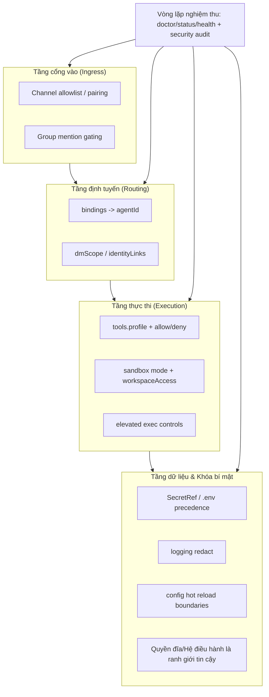

## 8.5 Đường cơ sở bảo mật (Security Baseline) & Quy trình kiểm toán

Mục tiêu của đường cơ sở bảo mật không phải là viết ra một "danh sách kiểm tra trên giấy", mà là giam giữ các năng lực có độ rủi ro cao vào trong các ranh giới xác định, đồng thời bảo đảm mọi quyết định then chốt đều có thể truy nguyên và phát lại được. Mục này dựa trên các tài liệu bảo mật chính thức của OpenClaw để cung cấp một quy trình kiểm toán và an toàn hoàn chỉnh: Phân tầng ranh giới ra sao, ghi nhận sự kiện kiểm toán thế nào, nạp khóa bí mật ra sao, và cách dùng các lệnh tự kiểm tra để biến đường cơ sở thành một quy trình có thể kiểm chứng.

### 8.5.1 Phòng thủ chiều sâu: Phân tầng ranh giới và kiểm chứng từng tầng

Mô hình bảo mật chính thức của OpenClaw được xây dựng trên giả định cơ sở **"Mô hình trợ lý cá nhân (Trusted operator boundary)"**. Bản thân nó không cung cấp cơ chế cách ly cứng cáp tự nhiên để chống lại môi trường đa người thuê độc hại (Malicious multi-tenant). Nếu phơi Gateway ra ngoài Internet mà không có các lớp bảo vệ kiên cố, chuỗi tin cậy của hệ thống sẽ trở nên cực kỳ mong manh.

Đặc biệt lưu ý: Giao thức HTTP của Gateway dùng chung secret token / password (như `/v1/chat/completions`, `/v1/responses`, `/tools/invoke`) phải được xem là cổng vào của người vận hành tin cậy (Trusted operator); một khi đã nắm giữ khóa bí mật dùng chung này thì không thể trông chờ vào phạm vi hẹp `x-openclaw-scopes` để thực hiện cách ly đa người thuê.

Trong một hệ thống Agent, rủi ro không đến từ một cổng vào đơn lẻ, mà bắt nguồn từ chuỗi kết hợp: "Kênh cổng vào + Định tuyến + Công cụ + Khóa bí mật + Bộ nhớ". Mô hình phòng thủ chiều sâu (Defense-in-Depth) tối thiểu khả thi được chia thành 4 tầng, với các điểm kiểm soát có thể kiểm chứng:

1. **Tầng cổng vào (Ingress)**: Cổng kiểm soát kênh, quy tắc kích hoạt nhóm chat, danh sách trắng (Allowlist) và quy tắc tag tên (@). Thiết lập **bề mặt thực thi mặc định cực kỳ thận trọng**: Khuyến nghị ép toàn bộ các phiên không phải phiên chính (như nhóm chat) vào môi trường Sandbox Docker, thậm chí đặt `workspaceAccess=none` hoặc chỉ đọc. Điều này giúp giảm thiểu tối đa nguy cơ lộ lọt chứng thư do cấu hình mở rộng `allowFrom` hoặc `dmPolicy`.
2. **Tầng định tuyến (Routing)**: Dùng quy tắc Bindings ưu tiên cố định các cổng rủi ro cao vào các Agent bị kiểm soát, tránh biến tính chính xác của định tuyến thành một bài toán xác suất. Chi tiết xem tại [Mục 7.3 Cơ sở định tuyến](../07_multi_agent/7.3_routing_basics.md).
3. **Tầng thực thi (Execution)**: Dùng chính sách công cụ `tools.allow`/`tools.deny` và phân tầng chính sách; quy tắc từ chối luôn ưu tiên hơn quy tắc cho phép. Chi tiết xem tại [Mục 5.2 Chính sách Tool](../05_tools_skills/5.2_tool_policy.md).
4. **Tầng dữ liệu & Khóa bí mật**: Chuyển khóa sang cơ chế nạp biến môi trường/SecretRef (xem [Mục 4.2](../04_config_models/4.2_provider_access.md)), bật tính năng làm mờ dữ liệu log nhạy cảm, lưu đầu ra chẩn đoán vào các đường dẫn được quản lý, và kiểm soát thời gian lưu trữ cùng quyền truy cập đĩa.

**Sơ đồ phân tầng an toàn & Chuỗi bằng chứng kiểm chứng:**



Hình 8-4: Sơ đồ phân tầng an toàn và chuỗi bằng chứng kiểm chứng

Để xác minh các phân tầng này có thực sự hiệu lực, hãy ưu tiên dùng các lệnh chẩn đoán hệ thống:

```bash
openclaw doctor
openclaw status --deep
openclaw channels capabilities
openclaw models status
openclaw models status --probe
openclaw secrets audit  # Căn cứ theo phiên bản CLI thực tế
openclaw security audit  # Căn cứ theo phiên bản CLI thực tế
openclaw security audit --deep  # Thăm dò live Gateway + Bộ thu thập bảo mật từ plugin
```

Lệnh `security audit` thông thường thực hiện kiểm tra cấu hình tĩnh/chỉ đọc; cờ `--deep` sẽ bổ sung thêm các đầu dò live Gateway probes và bộ thu thập bảo mật từ các plugin. Cổng vào Hooks cũng cần được rà soát: `hooks.token` bắt buộc phải là một chuỗi ngẫu nhiên mạnh, không rỗng, và tuyệt đối không được dùng lại giá trị của `gateway.auth.token`.

### 8.5.2 Bộ tứ sự kiện kiểm toán: Viết chuỗi nhân quả thành bản ghi có cấu trúc

Cốt lõi của việc kiểm toán là trả lời được 4 câu hỏi: Ai đã làm gì, vào thời điểm nào, qua cổng vào nào, và vì sao hệ thống lại cho phép hoặc từ chối hành vi đó. Để tránh việc nhật ký log trở thành một mớ văn bản hỗn độn không thể tra cứu, hãy chuẩn hóa các hành vi then chốt thành các sự kiện kiểm toán có cấu trúc theo 4 chiều dữ liệu:

1. **Chủ thể (Subject)**: Người dùng, định danh đối tác, tài khoản kênh, và Agent được định tuyến tiếp quản.
2. **Hành động (Action)**: Tên công cụ, tóm tắt tham số, định danh tài nguyên mục tiêu.
3. **Căn cứ (Reason)**: Quy tắc binding đã khớp, điều khoản chính sách công cụ đã trúng, lý do từ chối.
4. **Kết quả (Outcome)**: Thành công, thất bại, bị từ chối, yêu cầu người dùng phê duyệt (HITL).

Lệnh mẫu trích xuất các sự kiện định tuyến và gọi tool từ log JSON:

```bash
openclaw logs --follow --json | jq -c 'select(.type=="log") | (.raw | fromjson? // {}) | select(.event=="routed" or .event=="tool_call" or .event=="blocked_tool_call" or .event=="tool_call_blocked") | {ts:(.time // .ts), traceId, spanId, event, agentId:(.agentId // .agent_id), channelId, peerId, tool, reason}'
```

### 8.5.3 Quản trị khóa bí mật & Bán kính ảnh hưởng sự cố (Blast Radius)

Mục tiêu của quản trị khóa là giới hạn phạm vi tác động và thời gian tồn tại nếu chẳng may bị lộ lọt. Cấu hình OpenClaw hỗ trợ nạp khóa qua cú pháp `${VAR}` hoặc đối tượng `SecretRef`, tránh việc ghi lộ khóa dạng văn bản thuần trong cấu hình hoặc commit nhầm vào Git:

```jsonc
{
  secrets: {
    providers: {
      default: { source: "env" }
    }
  },
  models: {
    providers: {
      "custom-proxy": {
        baseUrl: "https://my-proxy.internal/v1",
        api: "openai-completions",
        apiKey: { source: "env", provider: "default", id: "OPENAI_API_KEY_STAGING" },
        models: [{ id: "team-fast", name: "Team Fast Model", input: ["text"] }]
      }
    }
  }
}
```

Kiểm soát bán kính ảnh hưởng đòi hỏi 3 quy tắc cứng:
1. **Cô lập cổng vào**: Nhóm chat và chat riêng dùng các chính sách và Agent mặc định khác nhau, ngăn các cổng có độ tin cậy thấp trực tiếp kích hoạt năng lực ghi dữ liệu.
2. **Cô lập thẩm quyền**: Các công cụ rủi ro cao chỉ được phép xuất hiện trong nhóm công cụ của một số ít Agent được kiểm soát nghiêm ngặt, bọc lót bằng quy tắc từ chối (Deny).
3. **Cô lập khóa bí mật**: Các năng lực khác nhau dùng các khóa khác nhau hoặc các chứng thư có phạm vi phân quyền khác nhau, tránh tình trạng "một chìa khóa mở vạn cánh cửa".

### 8.5.4 Bài học xương máu: Agent tự ý sửa cấu hình dẫn đến vòng lặp sập hệ thống

Ngay cả khi đã làm tốt các khâu cách ly trên, nếu bạn không bảo vệ quyền đọc/ghi của tệp cấu hình cốt lõi (`openclaw.json`), một thảm họa kỹ thuật nghiêm trọng vẫn có thể xảy ra:

> [!CAUTION]
> **Cảnh giác với ảo giác tự sửa cấu hình của Agent**: Trong một ca sự cố thực tế, người dùng đã cấp quyền đọc/ghi toàn bộ hệ thống tệp cho Agent. Khi hệ thống phát sinh lỗi nhỏ, Agent đã xuất hiện ảo giác "tự sửa lỗi" và bắt đầu tự ý chỉnh sửa tệp `openclaw.json` của chính nó.
>
> Do không hiểu hết định dạng tham số, Agent đã sửa sai cấu hình. OpenClaw phát hiện tệp cấu hình thay đổi liền tự động khởi động lại, vừa khởi động lên gặp lỗi cấu hình lại sập ngay lập tức. Sau đó tiến trình giám sát daemon tiếp tục kéo nó dậy, tạo thành một **vòng lặp sập và khởi động lại vô tận**. Hậu quả tệ nhất là làm tràn ngập ổ đĩa log và cạn kiệt hạn mức gọi API.

**Khuyến nghị phòng thủ:**

1. Trong môi trường sản xuất, **tuyệt đối không tắt các giới hạn phân quyền ở cấp người dùng của hệ điều hành**. Tài khoản chạy tiến trình OpenClaw không nên có quyền ghi vào thư mục chứa tệp cấu hình.
2. Kiểm soát ranh giới nạp lại cấu hình:
   - Tham số: `gateway.reload.mode`
   - Các giá trị: `hybrid` (mặc định, tự phán đoán nạp nóng hay khởi động lại), `hot`, `restart`, `off`.
   - Trong `openclaw.json` có thể đặt `gateway.reload.mode: 'off'` để tắt hoàn toàn việc tự động nạp lại khi file thay đổi.
3. Dùng giới hạn ở tầng tệp tin và thực thi để bảo vệ đường dẫn cấu hình, ví dụ `tools.fs.workspaceOnly`, `tools.exec.applyPatch.workspaceOnly` và gắn ổ đĩa ở chế độ chỉ đọc (Read-only mount).
4. Khi cần sửa cấu hình, hãy dùng các công cụ tự động hóa hạ tầng (Ansible, script triển khai) thay vì để Agent tự chỉnh sửa chính nó.

### 8.5.5 Diễn tập & Kiểm thử hồi quy: Biến đường cơ sở an toàn thành một chu trình kiểm chứng định kỳ

Nếu không diễn tập, đường cơ sở an toàn sẽ bị xói mòn và mất tác dụng qua các lần cập nhật:

1. **Hồi quy tự kiểm tra**: Sau mỗi lần phát hành hoặc thay đổi cấu hình, cố định chạy bộ lệnh nghiệm thu để bảo đảm ranh giới không bị trôi dạt.
2. **Bơm lỗi (Fault Injection)**: Chủ động đưa vào key không hợp lệ, ngắt mạng hoặc vô hiệu hóa kênh trong môi trường thử nghiệm để quan sát hệ thống có đưa ra đường thoái lui và thông báo lỗi rõ ràng hay không.
3. **Phản ứng sự cố**: Khi phát hiện dấu hiệu rò rỉ hoặc vượt quyền, kích hoạt quy trình: Phát hiện → Phân loại → Chỉ định đầu mối → Cầm máu (Chặn khẩn cấp) → Sửa chữa → Xác minh phát hành → Họp rút kinh nghiệm.

Bộ lệnh nghiệm thu tối thiểu:

```bash
openclaw doctor
openclaw health --json
openclaw status --deep
openclaw security audit --deep
openclaw secrets reload
```
