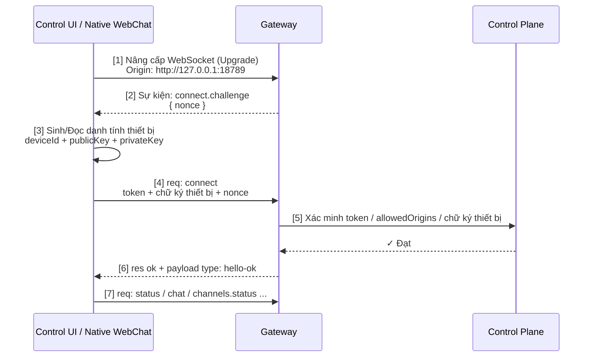

## 9.3 Vòng đời kết nối: Bắt tay (Handshake), Xác thực & Heartbeat

OpenClaw Gateway duy trì kết nối bền vững với các thiết bị từ xa thông qua giao thức kết nối dài WebSocket. Mục này đi sâu vào toàn bộ vòng đời của kết nối WebSocket, bao gồm quá trình bắt tay (Handshake), trao đổi mã xác thực, cơ chế giữ kết nối nhịp tim (Keepalive), tự phục hồi sự cố, và cách các cơ chế này bảo đảm độ tin cậy cho hệ thống phân tán.

### 9.3.1 Vì sao lại chọn WebSocket

So với mô hình Request-Response truyền thống của HTTP, kết nối dài WebSocket sở hữu 3 ưu thế vượt trội:

1. **Giao tiếp hai chiều (Full-duplex)**: Máy chủ có thể chủ động đẩy tin nhắn xuống máy khách client bất cứ lúc nào (ví dụ: "Có tác vụ mới", "Yêu cầu con người phê duyệt").
2. **Độ trễ cực thấp**: Không phải tốn thời gian thiết lập lại kết nối TCP và bắt tay giao thức cho mỗi lượt gửi, giảm thiểu tối đa độ trễ.
3. **Tái sử dụng kết nối (Multiplexing)**: Một kết nối duy nhất có thể xử lý song song nhiều luồng logic khác nhau.

### 9.3.2 Quy trình bắt tay WebSocket & Xác thực Challenge-Response

Quá trình bắt tay hiện tại của Control UI / WebChat gốc không còn là mô hình 2 giai đoạn kiểu cũ, mà bao gồm các bước then chốt: (1) Nâng cấp WebSocket Upgrade thiết lập kết nối tầng truyền tải, (2) Gateway phát ra sự kiện **`connect.challenge`** mang theo chuỗi `nonce`, (3) Client sinh hoặc đọc danh tính thiết bị cục bộ, (4) Client dùng `nonce` để ký số và gửi RPC `connect`, (5) Control Plane kiểm tra tính hợp lệ của token / allowedOrigins / chữ ký thiết bị, (6) Gateway phản hồi kết nối thành công (`hello-ok`), (7) Client chính thức gửi các yêu cầu nghiệp vụ. Chỉ sau khi bước (6) hoàn tất, kết nối mới thực sự bước vào trạng thái khả dụng.



Hình 9-1: Quy trình bắt tay WebSocket và xác thực Challenge-Response

Trong quy trình này, Control Plane đồng thời kiểm tra 3 ranh giới bảo mật:

- **Thông tin xác thực kết nối Gateway**: Do `gateway.auth.mode` và nguồn gốc kết nối quyết định (token, password, deviceToken, bootstrapToken, trusted-proxy, header danh tính Tailscale Serve).
- **Danh sách trắng Origin**: Do cấu hình `gateway.controlUi.allowedOrigins` kiểm soát.
- **Chữ ký danh tính thiết bị**: Bắt buộc client phải dùng `nonce` trong gói challenge để ký số lên payload kết nối.

Các mã từ chối điển hình thường gặp trong nhật ký log:
- `CONTROL_UI_ORIGIN_NOT_ALLOWED`: Nguồn gốc trình duyệt không nằm trong danh sách cho phép.
- `CONTROL_UI_DEVICE_IDENTITY_REQUIRED`: Thiếu chữ ký danh tính thiết bị.

Nói cách khác: **Bắt tay WebSocket Upgrade chỉ mới thiết lập tầng truyền tải mạng, việc xác thực thực sự diễn ra tại RPC `connect` ngay sau challenge.**

### 9.3.3 Phân công giữa các loại Token và Danh tính thiết bị

Quy trình kết nối Control UI là sự phối hợp của 5 loại tài liệu xác thực:

| Tài liệu xác thực | Vòng đời tồn tại | Mục đích sử dụng |
|---|---|---|
| **Gateway Token / Password** | Có thể xoay tua | Dùng phổ biến trong lần kết nối đầu tiên, chứng minh quyền truy cập Control Plane |
| **`deviceToken` đã cấp phát** | Tái sử dụng trên thiết bị đã duyệt | Giúp thiết bị đã phê duyệt khi kết nối lại được ưu tiên kế thừa vùng tin cậy sẵn có |
| **`bootstrapToken`** | Ngắn hạn trong giai đoạn khởi tạo | Tài liệu chuyển tiếp trong các kịch bản ghép nối lần đầu hoặc bàn giao token |
| **Danh tính thiết bị (deviceId + publicKey + privateKey)** | Lưu trữ lâu dài trên máy cục bộ | Chứng minh "đây chính là thiết bị phần cứng cụ thể đã từng gặp trước đây" |
| **Challenge Nonce** | Chỉ có hiệu lực cho một lượt bắt tay duy nhất | Chống tấn công phát lại (Replay Attack), bắt buộc mỗi lần kết nối phải ký số lại |

### 9.3.4 Cơ chế giữ kết nối nhịp tim (Keepalive & Heartbeat)

Trong kết nối dài, các thiết bị trung gian mạng (Proxy, Tường lửa) có thể tự động ngắt kết nối nếu phát hiện đường truyền nhàn rỗi trong một khoảng thời gian. Cơ chế Keepalive sinh ra để ngăn ngừa hiện tượng "rớt mạng oan uổng" này.

Gateway duy trì kết nối qua 2 tầng: Phía server định kỳ gửi WebSocket ping và phát sóng sự kiện `tick`; phía client duy trì tính tích cực của kết nối dựa trên tham số `hello-ok.policy.tickIntervalMs`. Client Gateway sẽ coi bất kỳ sự kiện hoặc phản hồi nào là tín hiệu kết nối còn sống (Liveness); chỉ khi kết nối nhàn rỗi, không có request đang xử lý và quá `2 * tickIntervalMs` hoàn toàn không có hoạt động gì, client mới đóng kết nối với mã lỗi `4000 "tick timeout"` và kích hoạt kết nối lại:

```javascript
if (pendingRequests === 0 && now - lastActivityTime > tickIntervalMs * 2) {
  client.close(4000, "tick timeout");
  reconnect();
}
```

### 9.3.5 Phục hồi ngoại lệ & Chiến lược kết nối lại

Kết nối giữa thiết bị và Gateway có thể bị gián đoạn do rung lắc mạng, thiết bị khởi động lại hoặc nâng cấp Gateway.

#### Chiến lược lùi thời gian số mũ (Exponential Backoff)

Client kết nối lại theo thuật toán lùi thời gian số mũ:

```python
attempt = 0
while not connected:
    delay = min(
        base_delay * (exponential_base ** attempt),
        max_delay
    )
    attempt += 1
    wait(delay)
    try_connect()
```

Các tham số điển hình:
- `base_delay` = 1 giây
- `exponential_base` = 2
- `max_delay` = 30 giây

#### Khôi phục trạng thái sau khi kết nối lại

Sau khi kết nối lại thành công, thiết bị không cần phải đẩy lại toàn bộ dữ liệu từ đầu; client thực hiện bắt tay lại theo giao thức, nhận bản chụp snapshot trạng thái mới nhất từ Gateway, và dựa trên số thứ tự sự kiện `seq` / `stateVersion` để phán đoán xem khung nhìn dữ liệu cục bộ có cần làm mới hay không.

### 9.3.6 Sự khác biệt mấu chốt giữa Kết nối (Connection) và Phiên (Session)

Người mới bắt đầu rất hay nhầm lẫn giữa hai khái niệm này:

| Chiều kích | Kết nối (Connection) | Phiên làm việc (Session) |
|---|---|---|
| **Bản chất vai trò** | Kênh truyền tải dữ liệu | Thùng chứa lưu trữ trạng thái |
| **Vòng đời** | WebSocket mở kết nối → Ngắt kết nối | Tác vụ người dùng bắt đầu → Hoàn thành / Hết hạn |
| **Quan hệ gắn kết** | Thường 1 kết nối mang 1 danh tính thiết bị | 1 phiên ↔ Có thể đón nhận nhiều lượt kết nối lại |
| **Khi bị gián đoạn** | Mất kết nối, thiết bị cần reconnect lại | Lịch sử phiên vẫn nguyên vẹn trên đĩa, tải lại bình thường |
| **Lưu trữ dữ liệu** | Nằm trong bộ nhớ RAM (Thông tin socket) | Tệp lịch sử transcript, tệp session store trên đĩa |

### 9.3.7 Tóm tắt mục

1. **Giai đoạn bắt tay**: Control UI nhận sự kiện `connect.challenge` trước, sau đó gửi RPC `connect` kèm chữ ký số chứa `nonce` để hoàn tất xác thực thực sự.
2. **Cơ chế xác thực**: Dựa trên sự hiệp đồng của Token dùng chung / `deviceToken`, `allowedOrigins` và chuỗi chữ ký danh tính thiết bị.
3. **Duy trì kết nối**: Dựa trên chu kỳ `tickIntervalMs` và giám sát trạng thái hoạt động thực tế của socket.
4. **Phục hồi ngoại lệ**: Kết hợp lùi thời gian số mũ, làm mới snapshot và tải lại lịch sử phiên để duy trì tính liên tục của trải nghiệm.
5. **Phân định ranh giới**: Kết nối thuộc tầng truyền tải (Transport), Phiên thuộc tầng nghiệp vụ (Business).
