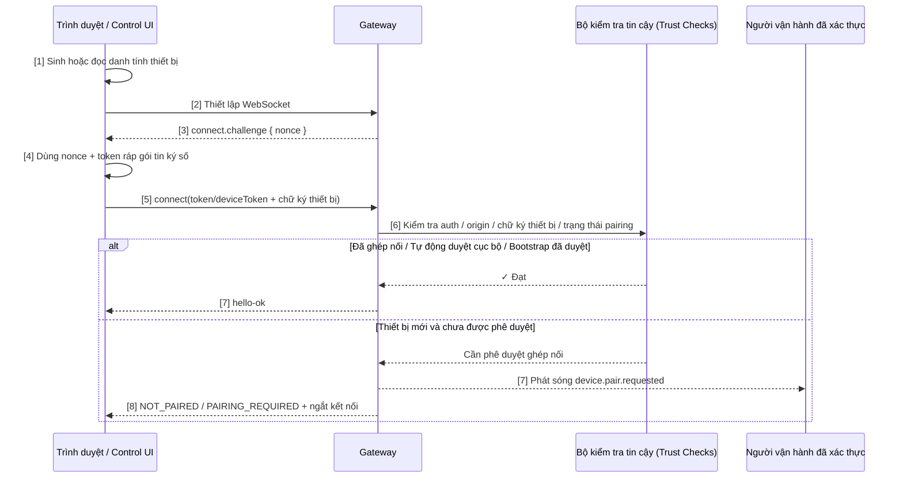

## 9.5 Ghép nối kênh & Thiết lập vùng tin cậy cục bộ

Câu hỏi căn bản nhất trong hệ thống phân tán là: "Bạn là ai, và dựa vào đâu để tôi tin tưởng bạn?". OpenClaw giải quyết bài toán này qua hai tuyến độc lập cần được phân biệt rõ ràng: **Truy cập mặt phẳng điều khiển (Control Plane Access)** và **Ghép nối kênh bên ngoài (Channel Pairing)**. Mục này giải thích cách thức Control Plane thiết lập vùng tin cậy thiết bị cục bộ, và điểm khác biệt của nó so với cơ chế ghép nối DM trong lịch sử.

### 9.5.1 Sự cần thiết của việc ghép nối (Pairing)

Dù là mở Control UI trên trình duyệt hay một node từ xa kết nối vào Gateway, hệ thống bắt buộc phải trả lời 4 câu hỏi:

1. Phía gọi có nắm giữ thông tin xác thực Control Plane hợp lệ hay không?
2. Yêu cầu này có xuất phát từ nguồn gốc (Origin) được phép hay không?
3. Đây có phải chính xác là thiết bị phần cứng cụ thể đã từng gặp trước đây không?
4. Nếu thiết bị hoặc token bị lộ, hệ thống có thể thu hồi ngay lập tức và tái lập vùng tin cậy không?

Đó chính là ý nghĩa sống còn của chuỗi tin cậy và cơ chế ghép nối.

### 9.5.2 Quy trình dẫn dắt vùng tin cậy của Control Plane

Trong các phiên bản hiện đại, quy trình chính của Control UI / WebChat gốc không còn dựa vào mã tạm thời kiểu "Mã tạm DM + `POST /pairing/complete`". Quy trình chuẩn xác hiện nay gồm:

1. Trình duyệt hoặc client sinh và lưu trữ danh tính thiết bị (`deviceId`, `publicKey`, `privateKey`) trên máy cục bộ.
2. Gateway sau khi nhận WebSocket sẽ chủ động gửi gói tin `connect.challenge`.
3. Client dùng `nonce` trong gói challenge để ký số lên payload kết nối, rồi gửi RPC `connect`.
4. Gateway đồng thời kiểm tra:
   - Token/password trong `gateway.auth` có khớp không;
   - `Origin` hiện tại có nằm trong `gateway.controlUi.allowedOrigins` không;
   - Chữ ký thiết bị có khớp với `nonce` không.
5. Nếu thiết bị chưa được phê duyệt, Gateway sẽ chuyển sang nhánh `pairing required` / `device.pair.requested`; chỉ trong kịch bản tự động duyệt trên loopback hoặc thiết bị đã được tin cậy từ trước, kết nối mới được chấp nhận ngay. Những lần kết nối tiếp theo, thiết bị dựa vào `deviceId + publicKey + deviceToken + chữ ký` để duy trì tính liên tục của niềm tin.

Nói cách khác, "ghép nối" ở Control Plane bản chất là **Đăng ký danh tính thiết bị + Xác thực Challenge-Response**, chứ không phải lấy mã tạm DM làm cổng chính.

### 9.5.3 Trình tự thiết lập vùng tin cậy của Control Plane

Hình 9-2: Trình tự thiết lập vùng tin cậy danh tính thiết bị tại Control Plane

Bốn mốc chuyển giao niềm tin then chốt:

1. Phía gọi nắm giữ gateway token hoặc password hợp lệ.
2. Trình duyệt / Client gửi kết nối từ Origin được phép.
3. Thiết bị thực hiện ký số chính xác lên `nonce` trong challenge, chứng minh nó sở hữu private key tương ứng đã sinh trước đó.
4. Gateway chấp nhận danh tính thiết bị và đưa vào tập hợp thiết bị đã nhận diện.

### 9.5.4 Phân biệt giữa Ghép nối Control Plane và Ghép nối DM lịch sử

Cơ chế **Ghép nối tin nhắn riêng (DM Pairing)** trong các tài liệu cũ không phải là vô hiệu, nhưng nó dùng để phê duyệt **người gửi (sender) trên kênh chat**, chứ không phải danh tính thiết bị hay node từ xa. Cần phân biệt rõ hai luồng:

| Luồng | Kịch bản phù hợp nhất | Cách hiểu chuẩn xác hiện nay |
|---|---|---|
| **Danh tính thiết bị Control UI + Challenge-Response** | Trình duyệt cục bộ, WebChat gốc, truy cập Dashboard | Lộ trình chính của Control Plane |
| **Mã ghép nối tạm thời DM (Pairing code)** | Dẫn dắt người dùng trên kênh chat (Ví dụ: kiểm soát ai được chat riêng với bot) | Năng lực ghép nối người gửi cấp kênh, không phải cơ chế khởi động mặc định của Control UI và không thay thế cấu hình cách ly phiên `session.dmScope` |
| **Setup code / bootstrap token** | Node từ xa, headless node hoặc các thiết bị cần tiền cấp quyền | Quét mã QR/setup code dùng để kết nối node ngoại vi; truy cập Control UI từ xa nên cấu hình allowed origins, token/password, Tailscale hoặc trusted-proxy trước rồi mới đi qua quy trình duyệt thiết bị |

Nếu trong log xuất hiện các lỗi như `CONTROL_UI_ORIGIN_NOT_ALLOWED`, `CONTROL_UI_DEVICE_IDENTITY_REQUIRED`, nguyên nhân không nằm ở chỗ "có mã DM hay không", mà nằm ở **Danh sách trắng Origin, gateway token hoặc chuỗi chữ ký thiết bị**.

### 9.5.5 Xoay tua và Thu hồi Token (Rotation & Revocation)

#### Xoay tua Token

Người dùng có thể chủ động xoay tua device token hoặc thiết lập lại gắn kết danh tính thiết bị:
- Gateway sinh device token mới, hoặc yêu cầu thiết bị hoàn thành lại quy trình challenge-response.
- Client cập nhật thông tin liên kết token/danh tính lưu ở máy cục bộ.
- Ngay cả khi token cũ bị đánh cắp thì kẻ xấu cũng không thể sử dụng lại.

#### Thu hồi Token khẩn cấp

Khi thiết bị bị thất lạc hoặc nghi ngờ bị xâm nhập:
- **Có hiệu lực tức thì**: Lệnh `openclaw devices revoke --device <id> --role <role>` sẽ thu hồi device token của vai trò đó ngay lập tức mà không cần đợi thiết bị kết nối lại.
- **Phân biệt với việc xóa bản ghi**: Thu hồi token sẽ chặn token đó kết nối lại; nếu muốn xóa hẳn bản ghi tin cậy của thiết bị, hãy dùng lệnh `openclaw devices remove <deviceId>`.
- **Lưu dấu vết kiểm toán**: Ghi lại thời điểm và lý do thu hồi vào nhật ký để phục vụ rà soát sau sự cố.

### 9.5.6 Tóm tắt mục

1. **Dẫn dắt vùng tin cậy**: Gateway bắt buộc phải đồng thời xác thực chứng thư Control Plane, nguồn gốc Origin và chữ ký danh tính thiết bị.
2. **Luồng Control Plane chuẩn**: Sinh danh tính thiết bị → Nhận `connect.challenge` → Gửi `connect` có chữ ký chứa nonce → Gateway xác minh phê duyệt.
3. **Đa kênh & Đa thiết bị**: Một người dùng có thể kết nối từ nhiều kênh và nhiều thiết bị khác nhau, mỗi thiết bị đều có danh tính độc lập.
4. **Quản trị vòng đời**: Xoay tua token (Cập nhật định kỳ), Thu hồi khẩn cấp (Ngắt truy cập tức thì), Kiểm toán (Ghi log minh bạch).
5. **Phân định rõ ràng**: Mã tạm DM quản lý người gửi trên kênh chat; còn node từ xa hoặc thiết bị Control UI đi qua setup code / bootstrap token và chuỗi chữ ký thiết bị.
