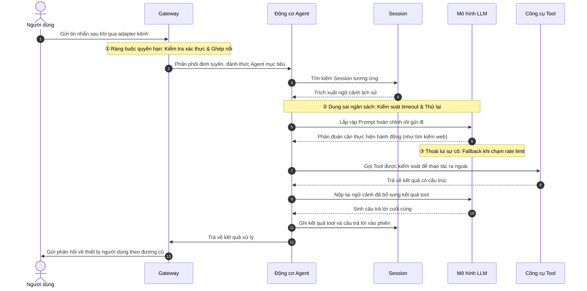
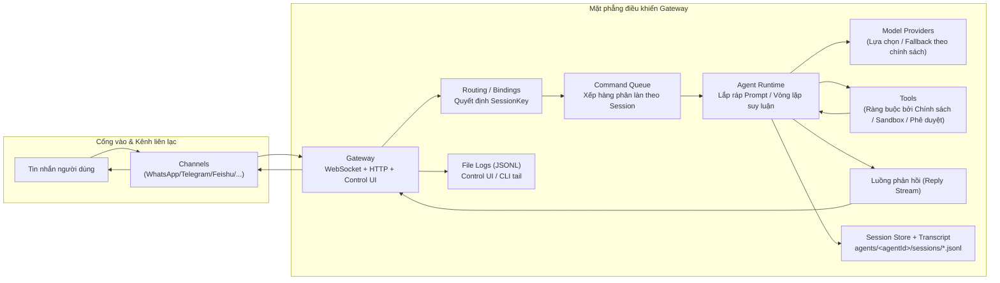

## 10.1 Vòng đời luân chuyển yêu cầu & Chẩn đoán theo tầng

> Trước khi đi sâu vào bóc tách nhân Agent Loop, mục này sử dụng vòng đời hoàn chỉnh của một yêu cầu thực tế để giúp bạn xây dựng trực giác toàn cục. Khi hệ thống gặp sự cố, chiến lược chẩn đoán phân tầng tại đây sẽ giúp bạn khoanh vùng chính xác tầng bị lỗi trong vòng vài giây, thay vì mò kim đáy biển.

---

### 10.1.1 Theo vết vòng đời hoàn chỉnh của một tin nhắn

Cách tốt nhất để hiểu Agent Loop là theo vết một lượt xử lý yêu cầu thực tế. Dưới đây lấy kịch bản "Người dùng gửi tin nhắn trên Telegram, Agent tra cứu một trang web rồi gửi phản hồi" làm ví dụ điển hình để tái hiện toàn bộ tiến trình luân chuyển:

Hình 10-1: Luồng luân chuyển cốt lõi của một yêu cầu (Kèm 3 điểm kiểm soát trọng yếu)

Giải mã từng bước:

1. **Bước ①②**: Tin nhắn gửi đến, Gateway xác thực danh tính và ghép nối thiết bị, căn cứ vào cấu hình định tuyến để bàn giao cho Agent tương ứng. Đây là phạm vi trách nhiệm của Mặt phẳng điều khiển ở Chương 9.
2. **Bước ③④⑤⑥**: Agent trích xuất ký ức lịch sử từ Session, lắp ráp prompt và gửi tới mô hình. Khâu này được kiểm soát bởi cơ chế timeout và thử lại — tương ứng với nội dung Mục 10.3–10.4 và 10.6.
3. **Bước ⑦⑧⑨⑩**: Mô hình suy luận và quyết định gọi công cụ (ví dụ tìm kiếm), sau khi thực thi xong sẽ trả kết quả ngược lại cho mô hình. Giai đoạn này được bảo vệ bởi chính sách công cụ và môi trường Sandbox — tương ứng với cơ chế thực thi công cụ ở Mục 10.5.
4. **Bước ⑪⑫⑬**: Mô hình dựa trên kết quả công cụ để sinh câu trả lời cuối cùng, và trong quá trình thực thi sẽ đan xen trả về các khối dữ liệu dạng luồng (Streaming) tới Gateway. Không nên hiểu nhầm là "phải đợi toàn bộ dữ liệu lưu đĩa xong mới trả về một cục". Điều này tương ứng với cơ chế xuất luồng ở Mục 10.6.

---

### 10.1.2 Chẩn đoán phân tầng: Khi phát sinh lỗi thì kiểm tra từ đâu?

Nhờ sự phân tách trách nhiệm chặt chẽ, việc gỡ lỗi có thể áp dụng chiến lược **"Từ ngoài vào trong"** — kiểm tra tầng cổng vào trước, tiếp theo là tầng điều khiển, rồi tầng thực thi, và cuối cùng mới đến tầng năng lực mô hình/công cụ.

| Tầng & Đối tượng | Trách nhiệm cốt lõi | Biểu hiện lỗi điển hình | Hướng chẩn đoán & Khắc phục |
|---|---|---|---|
| **Tầng cổng vào (Channels)** | Thích ứng giao thức, chuẩn hóa sự kiện | Log hoàn toàn không có bản ghi gửi đến; client liên tục "mất kết nối" | Cấu hình Webhook, kết nối mạng |
| **Tầng điều khiển (Gateway)** | Xác thực, định tuyến, xếp hàng | Yêu cầu bị từ chối ngay lập tức (Unauthorized), mô hình không nhận được gì | Bản ghi ghép nối thiết bị, cấu hình routing, giới hạn truy cập |
| **Tầng thực thi (Agent/Session)** | Ghép nối bộ nhớ, suy luận, thử lại | Thời gian suy luận quá lâu, vòng lặp vô tận, câu trả lời lạc đề hoặc quên vai | Độ dài Context, cấu hình Agent, tham số nén Compaction |
| **Tầng năng lực (Tool/Model)** | Thực thi bên ngoài, hoàn thiện văn bản | Không có phản hồi hành động, mã lỗi 429 Rate limit, tool không giải phóng | Hạn mức tài khoản mô hình, metadata công cụ, đầu dò probe |

**Định vị nhanh 2 triệu chứng phổ biến**:
- **"Thỉnh thoảng trả lời rất chậm và câu trả lời ngày càng kỳ quặc"** → Kiểm tra trước ở **Tầng thực thi / Tầng năng lực** (Ngữ cảnh quá dài, mô hình bị thoái lui chất lượng).
- **"Gửi tin nhắn im bặt không phản hồi, hoặc bị từ chối trong chớp mắt"** → Kiểm tra trước ở **Tầng cổng vào / Tầng điều khiển** (Xác thực thất bại, cấu hình định tuyến sai).

Bảng kiểm tra sự cố đầy đủ xem tại [Phụ lục C: Bảng kiểm tra xử lý sự cố](../appendix/troubleshooting_checklist.md).

---

### 10.1.3 Sơ đồ chuỗi tin nhắn End-to-End (Khung nhìn toàn cục)

Sơ đồ dưới đây thể hiện toàn cảnh chuỗi mắt xích từ khi tin nhắn người dùng đi vào đến lúc câu trả lời cuối cùng quay trở về, trải qua 4 tầng Cổng vào, Điều khiển, Thực thi và Năng lực:

Hình 10-2: Sơ đồ chuỗi tin nhắn End-to-End (Bao gồm đường dẫn lưu trữ và nhật ký log)

Sau khi đã nắm rõ bức tranh toàn cục này, Mục 10.2 tiếp theo sẽ đi sâu vào nền tảng thực thi π (pi), giải thích cách thức OpenClaw thông qua việc tích hợp nhúng đã biến bộ khung thực thi tối giản của pi thành một môi trường Agent Runtime cấp doanh nghiệp.
