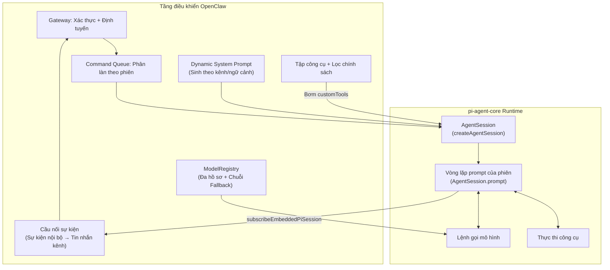
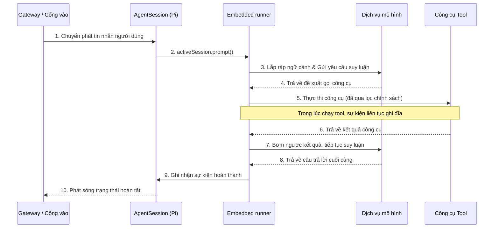

## 10.2 Nền tảng thực thi π & Tích hợp nhúng (Embedded Integration)

Khi lần đầu tiếp cận các framework Agent, sai lầm phổ biến nhất của lập trình viên là đồng nhất Agent với "một vòng lặp vô tận `while True` gọi mô hình AI có kèm bộ nhớ". Nếu dùng vòng lặp đồng bộ chặn luồng kiểu đó, một khi mô hình bắt đầu suy nghĩ hoặc gọi một API công cụ mất vài phút, luồng xử lý đó sẽ bị chiếm dụng hoàn toàn; nếu mạng bị chập chờn hoặc node khởi động lại giữa chừng, toàn bộ hàng chục ngàn Token và các bước suy nghĩ trung gian sẽ tan thành mây khói.

Để hỗ trợ các dây chuyền nghiệp vụ cấp doanh nghiệp kéo dài hàng chục tiếng đồng hồ và đòi hỏi nhiều người cùng tham gia, OpenClaw không sử dụng mô hình lập trình đồng bộ chặn luồng truyền thống, mà xây dựng động cơ suy luận tầng dưới trực tiếp dựa trên bộ khung thực thi tối giản của **[Dự án nguồn mở π (pi)](https://github.com/badlogic/pi-mono/)**, tái sử dụng lõi runtime của nó thông qua phương thức tích hợp nhúng (Embedded Integration).

### 10.2.1 Động cơ và Vỏ bọc: Định vị giữa Pi và OpenClaw

Nếu ví OpenClaw là một "Vỏ bọc quản gia toàn năng (Wrapper)" kết nối với các ứng dụng nhắn tin (như WhatsApp, Telegram, Lark...), túc trực 24/7 để tiếp nhận công việc, thì **Pi chính là bộ não cốt lõi (Engine) bên dưới mang lại cho người quản gia đó khả năng suy nghĩ, viết code và thực thi công cụ**.

Pi (`pi-coding-agent` / `pi-mono`) được sáng lập bởi lập trình viên mã nguồn mở nổi tiếng Mario Zechner (biệt danh badlogic). Động lực ra đời của Pi là nhằm phản kháng lại các framework AI Agent ngày càng trở nên "cồng kềnh và nặng nề" trên thị trường. Dưới dạng một kho monorepo chuyên biệt cho AI Agent, về mặt kiến trúc Pi phân định rạch ròi giữa tầng runtime (như `pi-agent-core` xử lý luân chuyển trạng thái, `pi-ai` chuẩn hóa giao diện gọi đa mô hình), tầng hạ tầng (như thư viện render giao diện dòng lệnh `pi-tui`) và tầng ứng dụng (như `pi-coding-agent` tương tác hoặc bot Slack `pi-mom`).

Triết lý kiến trúc tối giản này đã ảnh hưởng sâu sắc đến OpenClaw:

- **Nhân tối giản & Khả năng mở rộng cực cao**: Lõi động cơ của Pi từ chối sự phình to, mặc định chỉ cung cấp 4 công cụ nền tảng đặc quyền cao là Read, Write, Edit, Bash, và duy trì một System Prompt cực kỳ ngắn gọn. Khi cần các năng lực cao cấp hơn, nó dựa vào kiến trúc plugin để nạp động các gói mở rộng từ npm hoặc Git qua tệp cấu hình.
- **Hệ thống bộ nhớ hoàn toàn trong suốt**: Nó không phụ thuộc vào cơ sở dữ liệu vector hộp đen phức tạp, mà hoàn toàn đọc hiểu thiết lập hệ thống và kiến trúc dự án qua các tệp văn bản thuần có thể nhìn thấy rõ như `AGENTS.md` hoặc `TODO.md`.
- **Chế độ thực thi hoàn toàn tự chủ (Autonomous Execution)**: Pi mặc định vận hành ở chế độ tự động hóa hoàn toàn. Khác với các framework truyền thống luôn đòi hỏi con người xác nhận trước mỗi câu lệnh, Pi liên tục đọc, suy nghĩ, thực thi trong vòng lặp cho đến khi mô hình đánh giá tác vụ đã hoàn thành. Triết lý "không bị gián đoạn" này chính là bảo chứng nền tảng để OpenClaw thực hiện tự động hóa chạy ngầm thực sự.

### 10.2.2 Tích hợp nhúng: OpenClaw tiếp quản Pi như thế nào

OpenClaw không khởi động pi như một tiến trình con bên ngoài, mà nhúng trực tiếp pi SDK vào chính tiến trình của mình thông qua hàm `runEmbeddedPiAgent()`. Sự tích hợp nhúng này giúp OpenClaw nắm quyền kiểm soát tuyệt đối đối với vòng đời của phiên và luồng sự kiện, trong khi vẫn tận dụng trọn vẹn năng lực vòng lặp suy luận của pi-agent-core.

Bốn tầng giao diện tích hợp then chốt bao gồm:

- **Quản lý phiên (Session Management)**: Khởi tạo thực thể `AgentSession` của pi qua `createAgentSession()`, OpenClaw toàn quyền kiểm soát vòng đời tạo mới, phục hồi và hủy bỏ phiên làm việc.
- **Bơm công cụ (Tool Injection)**: OpenClaw kết hợp các công cụ cơ sở của pi, các công cụ đọc ghi/thực thi đã được OpenClaw thay thế, công cụ kênh và các công cụ nội tại của OpenClaw, rồi chuyển danh sách công cụ đang hoạt động sau khi lọc chính sách vào phiên. Thuộc tính `customTools` gánh vác các công cụ mở rộng do OpenClaw quản lý; mọi lượt gọi công cụ bắt buộc phải đi qua bộ lọc chính sách và ràng buộc Sandbox của OpenClaw (xem [Mục 5.2 Chính sách Tool](../05_tools_skills/5.2_tool_policy.md)).
- **Đăng ký sự kiện (Event Subscription)**: Thông qua `subscribeEmbeddedPiSession()` để đăng ký nhận luồng sự kiện nội bộ của phiên pi — bao gồm văn bản xuất dạng luồng, yêu cầu gọi và kết quả trả về của tool, các sự kiện vòng đời agent (khởi động/hoàn thành/lỗi). OpenClaw đóng vai trò cầu nối chuyển tiếp các sự kiện nội bộ này thành tin nhắn đẩy ra các kênh chat bên ngoài.
- **Sổ đăng ký mô hình (Model Registry)**: OpenClaw bơm `ModelRegistry` tùy biến vào để hiện thực hóa việc chọn mô hình độc lập với nhà cung cấp. Sổ đăng ký này hỗ trợ quản lý đa hồ sơ xác thực (Auth Profiles), xoay tua profile theo độ ưu tiên và chuỗi fallback xuyên nhà cung cấp (xem [Mục 10.6 Luồng xuất, thử lại & kết thúc sớm](10.6_streaming_retry.md)).

Hình 10-3: Mối quan hệ kiến trúc khi OpenClaw tích hợp nhúng pi runtime

### 10.2.3 Cơ chế hướng sự kiện & Vòng lặp Agent Loop

Mô hình thực thi cốt lõi của Pi dựa trên 3 trụ cột: **Sự kiện (Event)**, **Trạng thái (State)** và **Vòng lặp Agent Loop cấp phiên**.

Mọi biến động — đầu vào từ bên ngoài, đầu ra của mô hình, yêu cầu gọi công cụ, timeout hay sự cố — đều được chuẩn hóa thành các sự kiện vận hành có thể ghi nhận và theo vết. Tiến trình thực thi được kích hoạt bởi `runEmbeddedPiAgent()` / `runEmbeddedAttemptWithBackend()` của OpenClaw, khởi tạo phiên và gọi `activeSession.prompt()`, sau đó đăng ký lắng nghe sự kiện xuất qua `subscribeEmbeddedPiSession()`.

Hình 10-4: Trình tự luân chuyển của một lượt suy luận dựa trên phiên gọi nhúng

### 10.2.4 Cơ chế sinh Prompt hệ thống động (Dynamic System Prompt)

Khác với cách dùng prompt hệ thống tĩnh của pi gốc, cơ chế tích hợp nhúng của OpenClaw tự động sinh System Prompt động cho từng phiên làm việc. Logic sinh prompt sẽ tổng hợp dựa trên loại kênh hiện tại (quy tắc ứng xử trong nhóm Telegram khác với chat riêng trên WhatsApp), cấu hình vai trò của Agent mục tiêu (`AGENTS.md`), và mô tả của các kỹ năng được nạp tại runtime. Nhờ đó, cùng một instance pi runtime nhưng khi phục vụ ở các kênh và kịch bản khác nhau có thể thể hiện nhân cách và ranh giới năng lực hoàn toàn khác biệt.

Chi tiết lắp ráp prompt động sẽ được trình bày ở [Mục 10.4 Lắp ráp Prompt](10.4_prompt_assembly.md).

### 10.2.5 Độ bền vững của Runtime: Phân tích cú pháp luồng & Phục hồi lỗi

Trong quá trình tiến hóa, Pi đã trực tiếp đối mặt và giải quyết rất nhiều bài toán thực tế gai góc, mang lại kinh nghiệm kỹ thuật vô giá cho OpenClaw:

- **Dung sai tham số công cụ dạng luồng**: Khi kết nối với các provider khác nhau, tham số gọi tool do mô hình xuất ra có thể bị cắt cụt, dính nhiễu ở đuôi hoặc sai lệch tương thích. Hệ thống áp dụng cơ chế phân tích cú pháp có giới hạn, xác thực chặt chẽ và phân cấp lỗi, thay vì phụ thuộc vào một hàm parse mong manh.
- **Phân loại xử lý các lỗi có thể phục hồi**: Đối với các tác vụ tự động hóa kéo dài hàng giờ, việc coi mọi sự cố rớt mạng thoáng qua hoặc lỗi parse nhỏ là lỗi chí mạng (Fatal error) để dừng cuộc chơi là không thể chấp nhận được. Thiết kế bền vững sẽ phân định rõ giữa lỗi rate limit, quá tải, tràn ngữ cảnh, lỗi mạng và lỗi cú pháp không thể phục hồi, từ đó quyết định xem nên thử lại, failover, bơm thông báo lỗi dễ đọc hay kết thúc tác vụ.

> [!WARNING]
> **Ranh giới ràng buộc an toàn đối với các công cụ nền tảng đặc quyền cao**
>
> Các công cụ mặc định của Pi như Bash và đọc ghi tập tin diện rộng bản chất là những cổng vào có đặc quyền cực cao trên máy trạm. Khi cài đặt thêm nhiều gói mở rộng từ cộng đồng qua npm/git hoặc đóng gói bot phục vụ cộng tác nhóm, rủi ro đầu độc chuỗi cung ứng và thực thi lệnh vượt quyền sẽ tăng lên gấp bội. Đối với các kịch bản cấp doanh nghiệp, bắt buộc phải thiết lập cô lập cứng thông qua Container Sandbox và phân quyền đặc quyền tối thiểu ở tầng trên của nền tảng. Chi tiết xem tại [Chương 11: Độ tin cậy và An toàn bảo mật](../11_reliability_security/README.md).
