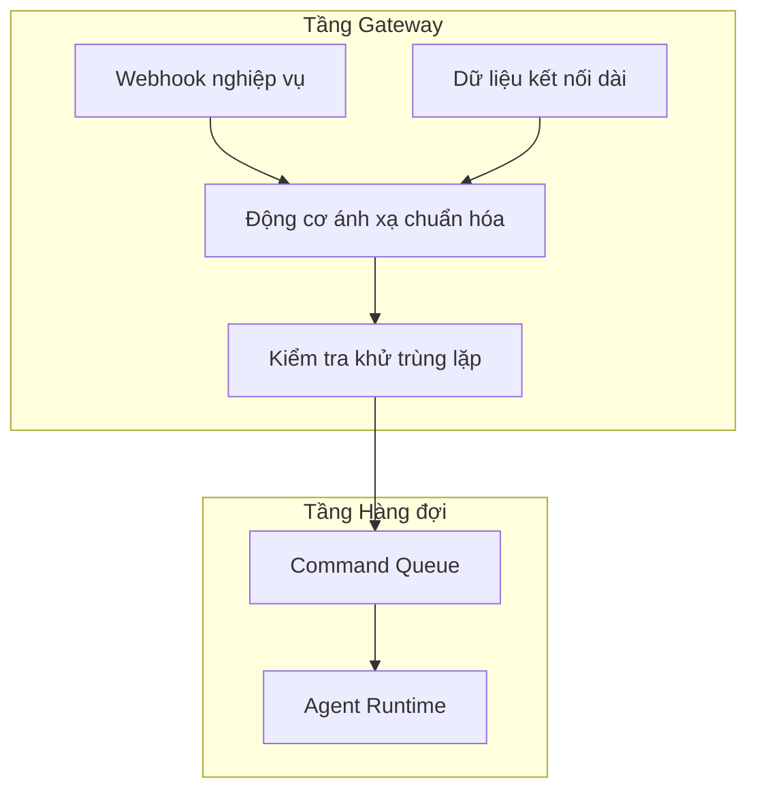
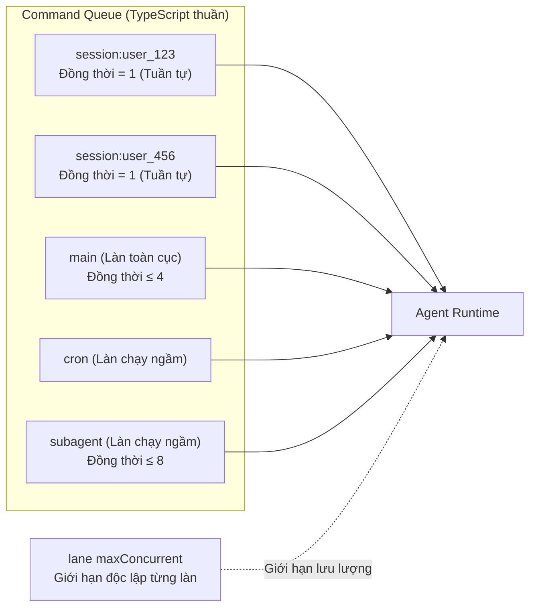

## 10.3 Cổng vào, xếp hàng & Kiểm soát đồng thời (Concurrency Control)

Mục này tập trung vào lớp bảo vệ ngoại vi tiên phong của vòng lặp Agent Loop: Quản trị cổng vào. Các lệnh gọi mô hình ngôn ngữ lớn rất đắt đỏ và cực kỳ dễ bị tấn công bởi độ trễ đuôi (Tail latency), vì vậy việc chuẩn hóa dữ liệu từ các kênh chat, tận dụng cơ chế hàng đợi phân làn (Lane Queuing) để kiểm soát độ đồng thời và tạo áp lực ngược (Backpressure) là tuyến phòng thủ đầu tiên giúp hệ thống không bị đổ vỡ dây chuyền.

### 10.3.1 Chuẩn hóa giao thức: Từ dữ liệu kênh dị thể thành sự kiện thống nhất

Bất kỳ framework Agent nào cho phép đưa thẳng dữ liệu thô từ các kênh liên lạc (như gói tin webhook từ Slack, WhatsApp hay HTTP request thô) vào thẳng ngữ cảnh suy luận thì chắc chắn sẽ gặp tình trạng hỗn loạn về logic. Mỗi kênh chat đều sở hữu một ngăn xếp khái niệm riêng (Tag tên, đồng bộ đa thiết bị, thu hồi tin nhắn...), hoàn toàn xa lạ với "miền tác vụ thuần khiết" mà Agent cần.

Chuẩn hóa (Normalization) là ca phẫu thuật bắt buộc đầu tiên. Hệ thống Gateway không chỉ đóng vai trò chuyển tiếp, mà còn bóc tách toàn bộ tạp âm giao tiếp, chuyển đổi thành định dạng sự kiện tiêu chuẩn mà hệ thống hiểu được, cuối cùng quy về một tác vụ điều phối có gắn kết phiên rõ ràng. Trong quá trình này, các thuộc tính cốt lõi sau được xác lập:

- **Khóa phiên (Session Key)**: Định danh khóa ngữ cảnh, bảo đảm các yêu cầu liên tiếp không làm ô nhiễm chéo giữa các phiên.
- **Gắn nhãn ý định (Intent)**: Thuộc mặt phẳng định tuyến hoặc nghiệp vụ, hệ thống dựa vào trường này để điều phối độ ưu tiên.
- **Ràng buộc ngân sách (Budget)**: Bao gồm giới hạn thời gian timeout, số lượt gọi mô hình tối đa, giúp bộ thực thi có thể chủ động ngắt tác vụ nếu vượt ngân sách.



Hình 10-5: Hiệu ứng phễu từ sự kiện kênh dị thể thành tác vụ điều phối chuẩn hóa

Tiêu chuẩn nghiệm thu của kiến trúc này là: Bất kỳ tương tác nào phát sinh từ các kênh online đều phải được phân giải thành sự kiện chuẩn có thể truy vết có cấu trúc, mang đầy đủ ID sự kiện, khóa phiên, dấu vết trace và ngữ cảnh log để dễ dàng tái dựng chuỗi xử lý khi gỡ lỗi.

### 10.3.2 Kiểm soát tính bất biến: Chặn đứng thảm họa phát lại (Replay)

Trong lập trình Web truyền thống, chỉ các yêu cầu sửa đổi như POST hoặc PUT mới cần cẩn trọng xử lý tính bất biến. Nhưng trong kiến trúc Agent, ngay cả một yêu cầu thoạt nhìn như "truy vấn thuần túy" cũng có thể khiến Agent tự động kích hoạt các công cụ thay đổi dữ liệu có rủi ro cao (như thao tác môi trường thử nghiệm, gọi API tính phí).

Vì vậy, việc tin nhắn bị nộp lặp ở phía Agent bắt buộc phải có cơ chế ngăn chặn đồng thời ở cấp độ vật lý trước khi công cụ kịp phân phối:

- **Khử trùng lặp yêu cầu thô (Cửa sổ khử trùng lặp)**: Ngăn chặn việc phía kênh do rung lắc mạng gửi lặp lại cùng một ID sự kiện trong thời gian ngắn; hệ thống sẽ chặn đứng và trả về kết quả trạng thái đã lưu trong cache.
- **Rào chắn tác dụng phụ tinh vi (Side-effect barrier)**: Khi Agent quyết định thực thi một công cụ có tính chất thay đổi dữ liệu, hệ thống đánh dấu rào chắn ghi trong bộ nhớ cache. Sau đó nếu cùng một tác vụ bị luân chuyển lại từ cổng vào, nó sẽ bị rào chắn chặn lại thay vì suy luận lại một cách mù quáng.

### 10.3.3 Command Queue: Hàng đợi phân làn bằng TypeScript thuần túy

Tầng hàng đợi của OpenClaw là một **bản cài đặt bằng TypeScript thuần túy, hoàn toàn không phụ thuộc vào Redis hay bất kỳ middleware bên ngoài nào**, kiểm soát độ đồng thời hoàn toàn dựa trên Promise. Thiết kế này giúp giảm thiểu độ phức tạp triển khai, cho phép một node độc lập sở hữu trọn vẹn năng lực hàng đợi mạnh mẽ.

Hàng đợi áp dụng kiến trúc **Phân làn (Lane)**, mỗi làn tự duy trì hàng đợi FIFO và ngưỡng đồng thời độc lập:

- **Làn phiên (Session Lane)**: Mang định danh `session:<key>`, bảo đảm các yêu cầu liên tiếp trong cùng một phiên được thực thi tuần tự nghiêm ngặt (độ đồng thời = 1). Đây là cơ chế cách ly quan trọng nhất — các tin nhắn gửi liên tục của cùng một người dùng sẽ không dẫm đạp lên nhau.
- **Làn toàn cục (Global Lane)**: Kiểm soát độ đồng thời cấp tiến trình, mặc định làn `main` có ngưỡng đồng thời tối đa là 4. Các làn chưa cấu hình mặc định có ngưỡng đồng thời là 1.
- **Làn chạy ngầm (Background Lane)**: Các quỹ đạo thực thi độc lập như `cron` và `subagent`; mặc định làn `subagent` có ngưỡng đồng thời tối đa là 8, bảo đảm các tác vụ định kỳ và agent con không bị "bỏ đói" bởi lưu lượng nghiệp vụ thông thường.

Tham số `agents.defaults.maxConcurrent` chủ yếu quyết định trần đồng thời cho làn main; các làn ngầm như cron hay subagent có cơ chế kiểm soát đồng thời riêng.



Hình 10-6: Hàng đợi Command Queue phân làn và kiểm soát độ song song

### 10.3.4 Áp lực ngược (Backpressure) & Timeout: Hạ cấp hệ thống trong tầm kiểm soát

Khi tải hệ thống lên quá cao, hệ thống cần chủ động và nhanh chóng phản hồi từ chối cho máy khách client thay vì để kết nối bị treo vĩnh viễn:

- **Giới hạn độ sâu hàng đợi**: Hàng đợi tin nhắn có trần dung lượng mặc định; chiến lược drop mặc định thiên về tóm tắt (summarize); chỉ khi cấu hình các chiến lược như `drop: "new"` thì yêu cầu mới mới bị từ chối thẳng thừng.
- **Khóa ghi phiên (Session Write Lock)**: Trong cùng một phiên tại cùng một thời điểm, chỉ có duy nhất một thao tác được quyền sửa đổi trạng thái; các yêu cầu sau buộc phải xếp hàng chờ đợi.
- **Timeout tác vụ**: Hàng đợi để lộ các điểm kiểm soát như `warnAfterMs`, `onWait` và `taskTimeoutMs`; timeout chủ yếu ràng buộc các tác vụ đã ra khỏi hàng đợi và đang thực thi, bảo đảm tác vụ dài không biến thành tiến trình thây ma (Zombie process).

Đường cơ sở nghiệm thu tính năng áp lực ngược là: Dưới tải áp lực gấp 10 lần mức đỉnh, hệ thống tuyệt đối không bị tràn bộ nhớ (OOM), dung lượng hàng đợi và chính sách drop vận hành chuẩn xác.

### 10.3.5 Chẩn đoán chuỗi xử lý dựa trên nhật ký Log

Nếu không có nhật ký log có thể định vị khách quan thì hàng đợi và kiểm soát đồng thời chỉ là khái niệm sáo rỗng. Hãy thu thập các chỉ số sau qua Trace để xây dựng bảng giám sát:

- **Chiều mức độ bão hòa**: Tổng số lượng tin nhắn đang ùn ứ, tỷ lệ chiếm dụng của từng làn hàng đợi, tần suất từ chối ở cổng vào.
- **Chiều độ trễ**: Thời gian chờ xếp hàng, độ trễ lượt gọi mô hình đầu tiên, tổng thời gian xử lý trọn vẹn yêu cầu.

Lệnh mẫu dùng `jq` để lọc thông tin chuẩn hóa và các mốc vòng đời từ log có cấu trúc:

```bash
openclaw logs --follow --json | jq -c 'select(.type=="log") | (.raw | fromjson? // {}) | select(.traceId=="t-78ab-09f1") | {time, traceId, level: ._meta.logLevelName, msg: .["0"]}'
```

Sau khi toàn bộ tín hiệu gửi đến được chuẩn hóa thành các đối tượng quản trị thuần khiết và chịu sự kiểm soát lưu lượng chặt chẽ, trọng trách tiếp theo của hệ thống sẽ chuyển sang việc chuẩn bị tri thức cốt lõi để mô hình tiêu thụ — chính là quy trình Lắp ráp Prompt.
