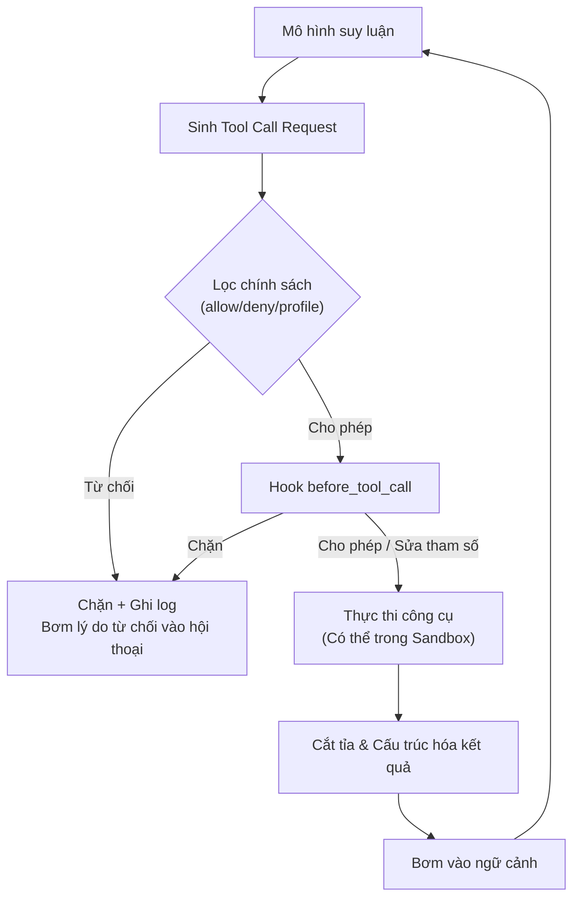

## 10.5 Thực thi Tool & Bơm ngược kết quả (Result Injection)

Bước nhảy vọt phấn khích nhất của hệ thống Agent nằm ở năng lực "chuyển hóa ngôn ngữ tự nhiên thành các hành động tạo ra tác động vật lý có thể kiểm chứng được trong thế giới thực". Tuy nhiên dưới góc nhìn của OpenClaw, đây cũng chính là mắt xích mong manh và tiềm ẩn nhiều rủi ro sập hệ thống nhất — bởi mỗi lượt gọi công cụ là một bước nhảy từ việc suy luận mang tính xác suất của mô hình sang các tác dụng phụ mang tính xác định trong thế giới vật lý.

Mục này xuất phát từ toàn bộ vòng đời của lượt gọi công cụ, bóc tách chuỗi thực thi hoàn chỉnh từ khi mô hình đề xuất ý định cho tới khi lọc chính sách, thực thi thực tế và bơm ngược kết quả vào ngữ cảnh.

### 10.5.1 Bản chất của công cụ: Hàm có thể gọi kèm chữ ký kiểu dữ liệu (Type Signatures)

Trong OpenClaw, công cụ (Tool) được định nghĩa là một **hàm có thể gọi đi kèm chữ ký kiểu dữ liệu tường minh**. Mỗi công cụ đều có tên, cấu trúc tham số (JSON Schema), giao thức gọi và các nhãn an toàn tùy chọn. Trong quá trình suy luận, nếu mô hình quyết định gọi tool, nó sẽ sinh ra một yêu cầu có cấu trúc (Tool Call Request) chứa tên công cụ và các tham số.

Lượt gọi công cụ trải qua 4 giai đoạn:

1. **Đề xuất ý định (Proposing)**: Mô hình sinh yêu cầu gọi công cụ có định dạng, luồng điều khiển quay trở về nhân thực thi.
2. **Lọc chính sách (Policy Filtering)**: Hệ thống kiểm tra xem công cụ đó có nằm trong phạm vi cho phép của chính sách hay không (`tools.allow` / `tools.deny`, profile công cụ `tools.profile`, người gửi `toolsBySender`, và cổng phê duyệt đặc quyền cao `tools.elevated.*`). Mọi hành vi vượt quyền đều bị chặn đứng ngay tại bước này mà không làm hao tổn tài nguyên gọi mô hình.
3. **Thực thi thực tế (Execution)**: Yêu cầu sau khi vượt qua kiểm tra an toàn sẽ được phân phối tới bộ thực thi tương ứng, có thể chạy trong môi trường Sandbox cô lập.
4. **Bơm ngược kết quả (Result Injection)**: Kết quả công cụ trả về sau khi được cắt tỉa và cấu trúc hóa sẽ được bơm ngược vào ngữ cảnh đối thoại để mô hình tiếp tục suy luận.



Hình 10-10: Vòng đời hoàn chỉnh của một lượt gọi công cụ

### 10.5.2 Hook before_tool_call: Điểm chặn động ở cấp Plugin

Bên ngoài hàng rào chính sách tĩnh, OpenClaw còn cung cấp một tầng can thiệp linh hoạt hơn — **Hook before_tool_call**. Nó cho phép các plugin can thiệp ngay trước khi công cụ kịp chạy, hiện thực hóa các logic động phức tạp (như chặn có điều kiện dựa trên trạng thái runtime). Chi tiết về kiến trúc hook xem tại [Mục 12.1.4 Kiến trúc Hook](../12_extension_engineering/12.1_plugin_architecture.md).

Hook chạy trước mỗi lượt gọi tool và có thể làm 2 việc:

- **Chặn thực thi**: Trả về `{ block: true, blockReason: "..." }`, việc gọi công cụ bị hủy bỏ ngay lập tức và lý do từ chối được bơm ngược vào phiên chat.
- **Sửa đổi tham số / Yêu cầu phê duyệt**: Trả về `{ params: { ... } }` hoặc yêu cầu phê duyệt (Approval request), runtime sẽ hợp nhất kết quả cuối cùng của hook vào tham số hiện tại. Một ứng dụng tích hợp sẵn điển hình là **Phát hiện vòng lặp (Loop Detection)**: Khi hệ thống phát hiện Agent liên tục gọi cùng một công cụ với tham số tương tự nhau, hook sẽ gắn nhãn `stuck` và tùy theo mức độ nghiêm trọng (`critical` chặn ngay / `warn` cảnh báo) để quyết định có dừng lại hay không.

### 10.5.3 Hệ thống chặn: Bọc lót bằng rào chắn chính sách thay vì phó thác cho prompt

Trao quyền thao tác thế giới thực tế cho một mô hình xác suất bản chất là một bài toán đánh cược rủi ro. Dưới góc độ kỹ thuật, việc thiết lập các quy tắc xác định tại tầng lọc chính sách luôn luôn vượt trội hơn hẳn so với việc liên tục dặn dò mô hình trong prompt "hãy cẩn thận đừng làm việc nguy hiểm".

Mọi công cụ có tác dụng phụ ra bên ngoài (như gửi email, cập nhật cơ sở dữ liệu, khởi động lại máy chủ...) đều nên được đưa vào danh sách cấm `tools.deny` theo mặc định, và chỉ mở ra khi thỏa mãn:

- Giới hạn tệp người dùng được phép kích hoạt qua `toolsBySender`.
- Đối với năng lực chạy lệnh trên máy chủ, chồng lớp thêm các cổng kiểm soát đặc quyền cao như `tools.elevated.enabled` / `tools.elevated.allowFrom`.
- Kết hợp luồng xác nhận của con người (Human-in-the-Loop), yêu cầu các thao tác then chốt bắt buộc phải có người phê duyệt mới được thực thi.

Trong tài liệu chính thức, một số công cụ được gắn cứng không thể gọi qua API bên ngoài (như `cron`, `sessions_spawn`, `gateway`, `whatsapp_login`). Chi tiết xem tại [Mục 5.2 Chính sách Tool](../05_tools_skills/5.2_tool_policy.md).

### 10.5.4 Bơm kết quả & Chống lãng quên: Cắt tỉa kết quả công cụ kích thước lớn

Sau khi công cụ chạy xong, nếu đưa nguyên xi cả một khối dữ liệu khổng lồ vào ngữ cảnh, cửa sổ Token sẽ bị các dữ liệu giá trị thấp chiếm trọn, đẩy các chỉ thị quan trọng ban đầu ra ngoài — đây chính là hiện tượng "ngập lụt ngữ cảnh (Context Drowning)". Ví dụ: Một câu lệnh Shell trả về mười vạn dòng log `nginx`, nếu nhồi thẳng vào prompt sẽ khiến mô hình mất sạch trí nhớ về các việc trước đó.

Hệ thống tuân thủ 3 chiến lược khi bơm kết quả ngược lại:

- **Ưu tiên tóm tắt có cấu trúc**: Bóc tách các trường then chốt và kết luận cốt lõi để bơm vào ngữ cảnh, thay vì trả về toàn bộ dữ liệu thô.
- **Cắt ngắn cưỡng bức (Hard Truncation)**: Thiết lập giới hạn dung lượng kết quả động (mặc định ngưỡng cứng khoảng 16K ký tự). Phần vượt ngưỡng bị cắt ngắn và chèn dòng chú thích rõ ràng để mô hình biết dữ liệu đã bị rút gọn.
- **Tham chiếu lưu trữ bên ngoài**: Với các dữ liệu cực lớn, không bơm nội dung thô mà chỉ trả về đường dẫn tệp (ví dụ: "Kết quả quét đã lưu tại `/tmp/scan_result.log`, nếu cần xem chi tiết hãy đọc lại tệp này").

### 10.5.5 Phương pháp chẩn đoán sự cố: Truy vết dựa trên nhật ký sự kiện

Vì mỗi giai đoạn gọi công cụ đều được lưu thành sự kiện độc lập trên đĩa, khi gỡ lỗi bạn có thể bám theo dòng thời gian của sự kiện để chỉ đích danh mắt xích bị hỏng mà không cần đoán mò:

1. Dùng `openclaw sandbox explain` để kiểm tra công cụ và chính sách sandbox có hiệu lực của Agent/Session hiện tại; dùng `openclaw status --deep` xác nhận Gateway và các đầu dò hệ thống khỏe mạnh.
2. Dùng `logs --follow --json` lọc theo `traceId` để xác nhận: Yêu cầu gọi tool đã phát ra chưa, có bị chính sách chặn không, và kết quả đã bơm ngược lại chưa.
3. Dùng `doctor` kiểm tra phụ thuộc và kết nối mạng, loại trừ các sự cố ở tầng hạ tầng.

```bash
openclaw status --deep
openclaw logs --follow --json
openclaw doctor
```

Sau khi đã nắm vững cơ chế lọc chính sách, thực thi và bơm ngược kết quả của công cụ, mục tiếp theo sẽ khám phá việc xuất dữ liệu dạng luồng và chiến lược thử lại — những mắt xích bảo đảm các tác vụ đường dài vẫn có thể hạ cấp trong tầm kiểm soát khi gặp sự cố bên ngoài.
