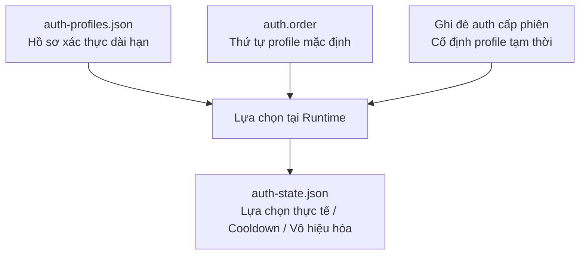
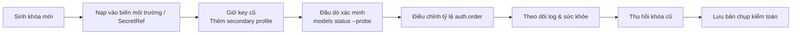

## 11.1 Quản trị đa khóa: Hồ sơ xác thực (Auth Profiles), Xoay tua môi trường & Thứ tự xác thực (auth.order)

Quản trị đa khóa rất dễ bị biến thành một bản "hướng dẫn thao tác xoay tua cơ học", nhưng trước hết nó là bài toán về **Mô hình đối tượng xác thực (Authentication Object Model)**: Ai định nghĩa tập hợp khóa ứng viên, ai quyết định lựa chọn mặc định, ai ghi nhận kết quả sử dụng thực tế, và thông tin này được phân bổ xuống các Agent và các môi trường khác nhau như thế nào. Chỉ khi làm sáng tỏ mối quan hệ đối tượng này thì các quy trình phát hành thử nghiệm (Canary), xoay tua và ứng cứu khẩn cấp mới không bị rơi vào lối mòn máy móc.

### 11.1.1 Vì sao quản trị đa khóa không chỉ là thao tác vận hành đơn thuần

Nếu hệ thống chỉ có duy nhất một API Key, rủi ro không chỉ dừng lại ở câu chuyện "hỏng thì đổi", mà đồng thời kéo theo 3 nguy cơ kỹ thuật lớn:

- **Rủi ro tính khả dụng**: Khi cạn hạn mức, chạm trần rate limit hoặc key bị khóa, toàn bộ hệ thống sẽ tê liệt 100%.
- **Rủi ro tính cách ly**: Lưu lượng thử nghiệm, lưu lượng sản xuất và các Agent rủi ro cao dùng chung một chứng thư, khiến bán kính ảnh hưởng sự cố (Blast Radius) trở nên quá lớn.
- **Rủi ro kiểm toán**: Sau khi xảy ra sự cố, bạn hoàn toàn không thể trả lời câu hỏi "luồng lưu lượng nào đã sử dụng khóa API nào".

Vì vậy, mục tiêu của quản trị đa khóa không phải là "chuẩn bị sẵn vài chiếc chìa khóa dự phòng", mà là phân tách và quản trị độc lập 4 yếu tố: **Tập hợp ứng viên, Chiến lược mặc định, Lựa chọn thực tế tại runtime và Bản ghi kiểm toán**.

### 11.1.2 Mô hình đối tượng xác thực: auth profile, auth order, ghi đè phiên & auth state

Mô hình phân tầng chuẩn xác hiện nay gồm: Tài liệu xác thực dài hạn bắt nguồn từ `auth-profiles.json` (và cấu hình provider khi cần); thứ tự ưu tiên mặc định do `auth.order` quy định; từng phiên hội thoại hoặc tác vụ đơn lẻ có thể tạm thời cố định profile thông qua session-level auth override; và trạng thái làm nguội (Cooldown), kết quả xoay tua cùng trạng thái vô hiệu hóa tại runtime được lưu trong `auth-state.json`.



Hình 11-1: Mô hình đối tượng xác thực trong quản trị đa khóa

Trách nhiệm của từng thành phần:

- **`auth-profiles.json`**: Định nghĩa "những hồ sơ xác thực dài hạn nào khả dụng để Agent lựa chọn". Các trường thông tin tĩnh hỗ trợ tham chiếu SecretRef ra hệ thống quản lý khóa bên ngoài; trong khi tài liệu OAuth thuộc loại xác thực biến đổi tại runtime nên không dùng SecretRef thông thường.
- **`auth.order`**: Định nghĩa "thứ tự ưu tiên mặc định khi thử các đường dẫn profile / provider".
- **Ghi đè auth cấp phiên (Session Auth Override)**: Định nghĩa "phiên hội thoại này có tạm thời cố định một profile cụ thể hay không".
- **`auth-state.json`**: Ghi nhận "profile nào bị rơi vào trạng thái làm nguội (Cooldown), bị vô hiệu hóa hoặc chuyển sang đường dự phòng vào thời điểm nào".

Tài liệu chính thức phân tách rạch ròi hai tệp này:
- `auth-profiles.json`: Lưu trữ chứng thư và tham chiếu SecretRef, là tài sản nhạy cảm cần được bảo vệ nghiêm ngặt.
- `auth-state.json`: Lưu trữ trạng thái runtime (cooldown, vô hiệu hóa, định tuyến).

### 11.1.3 Chiến lược cách ly đa khóa: Theo môi trường, Theo Agent, Theo Nhà cung cấp

Sai lầm phổ biến là ngộ nhận "nhiều key" đồng nghĩa với "tính sẵn sàng cao". Chất lượng quản trị thực sự phụ thuộc vào ranh giới phân tách:

#### 1. Phân tách theo môi trường
- Phát triển (Dev), Thử nghiệm (Staging) và Sản xuất (Production) bắt buộc dùng các khóa API hoàn toàn độc lập.
- Mục tiêu: Ngăn lưu lượng test làm cạn kiệt hạn mức sản xuất, và tránh các sự cố trên production bị khuếch đại bởi các thử nghiệm dev.

#### 2. Phân tách theo Agent
- Các Agent có quyền ghi dữ liệu rủi ro cao và các Agent chỉ đọc rủi ro thấp dùng các key khác nhau.
- Mục tiêu: Gắn ranh giới phân quyền đồng nhất với ranh giới chứng thư, thu hẹp bán kính ảnh hưởng nếu xảy ra rò rỉ.

#### 3. Phân tách theo Nhà cung cấp hoặc Miền thanh toán
- Trong cùng một provider, các dự án, đội ngũ hoặc tài khoản thanh toán khác nhau được cấu hình các key riêng biệt.
- Mục tiêu: Thuận tiện cho việc hạch toán chi phí, cô lập sự cố và kiểm soát hạn mức.

### 11.1.4 Vòng đời chuẩn mực: Sinh khóa, Nạp vào, Xác minh, Chuyển đổi, Thu hồi

Xoay tua khóa là một phần của vòng đời chuẩn tắc chứ không phải mẹo vặt tạm bợ. Quy trình 8 bước an toàn trong môi trường sản xuất:



Hình 11-2: Vòng đời chuẩn mực của quy trình xoay tua đa khóa

Giải mã từng bước:

1. **Sinh khóa & Nạp vào**: Khóa mới được đưa vào hệ thống quản lý khóa hoặc biến môi trường, tuyệt đối không ghi đè trực tiếp lên giá trị cũ.
2. **Xác minh**: Dùng `openclaw models status` để kiểm tra trạng thái profile, dùng `openclaw models status --probe` và `openclaw health --json` để xác nhận khóa mới hoạt động tốt.
3. **Chuyển đổi từng phần**: Điều chỉnh `auth.order` để lưu lượng mặc định chuyển dần sang khóa mới.
4. **Thu hồi & Lưu trữ**: Sau khi quan sát hệ thống vận hành ổn định trên khóa mới, tiến hành thu hồi khóa cũ ở phía nhà cung cấp và lưu bản chụp kiểm toán.

Lệnh thao tác kiểm tra:

```bash
openclaw models status
openclaw models status --probe
openclaw health --json
openclaw status --deep
```

Nguyên tắc vàng về thứ tự thực hiện: **Thêm mới trước → Xác minh kỹ → Chuyển đổi dần → Thu hồi sau cùng**. Làm ngược thứ tự sẽ tạo ra khoảng trống chết (Dirty window) gây gián đoạn dịch vụ.

### 11.1.5 Vòng đời sự cố: Ứng cứu khẩn cấp khi rò rỉ khóa

Khi phát hiện API Key bị lộ lọt, hệ thống cần kích hoạt ngay quy trình ứng cứu khẩn cấp:

1. **Thu hồi lập tức**: Lập tức vô hiệu hóa key bị lộ ở phía nhà cung cấp để chặn đứng việc bị lạm dụng.
2. **Xác định vùng ảnh hưởng**: Rà soát xem những provider, agent và hệ thống bên ngoài nào bị ảnh hưởng.
3. **Phân cấp & Chỉ định đầu mối**: Đánh giá mức độ nghiêm trọng dựa trên quyền hạn của key và dấu hiệu đã bị khai thác hay chưa, chỉ định người chỉ huy xử lý.
4. **Khắc phục & Xác minh phát hành**: Cập nhật cấu hình, xoay tua các chứng thư liên quan, chạy `security audit`, `models status --probe` để kiểm chứng.
5. **Rút kinh nghiệm & Công bố**: Ghi lại dòng thời gian sự cố, nguyên nhân gốc rễ và biện pháp phòng ngừa lâu dài.

### 11.1.6 Các sai lầm phổ biến & Trọng tâm nghiệm thu

Các cạm bẫy thường gặp:
- Ghi lộ khóa API dạng văn bản thuần trong file cấu hình hoặc in ra log.
- Ghi đè trực tiếp lên giá trị cũ mà không chừa đường hoàn tác rollback.
- Chỉ sửa `auth.order` mà không chạy đầu dò live probe để kiểm tra key mới có sống hay không.
- Nhầm lẫn giữa "Tập hợp khóa ứng viên" và "Trạng thái lựa chọn / làm nguội tại runtime".

Ba nhóm bằng chứng bắt buộc phải thu thập khi nghiệm thu:
1. **Bằng chứng cấu hình**: `auth-profiles.json`, `auth.order` có đúng như thiết kế không.
2. **Bằng chứng đầu dò**: `models status`, `models status --probe`, `health --json` có đạt không.
3. **Bằng chứng vận hành**: `auth-state.json` và nhật ký log có cấu trúc có trả lời được "ai đang dùng key nào, có bị rơi vào cooldown không".

```bash
openclaw models status
openclaw models status --probe
openclaw status --deep
openclaw logs --follow --json
```
