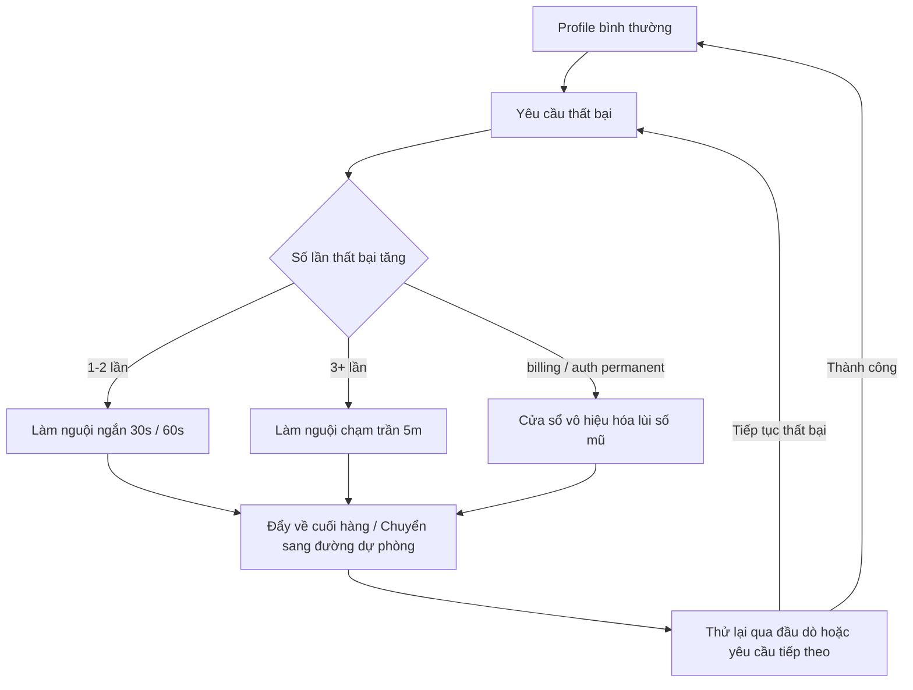

## 11.2 Làm nguội & Vô hiệu hóa (Cooldown): Cơ chế ngăn chặn lỗi lan rộng

Mục này tập trung vào cơ chế làm nguội (Cooldown) và vô hiệu hóa ở **cấp độ Auth Profile**: Khi một API key hoặc một OAuth profile liên tục báo lỗi, hệ thống sẽ tự động lùi bước (Backoff) và xoay tua sang profile khác như thế nào để ngăn chặn hiện tượng khuếch đại thử lại. Cơ chế chuyển đổi dự phòng xuyên mô hình (`fallbacks`) sẽ được trình bày ở [Mục 11.3](11.3_fallback_rules.md).

### 11.2.1 Bài toán mà cơ chế làm nguội (Cooldown) giải quyết: Ngăn chặn khuếch đại thử lại

Khi nhà cung cấp bị rung lắc mạng hoặc chạm trần rate limit, nếu hệ thống cứ liên tục thử lại mù quáng vào cùng một mục tiêu, một chuỗi phản ứng dây chuyền tiêu cực sẽ xuất hiện: Thất bại kích hoạt thử lại → Thử lại chiếm dụng độ đồng thời và cạn kiệt hạn mức → Hàng đợi ùn tắc dẫn đến timeout toàn diện.

Mục tiêu của Cooldown là cắt giảm các nỗ lực thử lại vô ích trong khung giờ sự cố, dành tài nguyên quý giá cho những con đường vẫn còn khả năng thành công.

### 11.2.2 Cơ chế làm nguội Auth Profile: Phân cấp chính thức

OpenClaw tích hợp sẵn cơ chế phân cấp cooldown ở tầng auth-profiles. Khi một auth profile (API key hoặc OAuth) liên tục báo lỗi, các thất bại thông thường sẽ đi qua các nấc thang cooldown ngắn, và trong quá trình xoay tua thì profile đang bị làm nguội sẽ bị đẩy xuống cuối hàng; thuật toán lùi thời gian số mũ chủ yếu áp dụng cho các lỗi thanh toán (Billing) hoặc lỗi xác thực vĩnh viễn. Tham khảo: [Khái niệm Model Failover](https://docs.openclaw.ai/concepts/model-failover).

Sự dịch chuyển trạng thái được mô hình hóa qua sơ đồ sau:



Hình 11-3: Chuyển dịch trạng thái của cơ chế Cooldown và Vô hiệu hóa Auth profile

**Các nấc thang làm nguội (Tăng dần theo số lần thất bại liên tiếp):**

| Số lần thất bại | Thời lượng làm nguội |
|---|---|
| 1 lần | 30 giây |
| 2 lần | 1 phút |
| 3 lần | 5 phút |
| 4 lần trở lên | 5 phút (Ngưỡng trần tối đa) |

Cần phân biệt rõ giữa "lưu trữ chứng thư" và "trạng thái định tuyến auth tại runtime": `auth-profiles.json` chịu trách nhiệm lưu trữ hồ sơ xác thực, còn các trạng thái cooldown, vô hiệu hóa và thứ tự ưu tiên runtime được quản lý độc lập trong `auth-state.json`:

```json
{
  "usageStats": {
    "provider:profile": {
      "lastUsed": 1736160000000,
      "cooldownUntil": 1736160060000,
      "errorCount": 2
    }
  }
}
```

**Cơ chế lùi thời gian đối với lỗi thanh toán (Billing disable):**

- Bắt đầu từ 5 giờ, mỗi lần gặp lỗi billing tiếp theo sẽ nhân đôi thời gian, tối đa 24 giờ.
- Được đánh dấu nhãn riêng biệt `disabledReason: "billing"` để phân biệt với cooldown thông thường.
- Nếu trong vòng 24 giờ không phát sinh thêm lỗi thì bộ đếm tự động được đặt lại về 0.

**Các trường cấu hình tùy biến (`openclaw.json`):**

```jsonc
{
  auth: {
    cooldowns: {
      billingBackoffHours: 5,           // Thời gian lùi bước khởi điểm của lỗi billing (giờ)
      billingBackoffHoursByProvider: {  // Ghi đè thời gian khởi điểm theo từng provider
        openai: 3,
      },
      billingMaxHours: 24,              // Thời gian vô hiệu hóa tối đa của lỗi billing
      failureWindowHours: 24,           // Khung thời gian đặt lại bộ đếm khi không có lỗi
      authPermanentBackoffMinutes: 10,  // Thời gian lùi khởi điểm của lỗi xác thực vĩnh viễn
      authPermanentMaxMinutes: 60,      // Thời gian lùi tối đa của lỗi xác thực vĩnh viễn
      overloadedProfileRotations: 1,    // Số lượng profile cùng provider tối đa được đổi khi gặp lỗi quá tải
      overloadedBackoffMs: 0,           // Thời gian lùi ngắn trước khi fallback khi quá tải
      rateLimitedProfileRotations: 1,   // Số lượng profile cùng provider tối đa được đổi khi chạm rate limit
    },
  },
}
```

### 11.2.3 Nghiệm thu & Xử lý sự cố

- Nếu hiện tượng fallback xảy ra liên tục nhưng luồng chính trông có vẻ bình thường, hãy kiểm tra các trường `cooldownUntil`, `errorCount` và lý do vô hiệu hóa trong tệp trạng thái auth state để xác nhận xem có profile nào đang liên tục kích hoạt cooldown hay không.
- Nếu lỗi billing disable liên tục xuất hiện, hãy kiểm tra `disabledReason` trên bảng điều khiển của nhà cung cấp để nạp thêm tiền hoặc xử lý thẻ thanh toán.
- Nếu sự cố mạng phía provider đã phục hồi nhưng hệ thống vẫn tiếp tục chạy trên đường dự phòng trong thời gian dài, hãy kiểm tra dấu thời gian `cooldownUntil` xem đã hết hạn chưa; nếu đã hết hạn mà chưa tự phục hồi, hãy dùng lệnh thăm dò để chủ động kích hoạt lại.

Lệnh kiểm tra:

```bash
openclaw models status
openclaw models status --probe
openclaw status --deep
```
