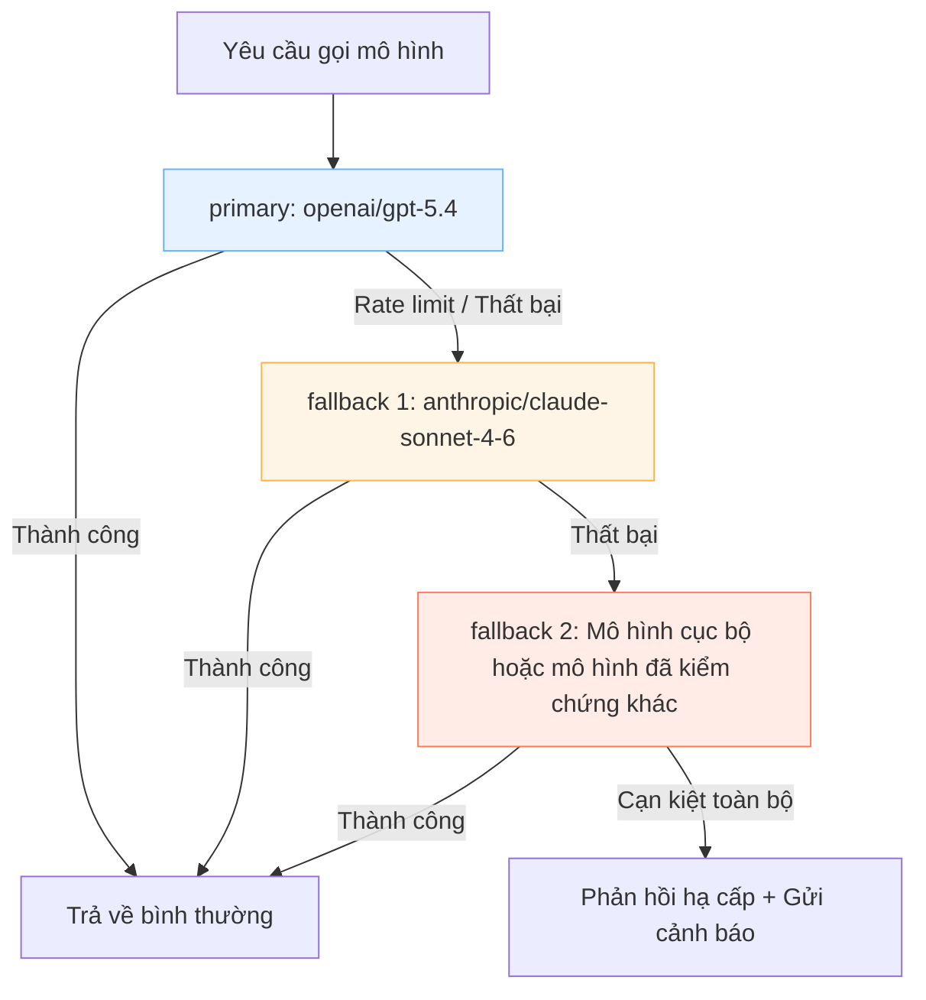

## 11.3 Chuỗi dự phòng mô hình (Fallback Chain) & Phân luồng xử lý lỗi

Mục này đưa bài toán "xử lý thế nào khi thất bại" vào các quy tắc chuyển đổi dự phòng (Failover) chính thức: Khai báo danh sách các mục tiêu thử lại tuần tự qua mảng `fallbacks`, và phân luồng lỗi thành các hành động kỹ thuật có thể thực thi, thay vì chỉ là một câu nói suông "thử lại xem sao". Trọng tâm bao gồm khả năng giải thích của chuỗi fallback, các trường bằng chứng kiểm toán, và kỹ thuật bơm lỗi để chứng minh cơ chế chuyển đổi thực sự phát huy tác dụng. Cấu hình cơ sở xem tại [Mục 4.4 Cơ sở chuyển đổi dự phòng](../04_config_models/4.4_failover.md).

### 11.3.1 Mục tiêu của Fallback: Ưu tiên tính liên tục nhưng phải có khả năng giải thích

Mục tiêu số một của Fallback là bảo đảm tính liên tục của dịch vụ, nhưng tuyệt đối không được biến thành việc âm thầm đổi mô hình ngoài tầm kiểm soát. Nếu không, khi chất lượng đầu ra bị sụt giảm hoặc chi phí bất ngờ tăng vọt, bạn sẽ hoàn toàn không thể định vị nguyên nhân.

Mỗi lượt fallback được kích hoạt bắt buộc phải ghi nhận tối thiểu:

- **Lý do kích hoạt**: Loại lỗi cụ thể và mục tiêu mô hình ban đầu.
- **Quy tắc đã khớp**: Thứ tự fallback đã trúng và phiên bản chính sách.
- **Lộ trình chuyển đổi**: Chuyển từ mô hình nào sang mô hình nào.
- **Hành động tiếp theo**: Có chuyển sang lùi bước (Backoff), áp dụng bảo vệ rate limit hay cần con người can thiệp hay không.

### 11.3.2 Thiết kế quy tắc: Phân luồng theo thứ tự tuần tự

Phân luồng lỗi không chỉ dựa vào việc chuyển đổi sau khi hỏng, mà còn phụ thuộc vào việc thiết lập ngân sách thử lại. Danh sách mặc định toàn cục `agents.defaults.model.fallbacks` là chuỗi thử tuần tự, do đó các mô hình dự phòng cần được sắp xếp theo độ tin cậy:

- `primary`: Mô hình của nhà cung cấp chủ lực được ưu tiên sử dụng.
- **Dự phòng cấp 1**: Mô hình nhỏ hơn của cùng nhà cung cấp (để đối phó với việc chạm trần rate limit của mô hình chính).
- **Dự phòng cấp 2**: Mô hình tương ứng của nhà cung cấp khác (để đối phó với sự cố đứt cáp mạng hoặc sập API của nhà cung cấp chính).

Sơ đồ dưới đây thể hiện logic ra quyết định của chuỗi Fallback:



Hình 11-4: Logic ra quyết định của chuỗi Fallback mô hình

Ví dụ cấu hình:

```javascript
{
  agents: {
    defaults: {
      model: {
        primary: 'openai/gpt-5.4',
        fallbacks: [
          'anthropic/claude-sonnet-4-6', // Đối phó sự cố mạng hoặc lỗi kiến trúc xuyên provider
        ],
      },
    },
  },
}
```

Mối quan hệ giữa 2 tầng: Cơ chế làm nguội Auth Profile ([Mục 11.2](11.2_rotation_cooldown.md)) sẽ ưu tiên xoay tua các profile trong cùng một provider; cơ chế Fallback mô hình mới thực sự thực hiện việc chuyển đổi nhảy vọt xuyên qua các model khác nhau.

### 11.3.3 Các hành vi thông minh bên trong chuỗi Fallback

Dưới đây là các chi tiết hành vi cực kỳ quan trọng khi xử lý sự cố thực tế:

**Lỗi tràn ngữ cảnh (Context Window Exceeded) KHÔNG kích hoạt Fallback.** Hệ thống tự động nhận diện các mẫu lỗi `request_too_large`, `context_window_exceeded`. Một khi phát hiện lỗi do ngữ cảnh quá dài, hệ thống lập tức ném lỗi ra ngoài chứ không kích hoạt fallback — bởi vì chuyển sang một mô hình dự phòng nhỏ hơn chỉ khiến nó thất bại nhanh hơn mà thôi. Trong tình huống này, hành động đúng đắn là kích hoạt cơ chế Nén (Compaction) chứ không phải đổi mô hình.

**Cơ chế thăm dò trong thời gian làm nguội (Half-open Probe).** Khi một mô hình ứng viên hoặc một profile đang nằm trong thời gian cooldown tạm thời, hệ thống sẽ tiến hành các đợt thăm dò có kiểm soát khi sắp hết hạn cooldown; các đợt thăm dò này được điều tiết lưu lượng (Throttled) theo từng provider. Điều này giúp ngăn chặn hiện tượng bùng nổ lưu lượng đột ngột khi vừa hết giờ cooldown, tương tự như trạng thái "nửa mở (Half-open)" trong thiết kế ngắt mạch (Circuit Breaker).

**Công thức lùi số mũ đối với lỗi thanh toán (Billing).** Công thức cụ thể là `baseMs × 2^(min(disableCount-1, 10))`, với thời gian vô hiệu hóa tối đa `billingMaxHours` (mặc định 24 giờ). Đường cong lùi bước dốc hơn rất nhiều so với cooldown thông thường, phản ánh thực tế rằng sự cố hết tiền trong tài khoản luôn cần con người can thiệp nạp tiền mới có thể phục hồi.

**Bỏ qua cơ chế cooldown đối với các Provider tổng hợp (Aggregators).** Một số nhà cung cấp mô hình tổng hợp (như OpenRouter...) mặc định bỏ qua việc kiểm tra auth cooldown, vì bản thân họ đã có cơ chế xoay tua nhà cung cấp nội bộ bên dưới.

**Thứ tự ưu tiên quy kết nguyên nhân lỗi.** Khi toàn bộ các profile đều không thể sử dụng, hệ thống sẽ chấm điểm và áp dụng chuỗi ưu tiên phân định: `auth_permanent` > `auth` > `billing` > `format` > `model_not_found` > `overloaded` > `timeout` > `rate_limit` > `empty_response` > `no_error_details` > `unclassified` > `unknown`. Kết quả này sẽ quyết định loại lỗi phơi bày ra ngoài và các chỉ dẫn hành động khắc phục gợi ý cho người dùng.

### 11.3.4 Phương pháp xác minh: Bơm lỗi & Đối soát nhật ký Log

Fallback không thể chỉ viết vào cấu hình rồi để đó, bạn bắt buộc phải chứng minh được nó thực sự kích hoạt:

1. **Đường cơ sở đạt chuẩn**: `models status` không báo thiếu hoặc hết hạn key, đầu dò `models status --probe` hoạt động tốt.
2. **Chủ động tạo lỗi**: Kích hoạt rate limit hoặc cố tình tạo lỗi mạng / API upstream giả lập.
3. **Quan sát nhật ký**: Xác nhận trong log xuất hiện sự kiện fallback, và mô hình được chọn kế tiếp khớp chính xác với thứ tự khai báo trong mảng `fallbacks`.

```bash
openclaw models status
openclaw models status --probe
openclaw logs --follow --json
```

Nếu trong log không thể đối soát được nguyên nhân vì sao fallback kích hoạt, hãy ưu tiên bổ sung các trường thông tin kiểm toán và log có cấu trúc trước khi nghĩ đến việc thêm quy tắc mới.
