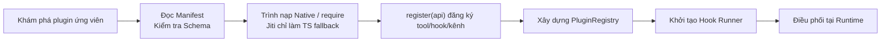

## 12.1 Hệ thống phát triển Plugin: Cơ chế kỹ thuật cho mở rộng tùy biến

Chìa khóa kỹ thuật của năng lực mở rộng không nằm ở việc "có thêm được tính năng hay không", mà nằm ở chỗ "tiện ích mở rộng đó có kiểm soát được, kiểm toán được và hoàn tác được hay không". OpenClaw hiện tại lấy hệ thống Plugin làm cổng mở rộng chính: Plugin nguyên bản có thể đưa vào các công cụ mới, kênh liên lạc mới, nhà cung cấp mô hình AI hoặc các thành phần runtime mới, đồng thời thu hẹp rủi ro thông qua cơ chế kích hoạt tường minh và danh sách trắng; song song đó, hệ thống cũng có khả năng phát hiện và nạp các gói bundle tương thích từ Codex, Claude, Cursor. Về mặt giao diện quản lý phía người dùng, cấu hình và CLI luôn sử dụng tiền tố thống nhất `plugins.*` / `openclaw plugins ...`. Mục này phân tích cấu trúc cốt lõi của Plugin nguyên bản, ranh giới của các bundle tương thích và bộ lệnh nghiệm thu chuẩn mực.

### 12.1.1 Bản chất của Plugin: Module TypeScript/JavaScript thường trực trong tiến trình

Hoàn toàn khác biệt với các gói Kỹ năng (Skills) chỉ thuần túy cung cấp chỉ dẫn văn bản, **Plugin nguyên bản bản chất là các module mở rộng bằng TypeScript/JavaScript chạy trực tiếp bên trong tiến trình của Gateway**. Chúng được nạp động thông qua Runtime Loader, có thể trực tiếp gắn thêm các công cụ Agent tools, đăng ký kênh chat, chạy các dịch vụ tuần tra ngầm, hoặc thậm chí tiếp quản các Hook và khả năng HTTP/RPC chuyên biệt.

Thiết kế kỹ thuật và an toàn then chốt nhất nằm ở tệp kê khai **`openclaw.plugin.json`** (Manifest file). Tệp này khai báo các metadata như `id` của plugin, `configSchema`, `contracts.tools`, `uiHints`... Khi Gateway khởi động để render biểu mẫu cấu hình hoặc kiểm tra tính hợp lệ vòng đầu, **hệ thống hoàn toàn không cần thực thi mã code của plugin bên thứ ba**, mà xác thực JSON Schema trực tiếp thông qua tệp manifest. Điều này triệt tiêu nguy cơ mã độc chưa qua kiểm duyệt tự động kích hoạt. Đối với các bundle tương thích, OpenClaw sẽ nhận diện tệp `.codex-plugin/plugin.json`, `.claude-plugin/plugin.json`, `.cursor-plugin/plugin.json` hoặc cấu trúc mặc định không manifest của Claude.

Nếu plugin được phân phối qua gói npm hoặc file nén, gói phát hành phải khai báo danh sách entry point trong trường `openclaw.extensions` của `package.json`; đường dẫn tệp thực thi runtime có thể dùng `openclaw.runtimeExtensions` trỏ tới mã JavaScript đã build:

Nguyên tắc quản trị kỹ thuật đối với Plugin:
1. Phiên bản plugin phải được quản lý qua Git và quy trình phát hành nghiêm ngặt.
2. Tệp `openclaw.plugin.json` phải ràng buộc chặt chẽ các tham số, manifest không hợp lệ sẽ bị Gateway từ chối nạp ngay khi khởi động.
3. Khi đóng gói phân phối, duy trì `openclaw.extensions` và `openclaw.runtimeExtensions` trong `package.json` để tránh lỗi không tìm thấy entry point sau khi cài đặt.
4. Mọi công cụ và tác dụng phụ của plugin bắt buộc phải chịu sự ràng buộc bởi Chính sách công cụ (Tool Policy) và Danh sách trắng (Whitelist).

### 12.1.2 Cấu hình & Kích hoạt: entries, enabled, config và load.paths

Việc kích hoạt plugin được khai báo qua `plugins.entries`. Ở đây hãy lấy **ID plugin trong manifest** làm định danh chuẩn mực, không nên tự ý lấy tên gói npm làm key cấu hình. Giao diện quản trị ổn định với người dùng luôn là `plugins.entries.<id>`. Lệnh CLI `openclaw plugins enable <id>` / `disable <id>` bản chất là thay đổi cờ `plugins.entries.<id>.enabled`. Lưu ý: Các plugin trong thư mục workspace mặc định ở trạng thái tắt, trong khi các plugin tích hợp sẵn (bundled plugins) tuân theo tập hợp bật mặc định của hệ thống.

Khung cấu hình mẫu hoàn chỉnh: Áp dụng danh sách trắng + Nạp đường dẫn cục bộ + Kích hoạt plugin và truyền tham số:

```jsonc
{
  plugins: {
    enabled: true,
    allow: ['my-plugin'],           // Danh sách trắng: Chỉ cho phép các plugin trong danh sách được nạp
    deny: ['untrusted-plugin'],     // Danh sách đen: deny luôn ưu tiên hơn allow
    load: {
      paths: ['~/Projects/my-plugin'], // Thư mục plugin trong quá trình phát triển cục bộ
    },
    entries: {
      'my-plugin': {
        enabled: true,
        config: {
          // Tham số cấu hình tùy biến của plugin
        },
      },
    },
  },
}
```

Để triệt tiêu rủi ro chuỗi cung ứng, hãy kết hợp cơ chế danh sách trắng `allow` để chỉ cho phép các plugin đã qua kiểm toán an toàn hoạt động.

### 12.1.3 Ranh giới an toàn: Sự hiệp đồng giữa Danh sách trắng Plugin và Chính sách công cụ

Plugin mang lại năng lực, nhưng ranh giới sử dụng năng lực đó bắt buộc phải do hệ thống chính sách xác định bọc lót. Thực tiễn khuyến nghị áp dụng cơ chế "Thu hẹp 2 tầng":

1. Dùng `plugins.allow` để thu hẹp tập hợp plugin được phép nạp vào hệ thống.
2. Dùng Chính sách công cụ (Tool Policy) để phân nhóm các công cụ do plugin mang lại theo mức độ rủi ro, và mặc định từ chối các nhóm công cụ nguy hiểm trong profile cơ sở.

Bằng cách này, bạn tách rời độc lập giữa "Khả năng sẵn sàng của tiện ích mở rộng" và "Quyền thực thi của tiện ích mở rộng", ngăn chặn nguy cơ một plugin vừa cài đặt xong lập tức gây ra các tác dụng phụ ngoài ý muốn.

**Ví dụ thực tế: Quy trình phát hành thử nghiệm (Canary) cho Plugin Jira**

Giả sử đội ngũ phát triển một plugin tích hợp Jira mang tên `jira-sync`, cho phép Agent tra cứu và tạo ticket hỗ trợ. Lộ trình phát hành an toàn gồm 3 giai đoạn:

1. **Giai đoạn 1: Mở danh sách trắng chỉ đọc** — Chỉ thêm plugin vào `plugins.allow`, nhưng trong `tools.deny` từ chối toàn bộ các công cụ ghi, ban đầu chỉ cho phép tính năng tra cứu:

```jsonc
{
  plugins: {
    allow: ['jira-sync'],
    entries: { 'jira-sync': { enabled: true } },
  },
  tools: {
    deny: ['jira.create*', 'jira.update*', 'jira.delete*'],
  },
}
```

2. **Giai đoạn 2: Mở quyền ghi trong phạm vi hẹp** — Trong nhóm Telegram nội bộ, dùng `toolsBySender` chỉ cho phép tài khoản quản trị viên được quyền tạo ticket:

```jsonc
{
  channels: {
    telegram: {
      groups: {
        '*': {
          toolsBySender: {
            'id:admin_id_001': { alsoAllow: ['jira.create*'] },
          },
        },
      },
    },
  },
}
```

3. **Giai đoạn 3: Phát hành toàn diện** — Sau 2 tuần thử nghiệm nội bộ không phát sinh lỗi, gỡ bỏ hạn chế ghi Jira trong `tools.deny`, nhưng vẫn duy trì nhật ký kiểm toán và khóa bất biến.

### 12.1.4 Kiến trúc Hook: Cơ chế vận hành hạt nhân của Plugin

Sức mạnh thực sự của Plugin không chỉ nằm ở việc "đăng ký thêm công cụ", mà nằm ở **Hệ thống Hook (Điểm móc)** — Plugin đăng ký các hàm hook tại các mắt xích then chốt trong đường ống thực thi để can thiệp, sửa đổi hoặc quan sát hành vi của hệ thống.

**Bảng tóm tắt các Hook thông dụng**:

#### Nhóm Hook vòng đời Agent

| Tên Hook | Chế độ thực thi | Công dụng điển hình |
|---|---|---|
| `before_model_resolve` | Sửa đổi | Ghi đè lựa chọn mô hình / nhà cung cấp |
| `agent_turn_prepare` | Sửa đổi | Chuẩn bị ngữ cảnh trước mỗi lượt đối thoại của agent |
| `before_prompt_build` | Sửa đổi | Bơm ngữ cảnh và Prompt hệ thống động |
| `before_agent_reply` | Độc quyền (Claim) | Trả về `{ handled: true }` để tổng hợp hoặc làm câm lặng phản hồi |
| `before_agent_finalize` | Sửa đổi / Kiểm tra | Kiểm tra câu trả lời cuối cùng, dọn dẹp trước khi kết thúc |
| `model_call_started` / `model_call_ended` | Quan sát | Giám sát vòng đời của lệnh gọi mô hình |
| `llm_input` | Quan sát | Kiểm toán chính xác đầu vào gửi tới LLM |
| `llm_output` | Quan sát | Kiểm toán chính xác đầu ra do LLM trả về |
| `agent_end` | Quan sát | Phân tích phiên hội thoại sau khi hoàn tất |
| `before_compaction` / `after_compaction` | Quan sát | Quan sát tiến trình nén tin nhắn (Trước / Sau) |

#### Nhóm Hook xử lý tin nhắn

| Tên Hook | Chế độ thực thi | Công dụng điển hình |
|---|---|---|
| `message_received` | Quan sát | Xử lý rẽ nhánh khi tin nhắn vừa gửi đến |
| `inbound_claim` | Độc quyền (Claim) | Cho phép plugin tiếp quản tin nhắn đến theo luật first-claim-wins |
| `message_sending` | Sửa đổi | Chỉnh sửa hoặc hủy bỏ tin nhắn chuẩn bị gửi đi |
| `reply_dispatch` | Quyết định điều phối | Quyết định tiếp quản hoặc sửa đổi mục tiêu chuyển phát phản hồi |
| `message_sent` | Quan sát | Xác nhận sau khi tin nhắn đã được gửi thành công |
| `before_message_write` | Đồng bộ | Chặn đồng bộ ngay trước khi dòng tin nhắn ghi vào JSONL |

#### Nhóm Hook gọi công cụ

| Tên Hook | Chế độ thực thi | Công dụng điển hình |
|---|---|---|
| `before_tool_call` | Sửa đổi | Chặn đứng hoặc chỉnh sửa tham số của công cụ |
| `after_tool_call` | Quan sát | Quan sát kết quả thực thi của công cụ |
| `tool_result_persist` | Đồng bộ | Chỉnh sửa dữ liệu trước khi bền vững hóa vào tin nhắn |

#### Nhóm Hook Sub-agent & Gateway

| Tên Hook | Chế độ thực thi | Công dụng điển hình |
|---|---|---|
| `subagent_spawning` | Tuần tự | Cấu hình gắn kết thread cho sub-agent |
| `subagent_delivery_target` | Tuần tự | Phân giải mục tiêu định tuyến tin nhắn của sub-agent |
| `gateway_start` / `gateway_stop` | Quan sát | Kích hoạt khi Gateway khởi động / dừng lại |

**Năm chế độ thực thi của Hook**:

- **Chế độ quan sát (Void Hooks)**: **Thực thi song song**, không thể sửa đổi trạng thái, dùng cho kiểm toán và xử lý rẽ nhánh (như `llm_input`, `message_sent`).
- **Chế độ sửa đổi (Modifying Hooks)**: **Thực thi tuần tự theo độ ưu tiên** (ưu tiên cao chạy trước); kết quả từ nhiều handler sẽ được hợp nhất áp dụng.
- **Chế độ độc quyền (Claim Hooks)**: Thực thi theo độ ưu tiên, handler đầu tiên trả về `{ handled: true }` sẽ giành chiến thắng và ngắt mạch các handler phía sau (như `inbound_claim`, `before_agent_reply`).
- **Chế độ tuần tự (Sequential Hooks)**: Thực thi theo chuỗi ưu tiên, chuyên dùng cho kịch bản định tuyến sub-agent.
- **Chế độ đồng bộ (Synchronous Hooks)**: Thực thi đồng bộ trên đường truyền nóng (Hot path), hệ thống sẽ từ chối các async handler bất thường (như `tool_result_persist`, `before_message_write`).

**Cú pháp đăng ký Hook trong Plugin**:

```typescript
// Khuyến nghị: Sử dụng API có định kiểu (Typed API)
api.on("before_tool_call", (event, ctx) => {
  if (event.toolName === "dangerous_tool") {
    return { block: true, blockReason: "Công cụ này bị nghiêm cấm trong phiên hiện tại" };
  }
  return { params: { ...event.params, audited: true } };
}, { priority: 10 });
```

**Vòng đời hoàn chỉnh của quá trình nạp Plugin**:

1. **Khám phá (Discovery)**: Thu thập các plugin ứng viên từ `plugins.load.paths`, workspace plugins, global plugins, bundled plugins.
2. **Kiểm tra (Validation)**: Đọc tệp kê khai `openclaw.plugin.json`, xác thực cấu hình theo JSON Schema.
3. **Phân giải Entry Point**: Xác định đường dẫn file thực thi từ manifest hoặc `package.json`.
4. **Đăng ký (Registration)**: Gọi đồng bộ hàm `register(api)` của plugin để đăng ký công cụ, hook, kênh chat, HTTP routes.
5. **Kích hoạt (Activation)**: Khởi tạo sổ đăng ký `PluginRegistry`, cấu hình Hook Runner toàn cục.
6. **Vận hành (Runtime Execution)**: Tại mỗi điểm hook, Hook Runner điều phối thực thi các handler đã đăng ký.



Hình 12-1: Vòng đời của Plugin từ khi khám phá đến điều phối tại runtime

### 12.1.5 Thị trường Plugin & Khả năng tương thích Bundle

Bên cạnh việc khai báo đường dẫn cục bộ trong `load.paths`, OpenClaw còn hỗ trợ cài đặt một dòng lệnh từ ClawHub hoặc các nguồn Marketplace:

```bash
# Cài đặt plugin chỉ định từ marketplace
openclaw plugins install <tên_plugin>@<tên_chợ>

# Liệt kê toàn bộ plugin khả dụng trong marketplace
openclaw plugins marketplace list <tên_chợ>

# Cập nhật các plugin đang theo dõi
openclaw plugins update <id-or-npm-spec>
openclaw plugins update --all
```

Ngoài ra, OpenClaw có khả năng phát hiện và cài đặt các **Codex, Claude và Cursor bundle** tương thích. Hệ thống sẽ cố gắng ánh xạ các kỹ năng, câu lệnh, settings và một phần hooks/agents của bundle sang năng lực tương ứng của OpenClaw theo tinh thần "tương thích tối đa có thể", tuy nhiên không cam kết tương đương 100% từng trường dữ liệu. Bạn nên dùng `openclaw plugins inspect <id>` để xem năng lực được nhận diện và dùng `openclaw plugins doctor` để kiểm tra các cảnh báo tương thích.

### 12.1.6 Nghiệm thu & Chẩn đoán sự cố: Quy trình khép kín bằng lệnh chuyên dụng

Các sự cố liên quan đến Plugin tuyệt đối không nên "chat thử để đoán lỗi". Hãy cố định bộ lệnh nghiệm thu tối thiểu sau mỗi lần thay đổi plugin:

```bash
openclaw plugins list
openclaw plugins inspect my-plugin
openclaw plugins inspect my-plugin --runtime --json
openclaw plugins doctor
openclaw gateway status --deep --require-rpc
```

- Khi plugin nạp thất bại: Ưu tiên kiểm tra đầu ra của `plugins doctor`, `plugins inspect` và `gateway status --deep --require-rpc`.
- Khi plugin nạp thành công nhưng chạy sai logic: Dùng `inspect --runtime --json` kết hợp nhật ký log có cấu trúc để phát lại chuỗi xử lý theo `traceId`:

```bash
openclaw logs --follow --json
```
