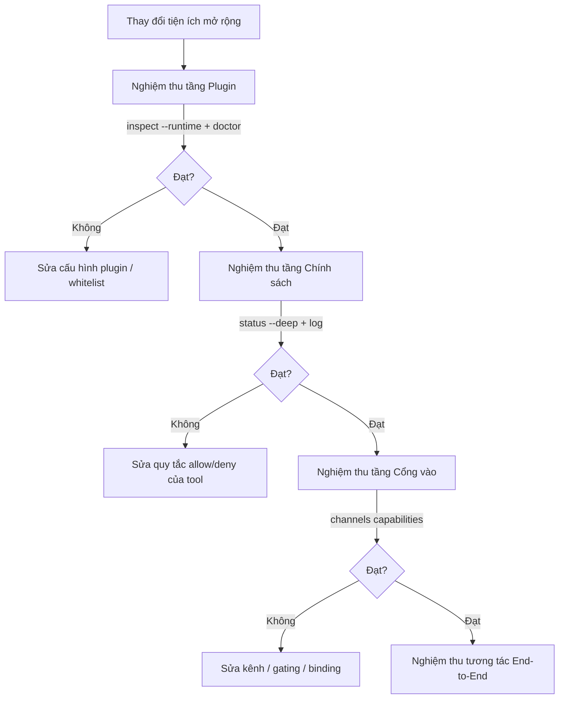

## 12.3 Kiểm thử & Gỡ lỗi (Debugging): Biến tiện ích mở rộng thành quy trình có thể tái hiện

Điểm khó nhất của kỹ thuật mở rộng không nằm ở việc viết code, mà ở chỗ làm sao biến các thay đổi thành một quy trình có thể kiểm chứng, có thể hoàn tác và có thể khoanh vùng lỗi. Khi Plugin, Chính sách công cụ và Chính sách kênh chồng lớp lên nhau, bất kỳ một sai lệch nhỏ nào ở một mắt xích cũng có thể biểu hiện ra ngoài thành triệu chứng "Agent không chịu làm việc". Mục này cung cấp một quy trình kiểm thử và gỡ lỗi chuẩn mực cho OpenClaw, nhấn mạnh việc dùng các câu lệnh tự kiểm tra và đầu dò probe để thiết lập chuỗi bằng chứng, thay vì ngồi đoán mò qua các câu chat.

### 12.3.1 Phạm vi nghiệm thu: Xác minh phân tầng thay vì nhảy cóc sang End-to-End

Khuyến nghị phân rã quy trình nghiệm thu tiện ích mở rộng thành 3 tầng tuần tự, như thể hiện trong sơ đồ dưới đây:



Hình 12-2: Lộ trình nghiệm thu phân tầng sau khi thay đổi tiện ích mở rộng

1. **Tầng Plugin**: Plugin đã được nạp chưa, cấu hình có vượt qua bước kiểm tra Schema không, danh sách trắng có hiệu lực không.
2. **Tầng Chính sách**: Chính sách công cụ có cho phép hay từ chối đúng như kỳ vọng không, lý do từ chối có hiển thị trong log không.
3. **Tầng Cổng vào**: Kênh chat có online không, cổng kiểm soát tag tên có hoạt động không, quy tắc binding có trúng đích không.

Lợi ích của việc phân tầng là khả năng định vị siêu tốc: Khi kiểm thử end-to-end thất bại, bạn dùng lệnh kiểm tra của từng tầng để khoanh vùng sự cố trước, sau đó mới quay lại sửa đổi mã nguồn.

### 12.3.2 Bộ lệnh tự kiểm tra tối thiểu: doctor trước, status tiếp theo, rồi đến các đầu dò probe

Bộ lệnh kiểm tra tối thiểu bắt buộc phải chạy sau mỗi lần thay đổi plugin:

```bash
openclaw doctor
openclaw gateway status --deep --require-rpc
openclaw plugins doctor
openclaw plugins inspect my-plugin --runtime --json
```

Nếu bất kỳ lệnh nào ở trên báo lỗi, hãy ưu tiên khắc phục lỗi đó trước khi nghĩ đến việc thử nghiệm trò chuyện end-to-end.

### 12.3.3 Kiểm thử bản chụp (Snapshot Testing): Đối chiếu đường cơ sở giữa cấu hình và hành vi

Sau khi thay đổi tiện ích mở rộng, rủi ro phổ biến nhất là "sửa cấu hình chỗ này nhưng lại làm thay đổi ngoài ý muốn ở chỗ khác". Kiểm thử bản chụp (Snapshot Testing) giúp lưu lại trạng thái cấu hình và hành vi chuẩn làm mốc cơ sở (Baseline), sau mỗi lần thay đổi chỉ cần so sánh diff là phát hiện ngay lỗi hồi quy (Regression).

```bash
# Tạo bản chụp trạng thái hiện tại làm đường cơ sở
openclaw status --deep > snapshots/status-baseline.txt
openclaw plugins list > snapshots/plugins-baseline.txt
openclaw plugins doctor > snapshots/plugins-doctor-baseline.txt
```

Trích xuất bản chụp hành vi từ nhật ký log:

```bash
openclaw logs --json | jq -c 'select(.type=="log") | (.raw | fromjson? // {}) as $raw | select(($raw|tostring)|contains("tool")) | {time, level, subsystem, raw:$raw}' \
  | tail -20 > snapshots/behavior-baseline.json
```

Script so sánh bản chụp (`scripts/snapshot-diff.sh`):

```bash
#!/bin/bash
# scripts/snapshot-diff.sh
# Cách dùng: bash scripts/snapshot-diff.sh ./snapshots ./snapshots-new

set -u

if [ "$#" -ne 2 ]; then
  echo "Usage: $0 <baseline-dir> <current-dir>" >&2
  exit 2
fi

BASELINE=$1
CURRENT=$2
failed=0

compare_snapshot() {
  local label=$1
  local file=$2

  echo "=== ${label} Diff ==="
  if diff -u "$BASELINE/$file" "$CURRENT/$file"; then
    echo "PASS: ${label} unchanged"
  else
    echo "FAIL: ${label} changed"
    failed=1
  fi
}

compare_snapshot "Config Snapshot" "status-baseline.txt"
compare_snapshot "Plugin Snapshot" "plugins-baseline.txt"
compare_snapshot "Plugin Doctor" "plugins-doctor-baseline.txt"

exit "$failed"
```

Trong đường ống CI/CD, việc so sánh bản chụp phải được thiết lập như một cổng kiểm soát bắt buộc trước khi triển khai.

### 12.3.4 Phát lại để định vị lỗi: Tái hiện chuỗi yêu cầu theo traceId

Nguyên tắc số một khi gỡ lỗi tiện ích mở rộng là "Phát lại bằng chứng thay vì đoán mò":

1. Khi tái hiện lỗi, ghi nhận lại mã `traceId`.
2. Theo dõi log JSON và lọc theo `traceId` đó để quan sát các sự kiện định tuyến, từ chối công cụ và chẩn đoán plugin.

```bash
openclaw logs --follow --json | jq -c 'select(.type=="log") | (.raw | fromjson? // {}) as $raw | select(($raw|tostring)|contains("<TRACE_ID>")) | {time, level, subsystem, message, raw:$raw}'
```

### 12.3.5 Đường ống kiểm thử tự động: Xác minh tiện ích mở rộng trong CI/CD

Đưa việc xác minh tiện ích mở rộng vào quy trình CI/CD (Ví dụ với GitHub Actions):

```yaml
name: Extension Verification

on: [push, pull_request]

jobs:
  verify:
    runs-on: ubuntu-latest
    steps:
      # Bước 1: Xác thực cấu hình plugin
      - name: Validate Plugin Configuration
        run: |
          openclaw doctor
          openclaw plugins doctor
          openclaw gateway status --deep --require-rpc
          openclaw plugins inspect my-plugin --runtime --json

      # Bước 2: So sánh bản chụp Snapshot
      - name: Run Snapshot Tests
        run: |
          openclaw status --deep > /tmp/status-baseline.txt
          openclaw plugins list > /tmp/plugins-baseline.txt
          openclaw plugins doctor > /tmp/plugins-doctor-baseline.txt
          bash scripts/snapshot-diff.sh ./snapshots /tmp

      # Bước 3: Unit Tests (Hợp đồng đăng ký Plugin SDK)
      - name: Unit Tests
        run: |
          pnpm test -- plugins/my-plugin/**/*.test.ts

      # Bước 4: Loader-backed smoke test (Xác minh manifest + đăng ký runtime)
      - name: Integration Tests
        run: |
          pnpm test -- plugins/my-plugin/loader-smoke.test.ts

      # Bước 5: Mô phỏng phát hành thử nghiệm Canary
      - name: Canary Simulation
        run: |
          bash tests/canary/simulate-rollout.sh --dry-run
```

Script kiểm thử tích hợp dựa trên log sự kiện (`tests/integration/test-tool-chains.sh`):

```bash
#!/bin/bash
# tests/integration/test-tool-chains.sh
set -euo pipefail

TMP_DIR="$(mktemp -d)"
LOG_FILE="$TMP_DIR/openclaw-test.log"
LOG_PID=""

cleanup() {
  if [ -n "$LOG_PID" ]; then
    kill "$LOG_PID" 2>/dev/null || true
    wait "$LOG_PID" 2>/dev/null || true
  fi
  rm -rf "$TMP_DIR"
}
trap cleanup EXIT

echo "=== Test 1: Khởi động Gateway và thu thập log ==="
openclaw logs --follow --json > "$LOG_FILE" &
LOG_PID=$!
for _ in {1..10}; do
  [ -s "$LOG_FILE" ] && break
  sleep 1
done

echo "=== Test 2: Xác minh chính sách công cụ đã nạp ==="
openclaw status --deep | grep -q "deny" || {
  echo "FAIL: Tool deny rules not found in status"
  exit 1
}
echo "PASS: Tool deny rules loaded"

echo "=== Test 3: Xác minh trạng thái nạp plugin ==="
openclaw plugins doctor || {
  echo "FAIL: Plugin doctor reported issues"
  exit 1
}
echo "PASS: All plugins healthy"

echo "=== Test 4: Kiểm tra định dạng sự kiện chặn công cụ trong log ==="
echo "Vui lòng kích hoạt một lệnh gọi công cụ dự kiến sẽ bị từ chối trong vòng 30 giây..."
deadline=$((SECONDS + 30))
found=0
while [ "$SECONDS" -lt "$deadline" ]; do
  if jq -e 'select(.type=="log") | (.raw | fromjson? // {}) | select((.event=="blocked_tool_call" or .event=="tool_call_blocked") and .traceId and .spanId and .tool and .reason)' "$LOG_FILE" >/dev/null 2>&1; then
    found=1
    break
  fi
  sleep 1
done

if [ "$found" -ne 1 ]; then
  echo "FAIL: no structured tool blocked event found"
  exit 1
fi
echo "PASS: Tool denial events are structured"

echo "All integration tests passed."
```

### 12.3.6 Phát hành thử nghiệm Canary & Hoàn tác Rollback

Khuyến nghị áp dụng chiến lược phát hành từng bước:

1. Ở tầng cấu hình luôn duy trì công tắc bật tắt tường minh (`enabled: false`).
2. Thu hẹp danh sách trắng về phạm vi tối thiểu, thử nghiệm trên một số ít kênh hoặc đối tác.
3. Khi phát sinh sự cố bất thường: **Hoàn tác công tắc bật tắt và danh sách trắng trước, sau đó mới hoàn tác mã nguồn**.
