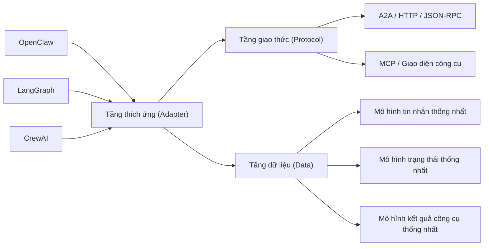

## 12.5 Hướng dẫn tương tác liên framework (Framework Interoperability)

Khi bàn về khả năng tương tác (Interoperability), sai lầm phổ biến nhất là vội vàng liệt kê danh sách các framework, tên giao thức và các bước di trú, mà quên mất câu hỏi căn bản nhất: **Vì sao lại cần tương tác liên framework, thay vì chọn duy nhất một framework và đi đến cùng**. Mục này trước tiên thiết lập khung đánh giá đó, sau đó giải thích các tầng kiến trúc, 3 mô hình triển khai điển hình, và sự khác biệt bản chất về ranh giới hệ thống giữa OpenClaw và các framework khác.

### 12.5.1 Vì sao lại cần tương tác liên framework

Sử dụng một framework duy nhất luôn là lựa chọn đơn giản và gọn gàng nhất. Tuy nhiên trong các tình huống sau, tương tác liên framework là quyết định kỹ thuật hoàn toàn hợp lý:

- **Di trú tiệm tiến (Gradual Migration)**: Doanh nghiệp đã có sẵn hệ thống Agent xây dựng trên LangGraph, CrewAI hoặc framework tự phát triển nội bộ, không thể đập đi xây lại bằng OpenClaw trong một sớm một chiều.
- **Tái sử dụng tài sản sẵn có**: Mong muốn giữ lại các workflow phức tạp, các thư viện công cụ đã đóng gói ổn định mà không cần viết lại từ đầu.
- **Phân tách trách nhiệm hệ thống**: Giao phần "Quản trị cổng vào sản xuất" và "Điều phối suy luận phức tạp" cho các hệ thống khác nhau, phát huy tối đa sở trường của từng bên.

Mục đích thực sự của tương tác liên framework không phải để "kết nối cho nhìn có vẻ hiện đại", mà là duy trì tính liên tục của hệ thống trong giai đoạn chuyển đổi, triển khai song song hoặc khi nhiều đội ngũ cùng cộng tác. Nếu là một dự án mới hoàn toàn của một nhóm độc lập, chọn một framework duy nhất sẽ luôn tiết kiệm chi phí hơn.

### 12.5.2 Kiến trúc 3 tầng của tương tác liên framework

Để trình bày một cách có hệ thống, hãy phân rã bài toán thành 3 tầng: **Tầng thích ứng (Adapter), Tầng giao thức (Protocol), và Tầng dữ liệu (Data)**. Các framework không gọi trực tiếp lẫn nhau một cách hỗn loạn, mà đi qua tầng thích ứng để quy tụ về một giao thức và mô hình dữ liệu chung:



Hình 12-3: Kiến trúc 3 tầng của khả năng tương tác liên framework

Nhiệm vụ cụ thể của từng tầng:

- **Tầng thích ứng (Adapter Layer)**: Xử lý bài toán "kết nối một framework cụ thể vào hệ thống như thế nào". Ví dụ: ánh xạ máy trạng thái của LangGraph, agent tác vụ của CrewAI, hoặc phiên và công cụ của OpenClaw về một cổng vào chuẩn.
- **Tầng giao thức (Protocol Layer)**: Xử lý bài toán "giao tiếp qua kênh truyền nào" (A2A, HTTP/JSON-RPC, MCP hoặc cầu nối runtime cục bộ).
- **Tầng dữ liệu (Data Layer)**: Xử lý bài toán "hai bên trao đổi thông tin gì với nhau". Nếu không thống nhất mô hình tin nhắn, trạng thái và kết quả công cụ, thì giao thức dù chuẩn đến đâu hai bên vẫn sẽ hiểu nhầm ý nhau.

### 12.5.3 Ba mô hình triển khai điển hình

Trong thực tế, tương tác liên framework thường rơi vào 1 trong 3 mô hình:

#### 1. Tương tác nhúng cục bộ (Local Embedded)

Các framework chạy chung trong cùng một tiến trình hoặc cùng môi trường máy chủ, gọi trực tiếp lẫn nhau qua adapter:
- **Áp dụng**: Môi trường thử nghiệm, do cùng một nhóm phát triển bảo trì, đòi hỏi độ trễ mạng cực thấp.
- **Ưu điểm**: Độ trễ tối thiểu, gỡ lỗi trực quan, ít phải chuyển đổi giao thức.
- **Đánh đổi**: Ranh giới triển khai không rõ ràng, sự gắn kết phụ thuộc khi nâng cấp rất cao.

#### 2. Tương tác dạng dịch vụ từ xa (Remote Service-based)

OpenClaw và các framework khác giao tiếp xuyên tiến trình hoặc xuyên máy chủ thông qua HTTP, JSON-RPC, gRPC hoặc giao thức A2A:
- **Áp dụng**: Ranh giới giữa các đội ngũ rất rõ ràng, cần triển khai và co giãn (Scale) độc lập.
- **Ưu điểm**: Ranh giới hệ thống rành mạch, từng dịch vụ có thể tiến hóa độc lập.
- **Đánh đổi**: Độ trễ mạng tăng, các bài toán về xác thực, thử lại và tính bất biến bắt đầu xuất hiện.

#### 3. Tương tác dạng cầu nối framework ngoài (External Framework Bridge)

OpenClaw không trực tiếp "hiểu" framework bên ngoài, mà thông qua một tầng cầu nối trung gian để chuẩn hóa tin nhắn, dịch công cụ và đồng bộ trạng thái:
- **Áp dụng**: Có sẵn hệ thống dị thể cũ, cần kết nối êm đẹp mà không phải đập đi xây lại.
- **Ưu điểm**: Chi phí di trú nằm trong tầm kiểm soát, giữ được tài sản cũ.
- **Đánh đổi**: Tầng thích ứng trở thành điểm phức tạp mới, dễ bị trôi dạt giao thức khi các bên nâng cấp.

### 12.5.4 Sự khác biệt then chốt giữa OpenClaw và các Framework khác

Muốn hiểu sâu về tương tác, trước hết phải nhìn rõ mục tiêu tối ưu hóa của từng framework:

| Chiều kích | OpenClaw | LangGraph | CrewAI |
|---|---|---|---|
| **Mục tiêu chính** | Quản trị cổng vào sản xuất & Vận hành tin cậy | Điều phối linh hoạt & Kiểm soát máy trạng thái | Xây dựng nhanh workflow cấp cao |
| **Ưu thế cốt lõi** | Đa kênh chat, quản trị phân quyền, kiểm toán vận hành | Nhánh rẽ có điều kiện, quy trình dạng đồ thị, tính kết hợp cao | Dễ học, tổ chức tác vụ trực quan |
| **Điểm hạn chế** | Khả năng vẽ đồ thị trạng thái phức tạp không linh bằng chuyên dụng | Quản trị sản xuất và kết nối kênh chat phải tự lập trình thêm | Năng lực quản trị kỹ thuật quy mô lớn chưa mạnh |

Dưới góc nhìn tương tác, điều quan trọng nhất là **phát huy tối đa sở trường của từng bên**:
- OpenClaw phù hợp làm cổng vào sản xuất, quản trị phiên, thu hẹp phân quyền và kiểm soát ranh giới công cụ.
- LangGraph phù hợp làm các nhánh rẽ điều kiện phức tạp, điều phối đồ thị trạng thái và workflow nghiên cứu.
- CrewAI phù hợp cho việc điều phối tác vụ cấp cao và thử nghiệm nhanh sự cộng tác đa vai trò.

Sự tương phản giữa `conditional_edges` của LangGraph và Định tuyến (Routing) của OpenClaw là một ví dụ điển hình:
- LangGraph thiên về ra quyết định theo kiểu hàm số lập trình (Functional), ưu thế là cực kỳ linh hoạt.
- OpenClaw thiên về ra quyết định theo cấu hình khai báo (Declarative), ưu thế là dễ kiểm toán, dễ quản lý phiên bản và quản trị rủi ro.

Nếu hệ thống của bạn cần cả hai, giải pháp hợp lý nhất là phân công rõ: "Ai chịu trách nhiệm quyết định ở cổng vào, và ai chịu trách nhiệm điều phối luồng bên trong".

### 12.5.5 Giao thức & Mô hình dữ liệu: A2A chỉ là một trong nhiều lựa chọn

A2A không phải là con đường độc đạo duy nhất. Các giải pháp giao thức phổ biến:

- **A2A (Agent-to-Agent)**: Phù hợp cho việc khám phá và giao tiếp chuẩn hóa giữa các Agent độc lập. OpenClaw tích hợp sẵn plugin kênh A2A, cung cấp thẻ Agent Card công khai và giao diện nộp tác vụ theo chuẩn JSON-RPC của A2A 1.0.
- **HTTP / JSON-RPC**: Rào cản triển khai thấp, rất thích hợp cho việc làm cầu nối dạng microservice.
- **MCP (Model Context Protocol)**: Phơi bày tools, resources và prompts; lệnh `mcp serve` của OpenClaw có thể làm cầu nối chuyển tiếp hội thoại cho MCP client, còn `mcp list/show/set` quản lý các MCP server bên ngoài.
- **Cầu nối runtime cục bộ**: Thích hợp cho máy đơn hoặc tích hợp nhúng, triệt tiêu chi phí mạng.

Dưới đây là một bộ khung mô hình dữ liệu thống nhất tối thiểu đủ dùng trong thực tế:

```typescript
interface UnifiedAgentMessage {
  agent_id: string;
  content: string;
  message_type: "text" | "tool_call" | "error";
  metadata: Record<string, unknown>;
  source_framework: "openclaw" | "langgraph" | "crewai";
}

interface UnifiedAgentState {
  agent_id: string;
  current_task: string;
  context: Record<string, unknown>;
  tool_results: Record<string, unknown>;
  message_history: Array<{ role: string; content: string }>;
  metadata: Record<string, unknown>;
}
```

Điều cốt tử là phải thống nhất được 3 thứ: **Cách biểu diễn tin nhắn, Cách biểu diễn trạng thái, và Cách biểu diễn kết quả công cụ**. Thiếu 3 thứ này, sự tương thích chỉ dừng lại ở tầng truyền tải vô nghĩa.

### 12.5.6 Lộ trình di trú & Lời khuyên ra quyết định

Nếu quyết định triển khai tương tác liên framework, lộ trình chuẩn hóa gồm 5 bước:

1. **Xác định nhu cầu thực sự**: Nếu một framework duy nhất đã đáp ứng đủ, tuyệt đối không đưa thêm sự phức tạp vào hệ thống.
2. **Dựng tầng thích ứng trước, bàn giao thức sau**: Phân định ranh giới rõ ràng trước khi quyết định dùng A2A, MCP hay HTTP.
3. **Thống nhất mô hình dữ liệu tối thiểu**: Ưu tiên chuẩn hóa cấu trúc tin nhắn, trạng thái và kết quả công cụ.
4. **Xác minh đơn Agent trước, đa Agent sau**: Không nên vừa bắt đầu đã làm ngay luồng hỗn hợp phức tạp.
5. **Nghiệm thu hiệu năng và phát hành**: Đánh giá độ trễ, throughput, cơ chế thử lại và phục hồi sau khi các bài test chức năng đã vượt qua.

Tóm tắt quyết định:
- **Nên làm tương tác**: Khi đã có sẵn hệ thống cũ, nhiều đội ngũ cùng cộng tác, cần giữ lại thế mạnh riêng của từng framework, và cổng vào sản xuất bắt buộc phải được quản trị nghiêm ngặt.
- **Không nên làm tương tác**: Dự án mới của một nhóm độc lập, yêu cầu nghiệp vụ rõ ràng, quy mô vừa phải, độ trễ và sự tinh gọn khi gỡ lỗi là ưu tiên hàng đầu.
