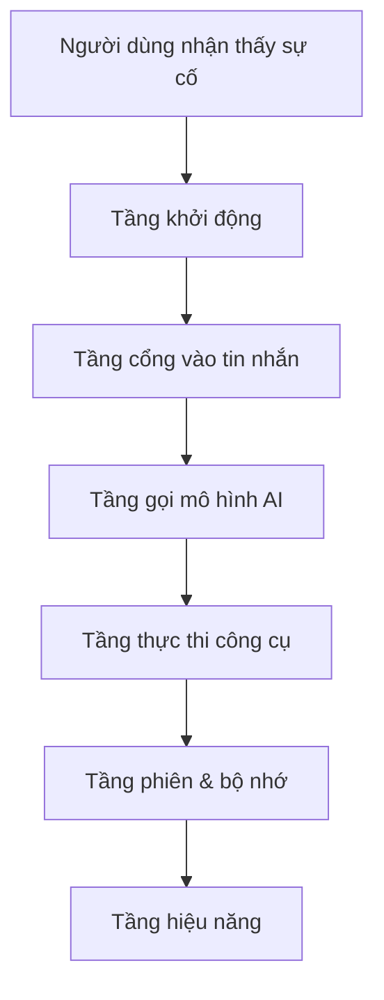
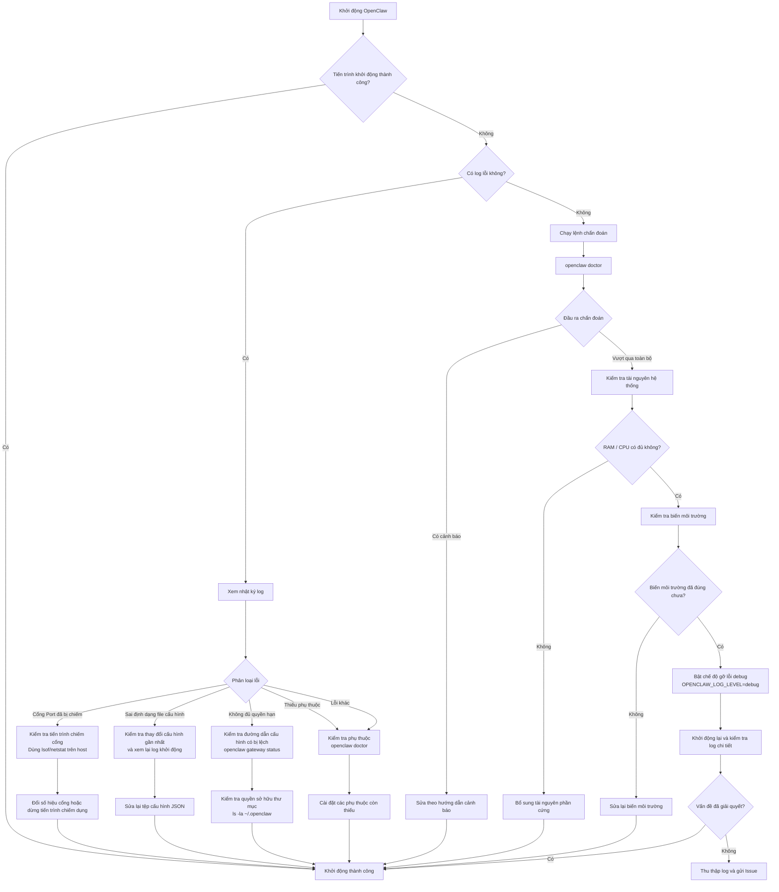
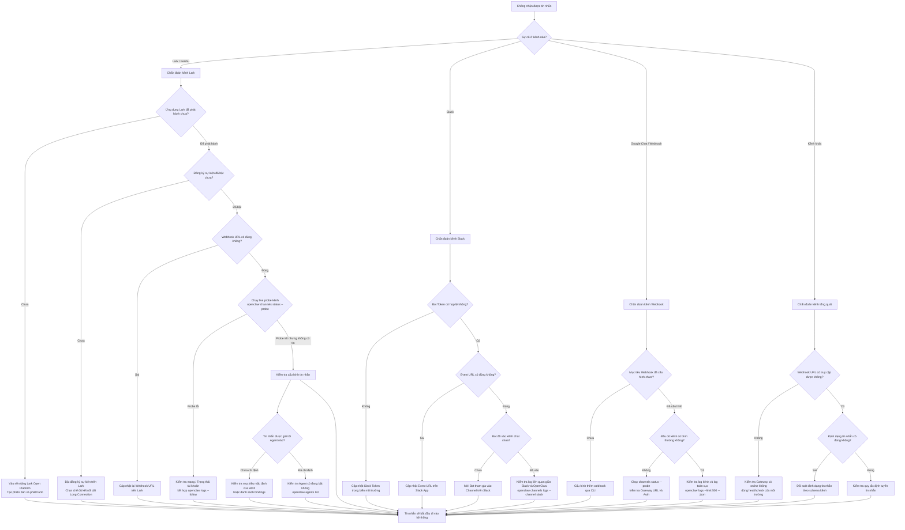
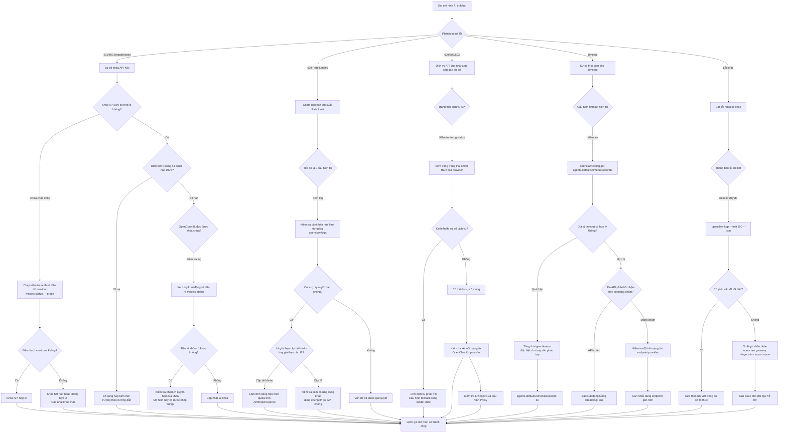
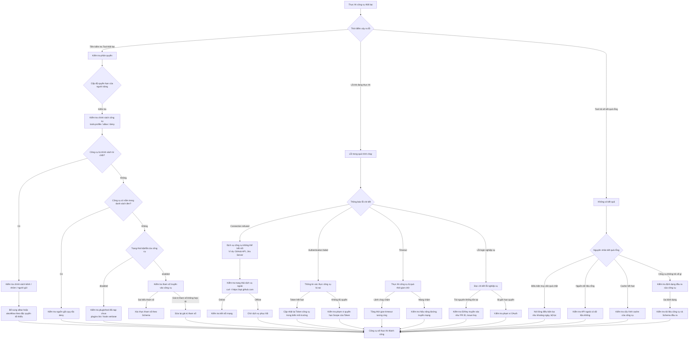
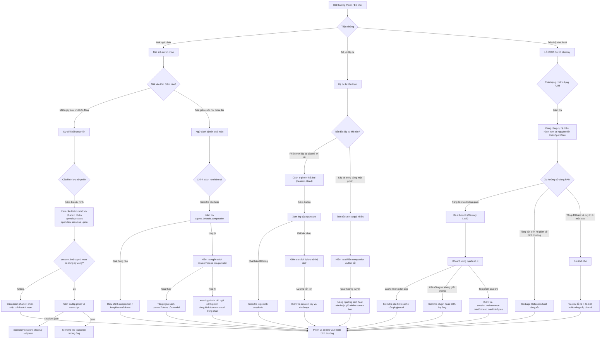
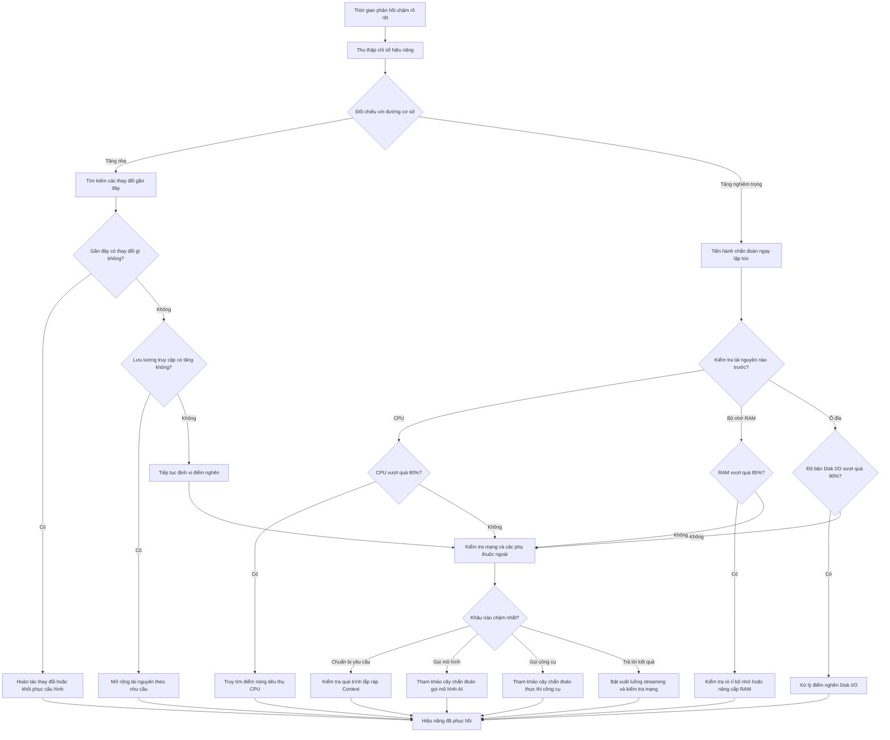

## 15.1 Chẩn đoán sự cố thường gặp theo phân tầng

Mục này cung cấp một hệ thống các cây quyết định (Decision Trees) bằng Mermaid, nhưng chúng không phải là một "tập hợp các quy trình rời rạc", mà là các góc cắt khác nhau của cùng một khung chẩn đoán thống nhất. Thứ tự tiếp cận chuẩn mực: **Hiểu mô hình phân tầng trước → Chọn cây quyết định theo triệu chứng → Lần theo chuỗi bằng chứng để loại trừ từng giả thuyết**. Mục đích là tránh việc vừa thấy lỗi đã vội vã thử các câu lệnh ngẫu nhiên, để rồi vô tình che lấp nguyên nhân gốc rễ thực sự.

### 15.1.1 Khung chẩn đoán tổng thể: Phân tầng trước, Chọn cây sau

Các sự cố thường gặp của OpenClaw được chia thành 6 tầng:

1. **Tầng khởi động**: Tiến trình có bật lên được không, cấu hình có nạp được không, phụ thuộc có đầy đủ không.
2. **Tầng cổng vào tin nhắn**: Tin nhắn có thực sự đi vào Gateway không, hay bị nghẽn ở phía kênh chat.
3. **Tầng gọi mô hình AI**: Chứng thư, hạn mức, trạng thái nhà cung cấp có bình thường không.
4. **Tầng thực thi công cụ**: Phân quyền công cụ, tham số truyền vào, dịch vụ hạ tầng phụ thuộc có ổn định không.
5. **Tầng phiên & bộ nhớ**: Ngữ cảnh, nén, cách ly phiên, tệp lưu trữ bộ nhớ có bị xáo trộn không.
6. **Tầng hiệu năng**: Trong điều kiện hệ thống "vẫn chạy được", khâu nào bắt đầu chậm chạp, ùn ứ hoặc suy thoái dây chuyền.



Hình 15-1: Khung chẩn đoán phân tầng của Chương 15

Ý nghĩa cốt tử của 6 tầng: **Tầng phía trước chưa đạt thì tuyệt đối không nhảy cóc sang tầng phía sau**. Ví dụ: Tiến trình Gateway còn chưa chạy nổi thì không thể nghi ngờ chất lượng mô hình; tin nhắn từ Telegram còn chưa vào được Gateway thì không thể đi gỡ lỗi công cụ.

### 15.1.2 Phương pháp chuỗi bằng chứng: Lệnh dùng để loại trừ giả thuyết

Câu lệnh không phải là đích đến, bằng chứng mới là mục tiêu. Tại mỗi tầng, việc cần làm trước tiên là xác định rõ bạn muốn loại trừ giả thuyết nào:

| Tầng | Bằng chứng ưu tiên | Giả thuyết chính cần loại trừ |
|---|---|---|
| **Khởi động** | `openclaw doctor`, Log khởi động | Tiến trình không bật lên được, cấu hình hỏng, thiếu phụ thuộc |
| **Cổng vào tin nhắn** | `openclaw channels status --probe`, Log kênh | Tin nhắn chưa vào Gateway, cổng kiểm soát tag tên chưa đạt |
| **Gọi mô hình AI** | `openclaw models status` / `--probe` | Khóa API hết hạn/thiếu, live auth provider lỗi, cạn hạn mức, provider sập |
| **Thực thi công cụ** | Log có cấu trúc, mã lỗi của tool | Công cụ bị chính sách chặn, tham số sai định dạng, downstream lỗi |
| **Phiên & bộ nhớ** | Log phiên, dấu vết nén/bộ nhớ | Lẫn lộn ngữ cảnh (Session bleed), mất context, ô nhiễm bộ nhớ |
| **Hiệu năng** | Độ trễ, tài nguyên, chỉ số hàng đợi | Điểm nghẽn CPU/RAM/IO hoặc suy thoái dây chuyền |

---

### 15.1.3 Tầng khởi động: Cây quyết định chẩn đoán lỗi khởi động thất bại



Hình 15-2: Cây quyết định chẩn đoán lỗi khởi động

---

### 15.1.4 Tầng cổng vào tin nhắn: Cây quyết định chẩn đoán tin nhắn không tiếp nhận được



Hình 15-3: Cây quyết định chẩn đoán tin nhắn không tiếp nhận được

---

### 15.1.5 Tầng gọi mô hình AI: Cây quyết định chẩn đoán bất thường khi gọi mô hình



Hình 15-4: Cây quyết định chẩn đoán bất thường khi gọi mô hình

---

### 15.1.6 Tầng thực thi công cụ: Cây quyết định chẩn đoán thực thi công cụ thất bại



Hình 15-5: Cây quyết định chẩn đoán thực thi công cụ thất bại

---

### 15.1.7 Tầng phiên & bộ nhớ: Cây quyết định chẩn đoán bất thường phiên và bộ nhớ



Hình 15-6: Cây quyết định chẩn đoán bất thường phiên và bộ nhớ

---

### 15.1.8 Tầng hiệu năng: Cây quyết định chẩn đoán suy giảm hiệu năng



Hình 15-7: Cây quyết định chẩn đoán suy giảm hiệu năng

> [!NOTE]
> Khi gỡ lỗi kết nối Control UI, hãy chú ý các lỗi `CONTROL_UI_ORIGIN_NOT_ALLOWED` và `CONTROL_UI_DEVICE_IDENTITY_REQUIRED` trong log. Những lỗi này xuất phát từ việc xác minh nguồn gốc trình duyệt hoặc chuỗi chữ ký danh tính thiết bị, chứ không đơn thuần là "cổng bị nghẽn".

### 15.1.9 Sự cố xuyên tầng & Lộ trình leo thang

Trong thực tế, một triệu chứng có thể bắt nguồn từ sự cố ở nhiều tầng khác nhau:
- Cổng vào bình thường, nhưng tầng mô hình bị 401 → Biểu hiện: "Bot im lặng không phản hồi".
- Mô hình bình thường, nhưng tầng công cụ bị từ chối → Biểu hiện: "Câu trả lời chung chung, không có dữ liệu thực tế".
- Công cụ bình thường, nhưng tầng phiên bị lẫn lộn → Biểu hiện: "Câu trả lời hỗn loạn, nói nhầm dữ liệu người khác".

Nguyên tắc chẩn đoán nhanh:
- Nếu chứng minh được "Tin nhắn chưa vào được hệ thống" → Ở lại **Tầng cổng vào**.
- Nếu chứng minh được "Tin nhắn đã vào nhưng mô hình không đáp" → Chuyển sang **Tầng mô hình**.
- Nếu chứng minh được "Mô hình có đáp nhưng hành động sai" → Chuyển sang **Tầng công cụ hoặc Tầng phiên**.
- Nếu chứng minh được "Tính năng không hỏng nhưng ngày càng chậm" → Chuyển sang **Tầng hiệu năng** và chuẩn bị bước vào [Mục 15.2](15.2_high_concurrency_diagnosis.md) chẩn đoán lỗi tải cao.

### 15.1.10 Lệnh chẩn đoán nhanh tham khảo

```bash
# Chẩn đoán toàn diện hệ thống
openclaw status
openclaw status --all
openclaw gateway probe
openclaw gateway status
openclaw doctor

# Kiểm tra kênh chat và theo dõi log thời gian thực
openclaw channels status --probe
openclaw logs --follow

# Xác thực và xem cấu hình
openclaw config
openclaw configure

# Kiểm tra sức khỏe tiến trình
openclaw health

# Thông tin trợ giúp và phiên bản
openclaw --help
openclaw --version
```
