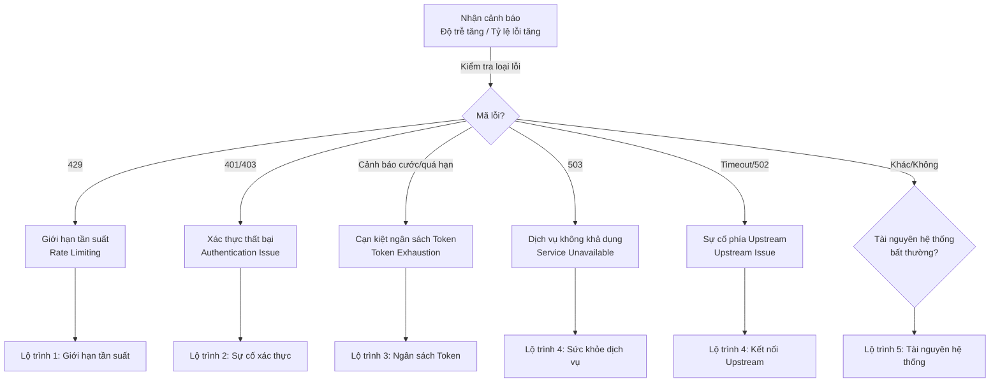

## 15.2 Cây quyết định chẩn đoán lỗi tải cao & Hướng dẫn tối ưu

Trong môi trường sản xuất, hệ thống OpenClaw khi chịu tải cao (High Concurrency) có thể đối mặt với nhiều dạng sự cố phức tạp. Mục này cung cấp cây quyết định chẩn đoán toàn diện và các giải pháp tương ứng, giúp kỹ sư nhanh chóng định vị và xử lý vấn đề.

### 15.2.1 Các loại sự cố phổ biến trong kịch bản tải cao & Tổng quan chẩn đoán

Bảng phân loại các sự cố thường gặp dưới tải cao:

| Loại sự cố | Triệu chứng biểu hiện | Nguyên nhân gốc rễ | Thời gian chẩn đoán trung bình |
|---|---|---|---|
| **Rate Limiting** | Mã lỗi HTTP 429 | Bị nhà cung cấp API siết giới hạn tốc độ | < 5 phút |
| **Authentication Failure** | Mã lỗi HTTP 401/403 | Khóa API Key hết hạn hoặc không hợp lệ | 5–10 phút |
| **Token Exhaustion** | Cảnh báo vượt ngân sách cước / 429 billing | Cạn kiệt ngân sách Token | 10–15 phút |
| **Queue Overflow** | Yêu cầu bị timeout / Bị drop | Tốc độ tiêu thụ hàng đợi quá chậm | 15–30 phút |
| **Memory Leak** | Lỗi sập Out of Memory (OOM) | Bộ nhớ RAM không được giải phóng | 30–60 phút |
| **Connection Pool** | Timeout kết nối cơ sở dữ liệu / API | Rò rỉ connection pool | 20–40 phút |
| **Cascading Failure** | Toàn bộ hệ thống sập dây chuyền | Thiếu cơ chế ngắt mạch và chuyển đổi dự phòng | 5–10 phút |

### 15.2.2 Cây quyết định chẩn đoán sự cố tải cao

Sơ đồ dưới đây là cửa ngõ ưu tiên để định vị nhanh sự cố tải cao dựa trên mã lỗi và triệu chứng:



Hình 15-8: Cây quyết định chẩn đoán sự cố tải cao

### 15.2.3 Các lộ trình chẩn đoán & Phương án xử lý

#### Lộ trình 1: Giới hạn tần suất (Lỗi HTTP 429 Rate Limiting)

**Triệu chứng**
- Client nhận mã lỗi HTTP 429 Too Many Requests.
- Header phản hồi chứa thông tin reset/retry đặc thù của provider (ví dụ OpenAI trả về `x-ratelimit-reset-requests`, Anthropic trả về `retry-after`).
- Yêu cầu bị ùn ứ trong hàng đợi, một số yêu cầu bị từ chối.

**Thu thập bằng chứng**
```bash
# Xem các lỗi 429 trong log gần nhất (dùng --limit để không bị chặn dòng lệnh)
openclaw logs --limit 500 --json

# Kiểm tra bản chụp hạn mức và lượng dùng phía provider
openclaw status --usage

# Kiểm tra trạng thái toàn cục của Gateway
openclaw health --json
```

**Hành động xử lý**
1. **Tức thì**: Kích hoạt bộ điều tiết tốc độ thích ứng:
   - Giảm tốc độ gửi request xuống còn 80% hạn mức API.
   - Áp dụng thuật toán lùi thời gian số mũ kèm nhiễu ngẫu nhiên (Jitter) để tránh bão thử lại: $\text{delay} = \min(2^n + \text{random}(0, 2^n), 60)$ giây.
2. **Ngắn hạn**: Quản trị lưu lượng:
   - Phân tán các tác vụ chạy ngầm nặng sang khung giờ thấp điểm.
   - Cân bằng tải giữa nhiều tài khoản API khác nhau.
3. **Dài hạn**: Nâng hạn mức:
   - Làm đơn đề nghị nhà cung cấp API nâng hạn mức RPS/TPM.
   - Triển khai chiến lược đa vùng địa lý (Multi-region).

---

#### Lộ trình 2: Xác thực thất bại (Lỗi HTTP 401/403)

**Triệu chứng**
- Yêu cầu liên tục trả về 401 Unauthorized hoặc 403 Forbidden.
- API trước đó đang chạy bình thường đột ngột bị từ chối.
- Log in ra thông báo "Invalid API key" hoặc "Token expired".

**Thu thập bằng chứng**
```bash
# Kiểm tra trạng thái mô hình và đầu dò xác thực
openclaw models status
openclaw models status --probe

# Xem chi tiết lỗi xác thực gần nhất
openclaw logs --limit 500 --json
```

**Hành động xử lý**
1. **Tức thì**: Kiểm tra lại thông tin xác thực trên trang quản trị của nhà cung cấp.
2. **Khôi phục**: Cập nhật thông tin xác thực:
   ```bash
   # Đăng nhập lại qua OAuth
   openclaw models auth login --provider <nhà_cung_cấp>

   # Hoặc dán API Token mới
   openclaw models auth paste-token --provider <nhà_cung_cấp>
   ```
3. **Xác minh**:
   ```bash
   openclaw models status
   openclaw doctor
   ```

---

#### Lộ trình 3: Cạn kiệt ngân sách Token

**Triệu chứng**
- Nhận cảnh báo cước phí hoặc email thông báo chạm trần chi tiêu.
- Yêu cầu bị giới hạn hoặc từ chối kèm thông báo "budget exceeded".

**Thu thập bằng chứng**
```bash
# Xem báo cáo chi phí qua CLI
openclaw gateway usage-cost

# Kiểm tra hạn mức tiêu thụ của provider
openclaw status --usage

# Kiểm tra danh sách mô hình đang kích hoạt
openclaw models list
openclaw models status
```

**Hành động xử lý**
1. **Tức thì**: Chuyển ngay các tác vụ không quan trọng sang mô hình chi phí thấp:
   ```bash
   openclaw models set <mô_hình_giá_rẻ>
   ```
2. **Tối ưu hóa**: Thu hẹp ngân sách ngữ cảnh và kích hoạt nén lịch sử (`compaction`).
3. **Phòng ngừa**: Thiết lập trần chi tiêu cứng trên bảng điều khiển của nhà cung cấp và cấu hình cảnh báo khi chạm 80% ngân sách.

---

#### Lộ trình 4: Ùn tắc hàng đợi & Sự cố đổ vỡ dây chuyền (Cascading Failure)

**Triệu chứng**
- Thời gian phản hồi của yêu cầu mới tăng vọt từ 50ms lên hơn 10 giây.
- Độ sâu hàng đợi tăng liên tục không có dấu hiệu giảm.
- Cuối cùng dẫn đến tràn bộ nhớ RAM hoặc timeout kết nối hàng loạt.

**Thu thập bằng chứng**
```bash
# Xem các sự kiện hàng đợi và áp lực ngược trong log
openclaw logs --limit 500 --json

# Kiểm tra sức khỏe toàn diện và tính ổn định của Gateway
openclaw status --deep
openclaw health --json
openclaw gateway stability --json
```

**Hành động xử lý**
1. **Tức thì**: Kích hoạt quản trị áp lực ngược (Backpressure): Hủy hoặc trì hoãn các tác vụ có độ ưu tiên thấp để bảo vệ luồng yêu cầu quan trọng.
2. **Cô lập**: Tách rời các thành phần bị lỗi (nếu cơ sở dữ liệu bị timeout, tạm thời phục vụ bằng dữ liệu trong cache).
3. **Khôi phục**: Khởi động lại Gateway:
   ```bash
   openclaw gateway restart
   ```

---

#### Lộ trình 5: Điểm nghẽn tài nguyên (CPU / RAM tăng vọt)

**Triệu chứng**
- Mức sử dụng CPU hoặc RAM duy trì liên tục ở mức > 85%.
- Hệ thống phản hồi chậm chạp hoặc bị đóng băng hoàn toàn.
- Log xuất hiện cảnh báo tạm dừng Garbage Collection hoặc cảnh báo bộ nhớ.

**Thu thập bằng chứng**
```bash
openclaw status --deep
openclaw health --json
openclaw gateway stability --json
openclaw logs --limit 500 --json
```

**Hành động xử lý**
1. **Nếu CPU cao**: Bật tính năng Profiling để tìm hàm ngốn CPU; giảm bớt độ đồng thời (`maxConcurrent`).
2. **Nếu RAM cao**: Xuất bản chụp Heap Snapshot để kiểm tra rò rỉ bộ nhớ (Memory Leak); dọn dẹp cache và khởi động lại dịch vụ.

---

### 15.2.4 Phân tích các ca sự cố thực tế

#### Ca 1: Lưu lượng đột biến kích hoạt Rate Limit

```text
Triệu chứng:
- Khách hàng nhận hàng loạt lỗi 429
- Thời gian phản hồi nhảy vọt từ 50ms lên 5000ms
- Log ghi rõ "Rate limit exceeded"

Quy trình chẩn đoán:
1. Kiểm tra mẫu yêu cầu gửi đến: openclaw logs --limit 500 --json
2. Xác nhận hạn mức API: Đối chiếu RPS tối đa với nhà cung cấp
3. Kiểm tra xem có hệ thống nào khác đang dùng chung API key không

Giải pháp:
1. Tức thì: Bật bộ điều tiết tốc độ thích ứng, giãn cách thời gian lùi thử lại
2. Ngắn hạn: Phân bổ lại hạn mức với các bên dùng chung
3. Dài hạn: Nâng hạn mức API và triển khai đa vùng địa lý

Thời gian phục hồi: 15 phút
```

#### Ca 2: Khóa API Key đột ngột hết hạn

```text
Triệu chứng:
- Nhận mã lỗi 401 Unauthorized
- Hệ thống trước đó chạy tốt, đột ngột từ chối toàn bộ yêu cầu

Quy trình chẩn đoán:
1. Kiểm tra trạng thái mô hình: openclaw models status
2. Kiểm tra trên trang quản trị provider xem key đã bị thu hồi hoặc đổi mới chưa

Giải pháp:
1. Tức thì: Nạp lại thông tin xác thực mới qua openclaw models auth paste-token
2. Xác minh: Chạy openclaw doctor và openclaw models status --probe

Thời gian phục hồi: 5–10 phút
```

#### Ca 3: Cạn kiệt ngân sách Token

```text
Triệu chứng:
- Hóa đơn cước báo vượt hạn mức
- Yêu cầu mới bị từ chối hoặc bị giới hạn tốc độ
- Nhận email cảnh báo thanh toán

Quy trình chẩn đoán:
1. Xem xu hướng tiêu thụ Token
2. Xác định Agent nào tiêu tốn nhiều Token nhất
3. Kiểm tra xem có phiên đối thoại dài nào quên chưa nén (Compaction) không

Giải pháp:
1. Tức thì: Chuyển sang mô hình giá rẻ qua lệnh openclaw models set <mô_hình_giá_rẻ>
2. Tối ưu: Kích hoạt compaction và session.maintenance thu hẹp dung lượng ngữ cảnh
3. Phòng ngừa: Thiết lập cảnh báo hàng giờ khi chạm ngưỡng chi tiêu

Thời gian phục hồi: 30 phút
```

---

### 15.2.5 Cách ly Agent & Điều phối hạn mức Token giữa các Agent

Khi nhiều Agent độc lập cùng chạy trên một hệ thống, chúng sẽ cạnh tranh tài nguyên Token hữu hạn. Chi tiết về cơ chế điều phối hạn mức Token xem tại [Mục 14.3](../14_performance_cost/14.3_usage_budget.md).

Điểm mấu chốt:
- Dùng `usage/status` và log có cấu trúc để chỉ mặt đặt tên Agent/Session tiêu tốn nhiều Token nhất.
- Đối với các cổng vào quan trọng, ưu tiên cấp mô hình mạnh và chính sách tool nghiêm ngặt; đối với cổng phụ, dùng mô hình giá rẻ và nén ngữ cảnh tối đa.

### 15.2.6 Các nguyên tắc vận hành cốt tử

- **Giám sát chủ động luôn tốt hơn chẩn đoán bị động**: Phát hiện sớm dấu hiệu bất thường để dập tắt sự cố trước khi nó lan truyền dây chuyền.
- **Định vị thần tốc**: Dựa vào mã lỗi HTTP (429 / 401 / 503) để đi thẳng vào cây quyết định tương ứng.
- **Chiến lược phân tầng giới hạn**: Áp dụng giới hạn tần suất ở nhiều tầng (API, Agent, Model).
- **Hạ cấp nhẹ nhàng (Graceful Degradation)**: Khi tài nguyên chạm trần, tự động chuyển sang mô hình nhẹ và tính năng thiết yếu thay vì để hệ thống sập hoàn toàn.
- **Tự động phục hồi**: Ứng dụng lùi thời gian số mũ kèm nhiễu ngẫu nhiên để tự động đứng dậy sau sự cố.
