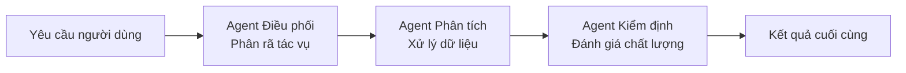
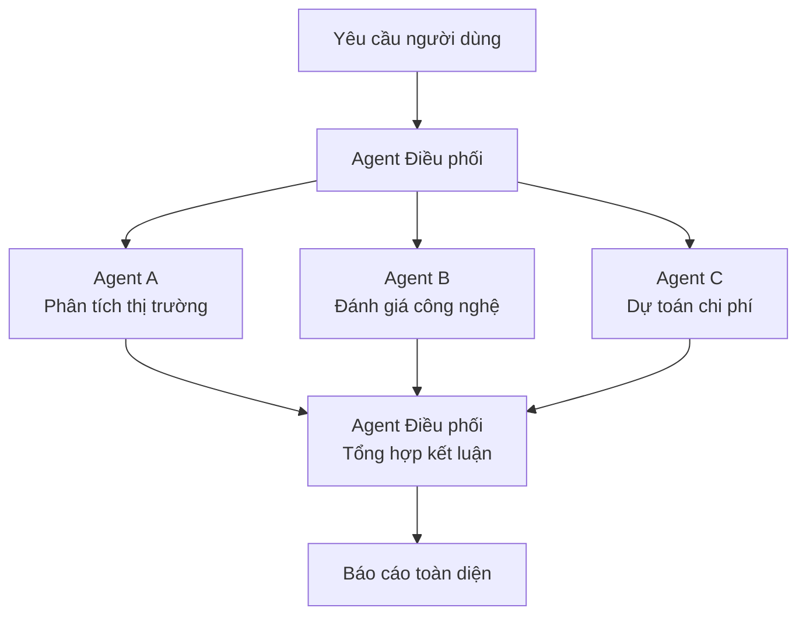

## 16.2 Mô hình cộng tác & Điều phối đa Agent (Multi-Agent Orchestration)

Mục này làm rõ cách thức sử dụng nhiều Agent phối hợp hoàn thành các tác vụ phức tạp trong OpenClaw. Cốt lõi của đa Agent trong OpenClaw dựa trên 3 thành tố nguyên thủy: **`agentId`, `accountId` và `bindings`**: Mỗi `agentId` đại diện cho một không gian làm việc (Workspace), hồ sơ xác thực và kho lưu trữ phiên độc lập; mỗi `accountId` đại diện cho một instance tài khoản cụ thể trên kênh chat; và `bindings` chịu trách nhiệm định tuyến các tin nhắn đến Gateway về đúng Agent mục tiêu một cách xác định. Nhân cách, ranh giới lâu dài và quy tắc đội ngũ được đúc kết trong các tệp workspace (`AGENTS.md`, `SOUL.md`, `USER.md`), thay vì nhồi nhét vào một trường `systemPrompt` nội suy duy nhất.

> **Làm rõ**: Anthropic cung cấp Agent SDK (trước đây là Claude Code SDK) để xây dựng ứng dụng agent tùy biến. Mục này tập trung vào cấu hình đa Agent và mô hình cộng tác nguyên bản của OpenClaw. Chi tiết về Agent SDK xin tham khảo [Tài liệu chính thức của Anthropic](https://code.claude.com/docs/en/agent-sdk/overview).

---

### 16.2.1 Lựa chọn kiến trúc cho Đa Agent

Có 2 con đường phổ biến để triển khai cộng tác đa Agent trong OpenClaw:

| Con đường | Cơ chế vận hành | Kịch bản áp dụng |
|---|---|---|
| **Định tuyến ràng buộc (Bindings)** | Gateway dựa trên quy tắc khớp `channel/accountId/peer` để chuyển tin nhắn về các `agentId` khác nhau | Phân tách miền nghiệp vụ, hỗ trợ đa tài khoản, phân luồng nhân cách theo kênh |
| **Ủy thác cấp Agent (Agent Delegation)** | Agent chính phân rã và bàn giao tác vụ con cho các Agent khác hoặc năng lực ngoài | Phân rã nhiệm vụ, hiệp đồng chuyên gia, kiểm định chất lượng |

Hai con đường này có thể kết hợp hoàn hảo: Gateway dùng `bindings` để đưa yêu cầu đến đúng Agent nghiệp vụ, sau đó Agent nghiệp vụ tiếp tục ủy thác các nhiệm vụ chuyên sâu cho các Agent chuyên gia khác.

### 16.2.2 Phân công đa Agent thông qua Bindings

Mô hình đơn giản nhất là thông qua `agents.entries` và `bindings`. Mỗi Agent dùng một workspace và kho lưu trữ phiên riêng, Gateway dựa trên tài khoản kênh, đối tác hoặc nhóm chat để định tuyến:

```jsonc
{
  agents: {
    entries: {
      support: {
        default: true,
        name: "Support",
        workspace: "~/.openclaw/workspace-support",
        agentDir: "~/.openclaw/agents/support/agent",
        model: { primary: "<provider/low-cost-model>" },
      },
      ops: {
        name: "Ops",
        workspace: "~/.openclaw/workspace-ops",
        agentDir: "~/.openclaw/agents/ops/agent",
        model: { primary: "anthropic/claude-sonnet-4-6" },
      },
      analyst: {
        name: "Analyst",
        workspace: "~/.openclaw/workspace-analyst",
        agentDir: "~/.openclaw/agents/analyst/agent",
        model: { primary: "anthropic/claude-opus-4-6" },
      },
    },
  },
  bindings: [
    { agentId: "support", match: { channel: "whatsapp", accountId: "support" } },
    { agentId: "ops", match: { channel: "telegram", accountId: "ops" } },
    {
      agentId: "analyst",
      match: {
        channel: "discord",
        peer: { kind: "group", id: "123456789012345678" },
      },
    },
  ],
  channels: {
    whatsapp: {
      accounts: {
        support: {},
      },
    },
    telegram: {
      accounts: {
        ops: {
          botToken: "${TELEGRAM_BOT_TOKEN_OPS}",
        },
      },
    },
  },
}
```

Chi tiết về đa tài khoản và quy tắc binding xem tại [Chương 7: Phân phối đa kênh & Đa Agent](../07_multi_agent/README.md).

### 16.2.3 Ba mô hình điều phối cộng tác điển hình

Khi bài toán vượt quá khả năng của một Agent đơn lẻ, 3 mô hình điều phối dưới đây bao phủ đa số kịch bản sản xuất:

#### Mô hình 1: Nối tiếp (Ủy thác tuần tự)

Đầu ra của Agent trước là đầu vào của Agent sau, phù hợp cho các dây chuyền có tính phụ thuộc tuần tự:



Hình 16-1: Mô hình cộng tác nối tiếp (Sequential Pipeline)

Kịch bản điển hình: Người dùng yêu cầu nghiên cứu đề tài → Agent điều phối chia nhỏ công việc → Agent phân tích thu thập dữ liệu → Agent kiểm định đánh giá độ tin cậy → Xuất báo cáo hoàn chỉnh.

Cơ chế thực hiện: Agent điều phối gọi `sessions_spawn` hoặc `/subagents spawn` để chạy tác vụ ngầm; kết quả sau khi hoàn thành được OpenClaw đẩy hồi đáp về kênh chat.

#### Mô hình 2: Song song (Phát tán và Gom cụm - Fan-out / Fan-in)

Nhiều Agent xử lý đồng thời các tác vụ con độc lập, sau đó tổng hợp kết quả lại:



Hình 16-2: Mô hình cộng tác song song (Fan-out / Merge)

Kịch bản điển hình: Đánh giá một giải pháp công nghệ → Đồng thời phân tích từ góc độ thị trường, kỹ thuật và chi phí → Tổng hợp thành báo cáo hoàn chỉnh.

#### Mô hình 3: Định tuyến động (Phân loại cổng vào + Chuyển giao chuyên gia)

Dựa trên nội dung tin nhắn để chọn Agent chuyên gia phù hợp nhất xử lý, tương tự như một "Bàn lễ tân thông minh". Khác với Bindings tĩnh ở cổng vào, bước này diễn ra sau khi Agent tiếp nhận đã đọc hiểu nội dung và quyết định bàn giao cho Agent chuyên biệt hơn.

### 16.2.4 Các ràng buộc kỹ thuật khi ủy thác Agent

- **Kiểm soát ngân sách Token**: Mỗi lượt ủy thác đều tiêu tốn thêm Token. Sub-agent mặc định ở chế độ cách ly (isolated), chỉ nhận văn bản tác vụ mà không kéo theo toàn bộ lịch sử; chỉ khi đặt `context: "fork"` mới kế thừa transcript. Khuyến nghị độ sâu ủy thác không vượt quá 2 tầng.
- **Timeout & Ngắt mạch**: Tác vụ con có thể chạy lâu (nhất là khi gọi tool ngoài). Bắt buộc phải đặt timeout hợp lý kèm chiến lược hạ cấp khi hết giờ.
- **Thu gọn ngữ cảnh chuyển giao**: Ngữ cảnh truyền cho Sub-agent phải được tinh gọn tối đa, tránh nhồi nhét cả lịch sử dài dòng khiến sub-agent bị phân tâm.
- **Truy vết kiểm toán**: Mọi lượt ủy thác bắt buộc phải ghi nhận vào log (ai giao cho ai, giao việc gì, kết quả ra sao) để phục vụ kiểm toán và hạch toán chi phí.

### 16.2.5 Mối quan hệ tương hỗ với Claude Agent SDK

| Chiều kích | Đa Agent trên OpenClaw | Claude Agent SDK |
|---|---|---|
| **Định vị** | Nền tảng vận hành: Quản lý vòng đời, định tuyến, kết nối, an toàn | Khung lập trình: Định nghĩa logic hành vi và điều phối luồng |
| **Gắn kết mô hình** | Đa nhà cung cấp (Anthropic, OpenAI, Local LLM...) | Chỉ duy nhất dòng mô hình Claude |
| **Hình thái triển khai**| Tiến trình thường trực Gateway + Agent Runtime | Nhúng trong mã ứng dụng, kích hoạt theo nhu cầu |
| **Quản trị công cụ** | Tool Policy + Hộp cát Sandbox + MCP | Hỗ trợ MCP gốc |
| **Kịch bản áp dụng** | Hệ thống sản xuất đa kênh, kiểm soát an toàn, phiên bền vững | Ứng dụng độc lập cần logic điều phối chuyên sâu |

Trong thực tế, hai giải pháp bổ trợ hoàn hảo cho nhau: Dùng Agent SDK để lập trình các logic điều phối phức tạp, sau đó tích hợp vào OpenClaw qua MCP hoặc plugin để tận dụng năng lực kết nối đa kênh, phê duyệt bảo mật và quản lý phiên bền vững của OpenClaw.
