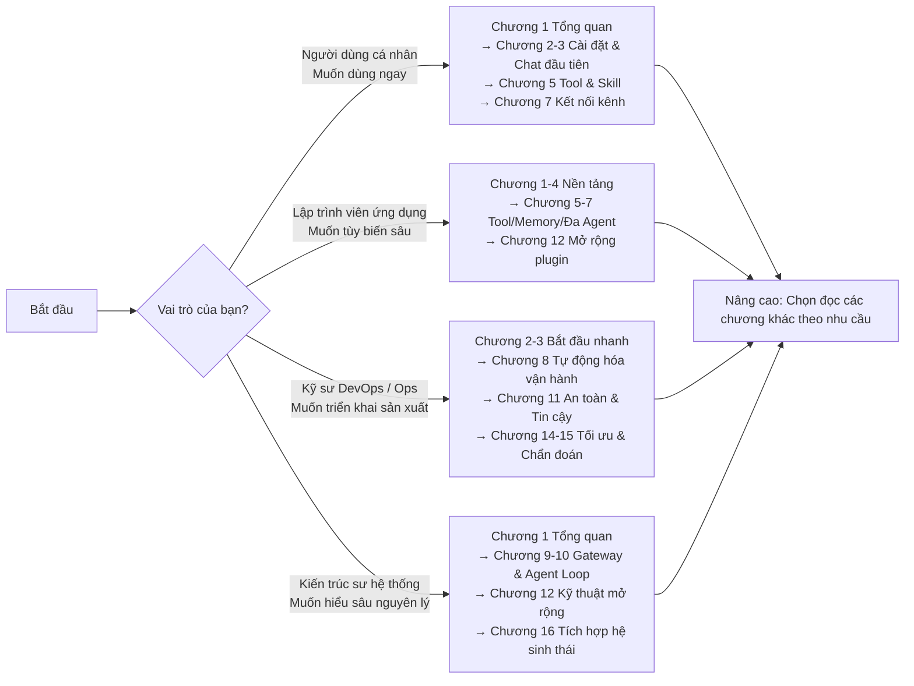

[English overview](README_en.md)

<div align="center">

# OpenClaw: Từ Nhập Môn Đến Tinh Thông

[](https://creativecommons.org/licenses/by/4.0/)
[](https://github.com/yeasy/openclaw_guide)
[](https://github.com/yeasy/openclaw_guide/releases)
[](https://yeasy.gitbook.io/openclaw_guide)
[](https://github.com/yeasy/openclaw_guide/releases/latest)

> **[OpenClaw](https://github.com/openclaw/openclaw) là hệ thống trợ lý AI cá nhân mã nguồn mở ưu tiên chạy cục bộ (local-first)**, được sáng lập bởi Peter Steinberger. Cuốn sách này kết hợp các thực tiễn tốt nhất, cung cấp cẩm nang toàn diện từ bước nhập môn đến ứng dụng chuyên sâu, đồng thời mổ xẻ chi tiết cơ chế vận hành và nguyên lý hiện thực hóa ở tầng lõi.


</div>

## Điểm nổi bật của cuốn sách

- **Thực chiến định hướng**: Xây dựng vòng lặp tối thiểu từ con số 0, cung cấp các mẫu cấu hình có thể tái sử dụng ngay.
- **Mổ xẻ cơ chế lõi**: Phân tích chuyên sâu Gateway, Agent Loop, hệ thống công cụ (Tools), phiên làm việc (Sessions) và bộ nhớ (Memory).
- **Sẵn sàng cho sản xuất (Production-ready)**: Tập trung vào độ tin cậy, gia cố an toàn bảo mật, giám sát vận hành và quy trình chẩn đoán sự cố.

## Đối tượng độc giả & Kiến thức nền tảng

- **Đối tượng độc giả**: Người dùng cá nhân đam mê AI Agent, nhà phát triển ứng dụng AI, kỹ sư triển khai mô hình lớn (LLM Engineers), kiến trúc sư giải pháp hệ thống.
- **Kiến thức yêu cầu**: Độc giả cần nắm vững kiến thức phát triển phần mềm cơ bản (như Node.js hoặc Python) và hiểu các khái niệm sơ khởi về mô hình ngôn ngữ lớn (LLM) và AI Agent. Bạn có thể tham khảo [《Học AI từ số 0》](https://yeasy.gitbook.io/ai_beginner_guide) và [《Cẩm nang chuẩn mực về Agentic AI》](https://yeasy.gitbook.io/agentic_ai_guide) để củng cố nền tảng.

## Cấu trúc tổng thể của cuốn sách

| Phần | Chương | Nội dung tóm lược |
|------|--------|-------------------|
| Phần I: Cơ sở nhập môn | Chương 1–4 | Toàn cảnh kiến trúc, dựng môi trường, phiên chat đầu tiên, cấu hình & tích hợp mô hình |
| Phần II: Tính năng nâng cao | Chương 5–8 | Hệ thống Tool & Skill, ngữ cảnh & bộ nhớ, đa Agent cộng tác, tự động hóa vận hành |
| Phần III: Nguyên lý lõi & Kỹ thuật triển khai | Chương 9–12 | Giao thức Gateway, nhân Agent Loop, cơ chế tin cậy & an toàn, mở rộng Plugin |
| Phần IV: Thực chiến & Tối ưu chuyên sâu | Chương 13–16 | Tình huống thực tế, tối ưu hiệu năng & chi phí, cây quyết định sự cố, tích hợp hệ sinh thái AI |
| Phụ lục | — | Bảng thuật ngữ, cấu hình mẫu, checklist sự cố, API/SDK reference, tra cứu lệnh nhanh, bản đồ phiên bản, tài liệu đọc thêm, script tự kiểm tra môi trường, lịch sử đổi tên, bảng đối soát dữ kiện nhanh |

## Phương thức đọc sách

### Đọc trực tuyến

- [Phiên bản trực tuyến trên GitBook](https://yeasy.gitbook.io/openclaw_guide/)
- [Bắt đầu đọc từ Chương 1](01_overview/README.md)

### Tải bản đọc ngoại tuyến (Offline)

Sách hỗ trợ định dạng PDF để đọc offline. Bạn có thể truy cập trang [GitHub Releases](https://github.com/yeasy/openclaw_guide/releases/latest) để tải phiên bản mới nhất.

### Xem trước tại máy cục bộ (Local Preview)

Kho tài liệu sử dụng mdPress để xây dựng. Để xem trước trên máy local:

```bash
brew tap yeasy/tap && brew install mdpress
mdpress serve
```

Nếu bạn quen dùng các công cụ xem trước Markdown khác, hoàn toàn có thể sử dụng hỗ trợ, tuy nhiên mdPress vẫn là chuỗi build chuẩn của kho sách.

## 5 phút bắt đầu nhanh

Chưa từng dùng OpenClaw? Chỉ với 3 bước đơn giản:

1. **Cài đặt** (1 phút): `curl -fsSL https://openclaw.ai/install.sh | bash -s -- --no-onboard` (trong môi trường mạng doanh nghiệp khuyên dùng tải về kiểm tra script trước hoặc cài đặt thủ công qua npm).
2. **Khởi tạo** (2 phút): `openclaw onboard --install-daemon` → Làm theo hướng dẫn trên màn hình để cấu hình ban đầu và cài đặt dịch vụ nền.
3. **Trò chuyện** (2 phút): Chạy `openclaw dashboard`, mở giao diện Control UI trên trình duyệt, gõ "Xin chào", nhận được phản hồi từ AI là bạn đã thành công 🎉

Xem chi tiết tại [Chương 2: Chuẩn bị môi trường & Cài đặt](02_setup/README.md) và [Chương 3: Phiên hội thoại đầu tiên](03_minimal_loop/README.md).

## Lộ trình học tập theo vai trò

Mỗi nhóm độc giả có thể chủ động chọn lộ trình phù hợp với mục tiêu:



| Vai trò | Các chương trọng tâm | Thời lượng ước tính | Mục tiêu đạt được |
|---------|---------------------|----------------------|-------------------|
| Người dùng cá nhân | 1→2→3→5→7 | 3–4 giờ | Dựng trợ lý AI cá nhân trên WhatsApp/Telegram |
| Lập trình viên ứng dụng | 1–7→12 | 8–10 giờ | Viết Tool, Skill tùy biến và hệ thống đa Agent |
| Kỹ sư vận hành (DevOps) | 2→3→8→11→14→15 | 6–8 giờ | Triển khai môi trường sản xuất, gia cố bảo mật và xử lý sự cố |
| Kiến trúc sư hệ thống | 1→9→10→12→16 | 6–8 giờ | Nắm vững tầng lõi, thiết kế kiến trúc Agent cấp doanh nghiệp |

## Tài liệu khuyến nghị tham khảo thêm

Cuốn sách này nằm trong bộ sách công nghệ AI. Các cuốn sách dưới đây bổ trợ mật thiết cho nội dung sách:

| Tên sách | Mối liên hệ với cuốn sách này |
|----------|-------------------------------|
| [《Học AI từ số 0》](https://yeasy.gitbook.io/ai_beginner_guide) | Nhập môn AI từ nền tảng, phù hợp cho người mới bắt đầu |
| [《Cẩm nang Prompt Engineering cho mô hình lớn》](https://yeasy.gitbook.io/prompt_engineering_guide) | Cơ sở lý thuyết về thiết kế prompt cho Agent |
| [《Cẩm nang thẩm quyền về Context Engineering》](https://yeasy.gitbook.io/context_engineering_guide) | Quản lý ngữ cảnh và kiến trúc bộ nhớ cho AI Agent |
| [《Hướng dẫn kỹ thuật Claude》](https://yeasy.gitbook.io/claude_guide) | Giao thức MCP của Claude, sử dụng Tool và Agentic Coding |
| [《Cẩm nang thẩm quyền về Agentic AI》](https://yeasy.gitbook.io/agentic_ai_guide) | Kiến trúc tổng quát của Agent và mô hình đa Agent cộng tác |
| [《Cẩm nang thẩm quyền về Bảo mật Mô hình lớn》](https://yeasy.gitbook.io/ai_security_guide) | Thiết kế an toàn và phòng thủ tấn công cho hệ thống Agent |
| [《Nguyên lý và Kiến trúc Mô hình lớn》](https://yeasy.gitbook.io/llm_internals) | Hiểu sâu kiến trúc và cơ chế bên dưới của mô hình ngôn ngữ lớn |

## Đóng góp & Phản hồi

Mọi đóng góp thông qua [Issue](https://github.com/yeasy/openclaw_guide/issues) hoặc [Pull Request](https://github.com/yeasy/openclaw_guide/pulls) đều rất được hoan nghênh. Đặc biệt là: sửa lỗi chính tả, khắc phục link hỏng, bổ sung tình huống thực tế và chia sẻ template cấu hình.

## Giấy phép bản quyền

Cuốn sách được phát hành dưới giấy phép [CC BY 4.0](https://creativecommons.org/licenses/by/4.0/).
